# 通用 Agent Service 与可执行任务模块架构

> 状态：方案基线。本文在[自建可嵌入 Agent Library](./README.md)和[可插拔外围 Runtime 架构](./runtime-architecture.md)之上，定义可部署的通用 Agent Service，以及按需启用的 Temporal Task Module 与 Sandbox Module。本文描述逻辑架构和稳定边界，不规定最终代码布局。

## 决策摘要

采用“**通用 Agent Service 为主体，可执行任务能力作为可插拔模块**”的结构：

- Agent Service 提供在线对话、单次运行、上下文、工具、流式事件和统一策略入口；
- Agent Core 同时被在线服务和环境 Task Worker 复用，不为任务场景重写 Agent Loop；
- Task Module 通过 Temporal 增加异步提交、定期触发、长任务恢复、等待、取消和环境路由；
- Sandbox Module 作为 Execution Provider，为 Shell、代码、文件、浏览器等高风险执行提供隔离，不属于 Temporal；
- `ExecutionTarget` 在任务创建时由可信策略解析并固定，模型不能自行选择环境、Namespace、Task Queue 或 Sandbox 权限；
- Temporal Task Queue 只负责路由，不作为租户、环境或权限隔离边界。

这不是通用任务平台：不建设流程设计器、组织管理后台、通用队列产品或任意工作负载编排能力。

## 目标与非目标

### 目标

- 为 Web、IM、后端服务、CLI 等宿主提供统一 Agent 服务接口；
- 同一 Agent Definition 同时支持在线运行和可恢复任务运行；
- 支持多个执行环境，并将任务稳定路由到指定环境；
- 支持一次性、定期、长时间、等待外部信号和人工审批的 Agent 任务；
- 对高风险工具提供可插拔的隔离执行机制；
- 保持模型、上下文、工具、工作流、Sandbox、存储和观测 Provider 可替换；
- 让任务状态、Agent 状态、业务状态和文件产物分别归属明确。

### 非目标

- 通用 BPM/DAG 编排平台；
- 面向任意业务的任务中心或低代码流程设计器；
- 在 Agent Service 内实现用户、租户、RBAC 和业务授权系统；
- 允许模型直接操作 Temporal、Kubernetes、Docker 或 microVM 管理接口；
- 依赖无限存活的进程、对话上下文或 Sandbox 完成长任务；
- 承诺外部副作用端到端 exactly-once。

## 方案选择

| 方案 | 说明 | 优点 | 代价与风险 | 结论 |
|---|---|---|---|---|
| A. Agent Library + 宿主定时器 | 每个宿主自行实现 cron、任务状态和恢复 | 最轻量 | 多环境路由、等待恢复、重试和审计重复建设 | 不采用 |
| **B. Agent Service + 可选 Task Module** | Agent Service 为主体，Temporal 和 Sandbox 通过模块接入 | 在线链路简单；任务可靠；模块可独立启用；边界可演进 | 需要维护 Service、Worker 和 Temporal 契约 | **采用** |
| C. 完整 Agent Task Platform | 建设统一控制面、工作区、流程编排和资源调度 | 平台能力完整 | 当前需求过度设计，容易让 Agent 退化为任务插件 | 不采用 |

选择 B 的核心理由不是任务量，而是已经存在多环境分配、定期任务和可靠恢复需求。接受的代价是引入 Temporal 和环境 Worker；通过限制 Task Module 的职责，避免演化成任务平台。

## 总体架构

```mermaid
flowchart LR
    CLIENT["宿主应用<br/>Web / IM / Backend / CLI"]

    subgraph SERVICE["通用 Agent Service（主体）"]
        API["Agent API<br/>chat / run / stream<br/>task/* 可选"]
        SESSION["Session & Context<br/>Scope / Conversation / Context"]
        API -->|"in-process"| SESSION
    end

    subgraph CORE["共享 Agent Core"]
        EXECUTOR["Agent Executor<br/>Agent Loop / Tool Dispatch<br/>Events / Cancellation"]
        PROVIDERS["Provider Registry<br/>Model / Memory / Tool / Policy"]
        SESSION -->|"in-process"| EXECUTOR
        EXECUTOR -->|"in-process"| PROVIDERS
    end

    subgraph TASK["可选：Executable Task Module"]
        TASK_FACADE["Task Facade<br/>submit / schedule / status / cancel"]
        TEMPORAL_ADAPTER["Temporal Adapter<br/>Workflow / Activity / Schedule"]
        TASK_FACADE -->|"in-process"| TEMPORAL_ADAPTER
    end

    TEMPORAL["Temporal<br/>Namespace / Workflow<br/>Task Queue / Schedule"]
    ENV_WORKER["Environment Task Workers<br/>dev / staging / prod<br/>内嵌 Agent Core"]

    subgraph SANDBOX["可选：Sandbox Module"]
        SANDBOX_PROVIDER["Sandbox Provider<br/>create / exec / snapshot / destroy"]
        SANDBOX_MANAGER["环境内 Sandbox Manager"]
        SANDBOX_PROVIDER -->|"gRPC"| SANDBOX_MANAGER
    end

    MODEL_TOOLS["LLM 与业务工具"]
    AGENT_STATE[("Memory / Agent State")]
    ARTIFACT_STORE[("Artifact Store")]
    SANDBOX_RUNTIME["隔离执行环境<br/>Container / gVisor / Kata / Firecracker"]

    CLIENT -->|"HTTP / SSE"| API
    API -->|"启用任务模块时"| TASK_FACADE
    TEMPORAL_ADAPTER -->|"gRPC"| TEMPORAL
    TEMPORAL -.->|"按 Namespace / Task Queue 分发"| ENV_WORKER
    ENV_WORKER -->|"in-process，复用同一内核"| EXECUTOR

    PROVIDERS -->|"HTTPS / RPC"| MODEL_TOOLS
    PROVIDERS -->|"SQL / KV"| AGENT_STATE
    PROVIDERS -->|"S3 API"| ARTIFACT_STORE
    PROVIDERS -->|"in-process"| SANDBOX_PROVIDER
    SANDBOX_MANAGER -->|"Sandbox API"| SANDBOX_RUNTIME

    classDef actor fill:#E3F2FD,stroke:#1565C0,color:#111;
    classDef gateway fill:#90CAF9,stroke:#1565C0,color:#111;
    classDef runtime fill:#C8E6C9,stroke:#2E7D32,color:#111;
    classDef platform fill:#D1C4E9,stroke:#5E35B1,color:#111;
    classDef infra fill:#FFE0B2,stroke:#EF6C00,color:#111;

    class CLIENT actor;
    class API gateway;
    class SESSION,EXECUTOR,TASK_FACADE,ENV_WORKER runtime;
    class PROVIDERS,TEMPORAL_ADAPTER,TEMPORAL,SANDBOX_PROVIDER,SANDBOX_MANAGER platform;
    class MODEL_TOOLS,AGENT_STATE,ARTIFACT_STORE,SANDBOX_RUNTIME infra;

    style TASK stroke-dasharray:6 4
    style SANDBOX stroke-dasharray:6 4
```



图的系统模型见 [`agent-service-task-module.architecture.json`](./agent-service-task-module.architecture.json)，Runtime 投影视图见 [`agent-service-task-module.runtime.dsl.yaml`](./agent-service-task-module.runtime.dsl.yaml)。

## 模块边界

| 模块 | 负责 | 不负责 | 是否可选 |
|---|---|---|---|
| Agent Service | HTTP/SSE 接入、Scope 传递、在线会话、运行入口、事件输出 | 可靠任务调度、Sandbox 基础设施、业务权限系统 | 否 |
| Agent Core | 单次有界 Agent Run、上下文组装、模型循环、工具调度、取消和统一事件 | 持久队列、跨运行 Workflow 历史、环境资源管理 | 否 |
| Task Module | 提交、定期触发、状态查询、取消、等待恢复、环境路由 | 通用 BPM、任意工作负载、组织管理面 | 是 |
| Temporal Adapter | Workflow/Activity/Schedule 映射、重试与 Signal 协议 | Agent 推理、业务授权、Sandbox 隔离 | Task Module 内部 |
| Environment Task Worker | 在指定环境领取任务并嵌入调用 Agent Core | 自行决定环境、提升权限、保存唯一业务真相 | Task Module 内部 |
| Sandbox Module | 隔离执行、资源限制、网络策略、快照和回收 | 任务调度、Agent 决策、业务授权 | 是 |
| Provider Registry | Model、Context、Memory、Tool、Policy、Artifact、Telemetry 等能力适配 | 厂商级平台管理 | 否 |

依赖方向固定为：

```text
Agent Service ──uses──▶ Agent Core
Task Module   ──uses──▶ Agent Core
Task Module   ──uses──▶ Temporal
Agent Core    ──uses──▶ Providers
Providers     ──uses──▶ Sandbox / Model / Tool / Storage
```

Agent Core 不依赖 Temporal；不启用 Task Module 时，在线 Agent 能力仍完整可用。

## 核心领域对象

### AgentDefinition

定义可运行的 Agent 行为，并必须版本化：

```text
AgentDefinition
├─ definitionId
├─ version
├─ systemInstructionRef
├─ modelPolicyRef
├─ toolSetRef
├─ contextPolicyRef
├─ executionPolicyRef
└─ eventSchemaVersion
```

任务创建后固定 Definition 版本，避免运行中部署变化导致不可解释的恢复行为。是否允许显式升级，由任务策略决定。

### AgentRun

表示一次有边界的 Agent Core 执行：

```text
AgentRun
├─ runId
├─ definitionId + version
├─ scopeRef
├─ inputRef
├─ checkpointRef
├─ deadline
├─ cancellationToken
└─ eventContext
```

`AgentRun` 可以是在线运行，也可以是 Task 的一个执行分片；它不是长期 Workflow 本身。

### AgentTask

表示需要可靠完成的逻辑任务：

```text
AgentTask
├─ taskId
├─ agentDefinitionRef
├─ scopeRef
├─ executionTarget
├─ trigger
├─ status
├─ inputRef
├─ checkpointRef
├─ resultRef
└─ createdBy
```

### TaskAttempt

表示某个 Worker 对 Task 的一次实际尝试。Activity 重试可以产生新 Attempt，但不产生新的逻辑 Task：

```text
TaskAttempt
├─ attemptId
├─ taskId
├─ workflowRunId
├─ workerIdentity
├─ startedAt / endedAt
├─ failureClass
└─ sandboxSessionRef
```

### ExecutionTarget

```text
ExecutionTarget
├─ targetId
├─ environmentId
├─ temporalNamespace
├─ taskQueue
├─ region
├─ capabilitySet
├─ policyProfile
├─ sandboxProfile
└─ secretScope
```

`ExecutionTarget` 必须由宿主或可信策略解析。创建 Task 后保存解析结果，默认不允许恢复时静默切换环境。

## 接口边界

以下是语义契约，不冻结具体 URL 和 TypeScript 类型。

### 在线运行

```text
runAgent
输入：definitionRef、input、scope、可选 conversationRef
输出：event stream + final resultRef
语义：直接调用 Agent Core，不经过 Temporal
```

### 任务操作

```text
submitTask
输入：definitionRef、inputRef、scope、executionTargetRef、taskPolicy
输出：taskId、workflowId

scheduleTask
输入：taskTemplate、calendar/interval、timezone、misfirePolicy、concurrencyPolicy
输出：scheduleId

getTaskStatus
输入：taskId
输出：status、progress、currentWait、resultRef、lastFailure

signalTask
输入：taskId、signalType、payloadRef、idempotencyKey
输出：accepted/rejected

cancelTask
输入：taskId、reason
输出：cancellationAccepted
```

Task API 通过 Agent Service 暴露，但实现由 Task Module 注册。模块未启用时，`task/*` 能力明确不可用，不进行静默降级。

## 运行链路

### 在线链路

```text
宿主
  → Agent API
  → Session & Context
  → Agent Executor
  → Model / Tool / Memory Provider
  → Event Stream
```

在线链路不进入 Temporal，避免为普通对话引入额外延迟和运行依赖。

### 任务链路

```text
宿主
  → Task Facade
  → 解析并固定 ExecutionTarget
  → Temporal：启动 AgentTaskWorkflow
  → 指定环境的 Task Worker
  → Agent Core：执行一个有界 Run/Slice
  → 保存 checkpoint / result / artifact
  → 完成、等待、重试或 Continue-As-New
```

### 定期任务链路

```text
Temporal Schedule
  → 生成一次不可变 occurrence
  → 使用 scheduleId + scheduledAt 去重
  → 启动 AgentTaskWorkflow
  → 按 concurrency/misfire 策略处理
```

推荐默认值：

- `concurrencyPolicy = forbid` 或 `queue`；
- `misfirePolicy = fireOnce`；
- Calendar Schedule 必须显式保存时区；
- 同一 occurrence 的业务幂等键保持稳定。

## Temporal 设计

### Namespace 与环境

安全环境至少按 Namespace 隔离：

```text
agent-dev
agent-staging
agent-prod
```

同一 Temporal Cluster 可以承载多个 Namespace；当生产要求独立故障域、网络或合规隔离时，再拆分 Cluster。Namespace 是逻辑和权限边界，Task Queue 是路由边界。

### Task Queue

任务量不大时，不按 Agent 类型过度拆分：

```text
agent-dev
agent-staging
agent-prod
```

只有当执行能力或 Sandbox 风险等级明显不同时才细分：

```text
agent-prod-api
agent-prod-code-hardened
```

Worker 只监听其部署环境允许的队列。队列名由 `ExecutionTarget` 映射，不能直接接受模型或不可信请求参数。

### Workflow 与 Activity 边界

`AgentTaskWorkflow` 只保存确定性的编排状态：

- 当前阶段和状态；
- checkpoint、input、result 和 artifact 引用；
- Timer、Signal、取消和重试决策；
- Definition 版本与 ExecutionTarget；
- 已提交副作用的幂等标识。

以下操作必须位于 Activity：

- LLM 调用；
- Agent Core 运行；
- Context/Memory 读写；
- 工具和外部 API 调用；
- Sandbox 创建、执行、快照和销毁；
- Artifact 上传下载。

默认使用粗粒度 `RunAgentSliceActivity` 执行有限轮次的 Agent Loop和低风险操作。对于高风险或必须单独恢复的写工具，Agent Runtime Adapter 返回 `ToolIntent`，由 Workflow 调度独立的 `ExecuteToolActivity`，再把结果送回下一 Slice。这样兼顾 Pi Agent Loop 的可复用性与关键副作用的可审计性。

### 有界运行与 Continue-As-New

单个 Slice 必须受以下至少一种边界限制：

- 最大运行时间；
- 最大模型轮次；
- 最大工具调用数；
- 最大 token/费用预算；
- Workflow History 阈值。

达到边界后保存结构化 checkpoint。长期 Workflow 定期 `Continue-As-New`，只传递稳定 ID 和引用，不把完整对话、日志、大文件或敏感正文放入 Workflow History。

### 等待与恢复

```text
running
  ├─ succeeded
  ├─ retry_scheduled
  ├─ waiting_signal
  ├─ waiting_approval
  ├─ sleeping
  ├─ cancelled
  └─ failed
```

进入等待状态时释放 Worker 和 Sandbox Compute。Timer 或 Signal 到达后，从持久化 checkpoint 重建上下文并执行新的 Slice，不依赖原进程对象继续存活。

## 状态归属

| 状态 | Owner | Temporal 中保存什么 |
|---|---|---|
| Workflow 阶段、Timer、Signal、Activity 结果 | Temporal | 小型确定性状态和稳定引用 |
| Agent 对话、任务摘要、checkpoint | Context/Memory Provider | 仅保存引用和必要摘要 |
| 业务实体与业务事务 | 宿主业务系统 | 业务 ID、幂等键和调用结果引用 |
| 文件、报告、日志包、Sandbox Snapshot | Artifact Provider | ArtifactRef 和校验信息 |
| Sandbox 计算实例 | Sandbox Manager | sandboxId、租约和状态引用 |
| Definition、Policy、ExecutionTarget | Agent Service 配置存储 | 固定版本和解析结果 |

禁止将上述状态合并为一个无边界的通用 `StateProvider`。

## 副作用、重试与幂等

系统采用 at-least-once 执行语义。每次高风险工具调用至少携带：

```text
runId
attemptId
toolCallId
idempotencyKey
deadline
scopeRef
executionTarget
```

写工具必须满足以下至少一种能力：

1. 接收稳定幂等键；
2. 可按请求标识查询先前结果；
3. 提供补偿操作；
4. 状态不确定时转入人工处理，而不是自动重复。

Activity Retry 只处理明确可重试的基础设施或瞬时错误。授权失败、参数校验失败、预算耗尽和高风险不确定副作用默认不可自动重试。

## Sandbox Module

### 适用范围

以下能力默认需要 Sandbox：

- Shell 或任意代码执行；
- Git checkout、构建和测试；
- 用户提供的脚本或依赖；
- 文件系统批量修改；
- 浏览器自动化；
- 需要受限网络访问的高风险工具。

只有显式、低风险、Schema 可校验的业务 API 工具可以直接执行。

### 稳定契约

```text
create(profile, owner, workspaceRef) → sandboxSession
exec(sandboxId, command, limits) → executionResult
snapshot(sandboxId) → artifactRef
restore(profile, artifactRef) → sandboxSession
destroy(sandboxId) → result
inspect(sandboxId) → health/status
```

模型不能直接调用这些管理接口。模型调用受限工具，由 Tool/Policy Provider 选择 Sandbox Profile 并构造请求。

### Profile

| Profile | 能力 | 推荐场景 |
|---|---|---|
| `api-only` | 无 Shell、无通用文件和网络 | 普通业务 Agent 默认值 |
| `code-container` | 非 root 容器、临时 workspace、受限网络 | 可信仓库的开发任务 |
| `code-hardened` | gVisor/Kata、严格 egress、短期凭据 | staging/prod 代码任务 |
| `untrusted` | microVM、无宿主挂载、强资源隔离 | 用户代码和未知依赖 |

Profile 是服务端策略对象，模型只能提出能力需求，不能提升自身 Profile。

### 生命周期

采用“每个 Task 一个逻辑 Workspace，每个 Attempt 一个临时 Sandbox”的模型：

```text
Task Workspace
  ├─ baseArtifactRef
  ├─ latestSnapshotRef
  └─ outputArtifactRefs

Attempt
  └─ restore/create Sandbox
       → execute
       → snapshot
       → destroy
```

Task 等待、Worker 重启或发生迁移时销毁计算实例，从 Artifact Snapshot 恢复文件状态。不得把长期任务的唯一状态留在容器本地磁盘。

### 安全基线

- 非 root，移除 Linux capabilities，启用 seccomp 与 AppArmor/SELinux；
- 只读根文件系统，workspace 独立挂载；
- 禁止宿主目录、设备和 Docker Socket；
- 默认拒绝网络，通过受控 Egress Proxy 按 Profile 放行；
- 限制 CPU、内存、PID、磁盘、inode、带宽和执行时长；
- 使用 workload identity 或短期凭据，不写入长期 Secret；
- Artifact 导出前执行大小、类型、敏感信息和恶意内容检查；
- Sandbox Manager 保存 owner、lease、TTL 和最后心跳；
- 独立 Reaper 回收创建成功但 Activity 未返回的孤儿 Sandbox。

Workflow 的清理 Activity 是正常路径，Sandbox Reaper 是最终兜底，两者不能互相替代。

## 安全与环境隔离

1. 宿主完成身份认证，并签发最小化 `scope`；
2. Agent Service 根据主体、Definition、风险和目标解析 `ExecutionTarget`；
3. Task 创建后固定 Namespace、Task Queue、Policy 与 Sandbox Profile；
4. 环境 Worker 使用独立 workload identity，只能访问本环境资源；
5. 每次工具调用仍执行 Authorize/Policy，定时任务不绕过授权；
6. 原始凭据不进入 Prompt、Workflow History、Task Payload 或日志；
7. 跨环境迁移默认禁止；如需迁移，创建新的 Task/Run 并保留审计链路；
8. 生产任务不得自动降级到非生产环境执行。

## 事件与可观测性

统一关联标识：

```text
traceId
agentRunId
taskId
workflowId
workflowRunId
attemptId
sandboxId
toolCallId
executionTarget
```

Agent Core 继续输出统一 Event；Task Module 增加任务生命周期事件；Sandbox Module 增加资源和执行事件。事件正文默认脱敏，大型日志写入 Artifact Store，只在事件中传引用。

重点指标：

- 在线 Run 与 Task 的成功率、延迟和取消率；
- Temporal Schedule 延迟、Activity Retry 和等待时长；
- 各环境队列积压与 Worker 可用性；
- 模型 token、费用和工具错误；
- Sandbox 创建耗时、资源使用、超时和孤儿回收；
- 幂等冲突、策略拒绝和人工介入次数。

## 部署建议

最小可用部署：

```text
Agent Service × 2
Temporal Namespace：dev / staging / prod
Environment Worker：每环境至少 1 个
Agent State Store
Artifact Store
可选 Sandbox Manager：每个需要隔离执行的环境部署
```

Task Worker 可以和 Agent Service 使用同一代码仓库与 Agent Core package，但应作为独立进程部署，以隔离在线流量与长任务资源。生产环境根据故障域和安全要求决定是否使用独立 Temporal Cluster。

## 故障与降级

| 故障 | 行为 |
|---|---|
| Temporal 不可用 | 在线 Agent 保持可用；新 Task 明确失败或排队重试，不静默改为进程内任务 |
| 某环境 Worker 不可用 | Task 留在对应队列并告警；不自动跨环境执行 |
| LLM 限流或瞬时失败 | 受预算和截止时间约束地重试 |
| Sandbox 创建失败 | 按错误分类重试；不能退化为宿主直接执行 |
| Worker 在副作用后崩溃 | 使用稳定幂等键查询结果；状态不确定时转人工处理 |
| Artifact Store 不可用 | 需要文件持久化的步骤暂停或失败；不只保存在 Sandbox 本地 |
| Policy Provider 不可用 | 高风险工具 fail closed；只读低风险能力是否降级由显式策略决定 |

## 演进边界

只有出现以下真实需求时，才考虑从模块架构演进为平台层：

- 大量团队共享 Agent Definition 和工具目录；
- 需要组织级配额、成本和审批管理；
- 需要动态 Worker 注册、容量调度和区域容灾；
- 需要多人共享 Workspace；
- 需要统一运营管理面和 SLA。

在此之前，不增加通用 DAG、资源市场、低代码流程或多租户管理后台。

## 待细化问题

- Temporal 使用共享 Cluster + 多 Namespace，还是生产独立 Cluster；
- `RunAgentSliceActivity` 与独立 `ExecuteToolActivity` 的最终粒度；
- Sandbox 首选实现为 Kubernetes + gVisor/Kata、自建 microVM 还是托管服务；
- Definition、Policy、ExecutionTarget 的配置存储和发布机制；
- Agent checkpoint 的稳定 Schema 与版本迁移规则；
- 任务、Workflow History、Trace、Artifact 和长期记忆的保留期。

这些问题不改变本文的模块边界，可以在实现前分别形成 ADR 或验证性方案。

## 方案演进讨论（参考）

> 本章记录形成当前结论之前的讨论，不作为规范性架构要求。若与前文冲突，以前文“决策摘要”和模块边界为准。

### 从嵌入式 Library 出发

最初方案强调 Agent 是嵌入宿主的 Library：核心负责一次 `run`、上下文、工具调度和事件，队列、调度、数据库与后台任务由宿主负责。这个边界对在线 Agent 仍然成立，也是当前共享 Agent Core 的来源。

### 低任务量下的轻量方案

在任务量较小时，曾考虑单进程 Durable Agent Host，使用 PostgreSQL 或 SQLite 保存 Schedule、Job 和 Checkpoint，通过单 Scheduler/Worker 执行。该方案部署简单，适合单环境和短链路周期任务。

后来确认的关键约束不是吞吐量，而是：任务需要在多个环境运行、按环境稳定分配，并支持长期等待和恢复。继续自建会逐步补齐 Namespace、队列路由、Timer、Signal、重试、取消、版本和恢复语义，因此选择 Temporal 更合适。

### 从长期进程转向持久任务

讨论中明确：“长期运行的 Agent”不等于一个永不退出的 Agent Loop。更稳定的模型是长期存在的逻辑 Agent 或 Task，由多个有界 Agent Run/Slice 推进；状态、checkpoint 和 artifact 外置，进程、Worker 和 Sandbox 都可以重启或替换。

曾进一步区分 Schedule、Job、Run 和 Attempt。这些概念有助于分析可靠执行，但当前设计不把它们全部暴露为平台级公共模型：外部稳定对象保持为 AgentRun、AgentTask、TaskAttempt 和 ExecutionTarget，Temporal 内部对象通过 Adapter 映射。

### Temporal 方案的平台化倾向

初步 Temporal 方案曾展开 SchedulerProvider、RunStateStore、LeaseProvider、RecoveryPolicy、Worker 注册和复杂环境调度，视觉和职责上接近通用任务平台。

当前方案对此进行了收敛：

- Temporal 是 Task Module 的实现后端，不是系统主体；
- 不在 Agent Core 中增加 Scheduler、Queue 或 Lease；
- 不为 Temporal 已提供的可靠执行能力再抽象一套自建分布式 Runtime；
- 环境路由使用显式 ExecutionTarget、Namespace 和少量 Task Queue，不建设动态资源调度器；
- Agent Service 和在线链路不依赖 Temporal；
- 只有高风险执行进入 Sandbox，普通业务工具不强制隔离。

### Sandbox 讨论的结论

Sandbox 不能只是与 Agent Worker 同进程的“命令执行插件”，否则无法形成安全边界。稳定契约可以是 Provider，但实现需要独立的环境内 Sandbox Manager 和真正的容器、强化容器或 microVM 隔离。

同时，Sandbox 不是持久状态 Owner。长期任务的 workspace 通过 Artifact/Snapshot 外置，Sandbox 是可销毁、可恢复的计算实例；Temporal 正常编排创建和销毁，独立 Reaper 处理异常路径中的孤儿资源。

### 保留的原则

前期讨论中以下原则继续有效：

1. Agent 是逻辑实体，不是进程；
2. 长任务由有界 Run 推进；
3. Prompt 和进程内对话不是唯一真实状态；
4. Scheduler 产生工作，Workflow 保证工作推进；
5. 状态 Owner 必须分离；
6. 外部副作用按 at-least-once 和幂等设计；
7. Task Queue 是路由，不是权限边界；
8. Sandbox 权限由策略决定，不由模型决定。

## 相关内容

- [自建可嵌入 Agent Library 架构](./README.md)
- [可插拔外围 Runtime 架构](./runtime-architecture.md)
- [Pi 与 QM 调研](./pi-qm-research.md)
