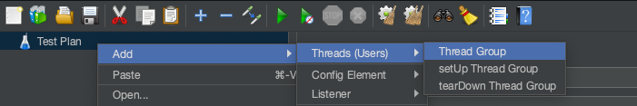

# RPC 压测

针对 RPC 需要基于 SDK 做开发，整体流程如下。

- 基于 SDK 开发

  - 引用 jmeter 依赖包
  - 编写压测类，实现 JavaSamplerClient 接口

- 将包及其依赖拷贝至 jmeter 的 `lib/ext` 目录下

- 重新打开 jmeter

- 创建压测项目

  - 新建线程组

    

  - 新建 java 请求

    

    

  - 下拉框选择我们的实现类

  - 参数需要在实现类的 `getDefaultParameters` 方法返回，但是值可以在 jmeter GUI 修改以及保存

  - 添加` view result tree`

    

- 点击开始按钮，进行压测

- 通过 `view result tree` 查看结果

  

## 代码示例

```java
// EchoService 是已运行的 gRPC 服务
public class DivinerClientExampleForJMeter implements JavaSamplerClient {
  EchoService echoService;
  @Override
  public void setupTest(JavaSamplerContext javaSamplerContext) {
    echoService = ...; // 初始化 echoService
  }

  @Override
  public SampleResult runTest(JavaSamplerContext javaSamplerContext) {
    SampleResult result = new SampleResult();
    result.sampleStart();
    
    String id = javaSamplerContext.getParameter("id");
    String name = javaSamplerContext.getParameter("name");

    EchoRequest request = EchoRequest.newBuilder()
        .setId(id)
        .setName(name)
        .build();
    try {
      EchoResponse response = echoService.echo(request);
      result.sampleEnd();
      result.setSuccessful(true);
      result.setResponseData(JsonFormat.printer().print(response), null);
      result.setDataType(SampleResult.TEXT);
      result.setResponseCode("OK");
    } catch (Exception e) {
      result.sampleEnd();
      result.setSuccessful(false);
      java.io.StringWriter stringWriter = new java.io.StringWriter();
      e.printStackTrace(new java.io.PrintWriter(stringWriter));
      result.setResponseData(stringWriter.toString(), null);
      result.setDataType(SampleResult.TEXT);
      result.setResponseCode("FAILED");

      e.printStackTrace();
    }

    return result;
  }

  @Override
  public void teardownTest(JavaSamplerContext javaSamplerContext) {
  }

  @Override
  public Arguments getDefaultParameters() {
    Arguments arguments = new Arguments();
    arguments.addArgument("id", String.valueOf(RANDOM.nextInt(10) + 2000));
    arguments.addArgument("name", "pressure" + RANDOM.nextInt(100000000) + 10000000);
    return arguments;
  }
}
```

# 异常

## OutOfMemoryError

修改 `bin/jmeter` 脚本。

```shell
...
: "${HEAP:="-Xms4g -Xmx4g -XX:MaxMetaspaceSize=1024m"}"  # 调大堆内存和 Meta 内存
...
```

