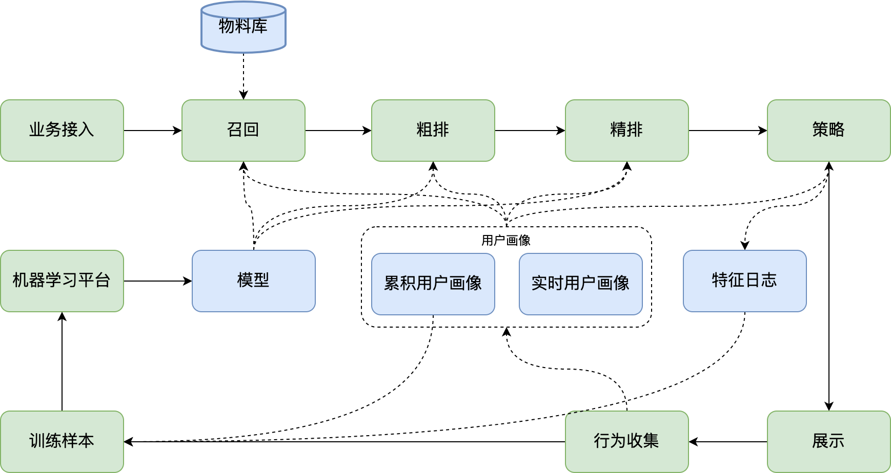

# 推荐系统的典型架构

# 如何快速了解一个推荐系统

- 架构
  - 在线架构，流量接入、策略、在线打分
  - 离线架构，样本日志的产生、收集、清洗、拼接，模型训练平台
- 数据
  - 用户数据，了解时效性、数据量、存储方式
    - 累计用户画像
    - 实时用户行为数据
  - 正排数据
    - 信息流，视频、文章、图片等
    - 广告，Offer、模板、素材等
- 代码组织
  - 代码使用到的框架
  - 处理流程
- 策略
  - 对指标（信息流，点击率预估、停留时长预估，广告，IVR、CTR、CVR、eCPM 等）的调整
- 特征
  - 特征来源
  - 如何做特征抽取（FE，Feature Extractor）
  - 落特征、特征回流

