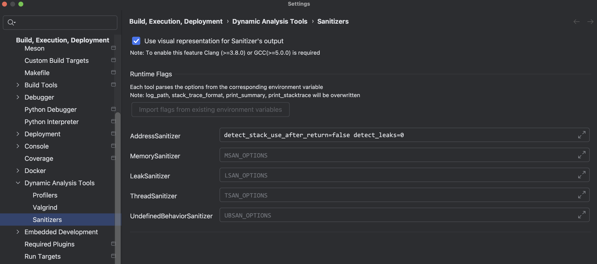

[AddressSanitizer](https://github.com/google/sanitizers/wiki/AddressSanitizer/AddressSanitizer) (ASan) C/C++ 程序的内存错误检测器，可以检查如下错误。

- [Use after free](https://github.com/google/sanitizers/wiki/AddressSanitizer/AddressSanitizerExampleUseAfterFree) (dangling pointer dereference)
- [Heap buffer overflow](https://github.com/google/sanitizers/wiki/AddressSanitizer/AddressSanitizerExampleHeapOutOfBounds)
- [Stack buffer overflow](https://github.com/google/sanitizers/wiki/AddressSanitizer/AddressSanitizerExampleStackOutOfBounds)
- [Global buffer overflow](https://github.com/google/sanitizers/wiki/AddressSanitizer/AddressSanitizerExampleGlobalOutOfBounds)
- [Use after return](https://github.com/google/sanitizers/wiki/AddressSanitizer/AddressSanitizerExampleUseAfterReturn)
- [Use after scope](https://github.com/google/sanitizers/wiki/AddressSanitizer/AddressSanitizerExampleUseAfterScope)
- [Initialization order bugs](https://github.com/google/sanitizers/wiki/AddressSanitizer/AddressSanitizerInitializationOrderFiasco)
- [Memory leaks](https://github.com/google/sanitizers/wiki/AddressSanitizer/AddressSanitizerLeakSanitizer)

# TL;TR

```shell
# CMAKE_CXX_FLAGS
-g3 -fno-omit-frame-pointer -fno-common -fsanitize=undefined -fsanitize=address -fsanitize-recover=address

# 环境变量
export ASAN_OPTIONS=symbolize=true:halt_on_error=false:abort_on_error=false:disable_coredump=false:unmap_shadow_on_exit=true:disable_core=false:sleep_before_dying=15:fast_unwind_on_fatal=1:log_path=asan.log
```

**指定 Asan Library 路径**

```shell
export LD_LIBRARY_PATH=/path/to/libasan.so.x
```

## 注意

- 部分 IDE 集成分析工具，ASAN_OPTIONS 可能被覆盖，比如 CLion，需要在设置中设置 ASAN_OPTIONS（AddressSanitizer）。



# 使用

## 编译选项

```shell
-fsanitize=address						# 开启内存越界检测
-fsanitize-recover=address		# 内存出错后继续运行, 需配合运行选项 halt_on_error=0
-fno-stack-protector 					# 去使能栈溢出保护
-fno-omit-frame-pointer 			# 去使能栈溢出保护
-fno-var-tracking 						# 默认选项为-fvar-tracking，会导致运行非常慢
-g1														# 表示最小调试信息，通常debug版本用-g即-g2
```

**示例**

```shell
ASAN_CFLAGS += -fsanitize=address -fsanitize-recover=address
ASAN_CFLAGS += -fno-stack-protector -fno-omit-frame-pointer -fno-var-tracking -g1
```

## 链接选项

```shell
ASAN_LDFLAGS += -fsanitize=address -g1 # 如果使用gcc链接，此处可忽略
```

## 运行选项

ASAN_OPTIONS是Address-Sanitizier的运行选项环境变量。

```shell
halt_on_error=0/1 					# 检测内存错误后继续运行
abort_on_error=0/1					# 遇到错误后调用 abort() 而不是 _exit()
detect_leaks=0/1 						# 使能内存泄露检测
malloc_context_size=15 		  # 内存错误发生时，显示的调用栈层数为15
log_path=asan.log     		  # 内存检查问题日志存放文件路径
suppressions=$SUPP_FILE 		# 屏蔽打印某些内存错误
symbolize=0/1               # 启用符号化，将错误地址翻译成代码行号
disable_coredump=0/1        # 禁用 core dump         
disable_core=0/1            # 禁用 core dump   
unmap_shadow_on_exit=1
sleep_before_dying=60
```

**更多**

- https://github.com/google/sanitizers/wiki/SanitizerCommonFlags
- https://github.com/google/sanitizers/wiki/AddressSanitizerFlags

**示例**

```shell
# 1
export ASAN_SYMBOLIZER_PATH=/usr/bin/llvm-symbolizer
export ASAN_OPTIONS=halt_on_error=0:use_sigaltstack=0:detect_leaks=1:malloc_context_size=15:log_path=/tmp/asan.log:suppressions=$SUPP_FILE

# 2
export ASAN_SYMBOLIZER_PATH=/usr/bin/llvm-symbolizer
export ASAN_OPTIONS=symbolize=true:halt_on_error=false:abort_on_error=false:disable_coredump=false:unmap_shadow_on_exit=true:disable_core=false:sleep_before_dying=15:log_path=asan_log
```

## cmake 链接

```shell
#asan 链接sys
set(CMAKE_CXX_FLAGS "${CMAKE_CXX_FLAGS} -fsanitize=address")
SET(CMAKE_C_FLAGS_ASAN "-O2 -g -fsanitize=address -fno-omit-frame-pointer" CACHE STRING "Flags used by the C compiler during asan builds." FORCE)
SET(CMAKE_C_FLAGS "-O2 -g -fsanitize=address -fno-omit-frame-pointer -lstdc++ -lasan" CACHE STRING "Flags used by the C compiler during asan builds." FORCE)
```

# Debug

```shell
==1867==ERROR: AddressSanitizer: heap-use-after-free on address 0x7f69c0e59823 at pc 0x000001f1f50c bp 0x7f69c02624e0 sp 0x7f69c02624d0
...
0x7f69c0e59823 is located 35 bytes inside of 8388608-byte region [0x7f69c0e59800,0x7f69c1659800)
freed by thread T14 here:
...
previously allocated by thread T14 here:
...
SUMMARY: AddressSanitizer: heap-use-after-free /data/zhenkai.sun/ranker/cmake-build-debug/CMakeUnzipPackages/mongo-c-driver-1.19.1/src/libbson/src/bson/bson.c:1993 in bson_init_static
Shadow bytes around the buggy address:
  0x0fedb81c32b0: fa fa fa fa fa fa fa fa fa fa fa fa fa fa fa fa
  0x0fedb81c32c0: fa fa fa fa fa fa fa fa fa fa fa fa fa fa fa fa
  0x0fedb81c32d0: fa fa fa fa fa fa fa fa fa fa fa fa fa fa fa fa
  0x0fedb81c32e0: fa fa fa fa fa fa fa fa fa fa fa fa fa fa fa fa
  0x0fedb81c32f0: fa fa fa fa fa fa fa fa fa fa fa fa fa fa fa fa
=>0x0fedb81c3300: fd fd fd fd[fd]fd fd fd fd fd fd fd fd fd fd fd
  0x0fedb81c3310: fd fd fd fd fd fd fd fd fd fd fd fd fd fd fd fd
  0x0fedb81c3320: fd fd fd fd fd fd fd fd fd fd fd fd fd fd fd fd
  0x0fedb81c3330: fd fd fd fd fd fd fd fd fd fd fd fd fd fd fd fd
  0x0fedb81c3340: fd fd fd fd fd fd fd fd fd fd fd fd fd fd fd fd
  0x0fedb81c3350: fd fd fd fd fd fd fd fd fd fd fd fd fd fd fd fd
Shadow byte legend (one shadow byte represents 8 application bytes):
  Addressable:           00
  Partially addressable: 01 02 03 04 05 06 07 
  Heap left redzone:       fa
  Freed heap region:       fd
  Stack left redzone:      f1
  Stack mid redzone:       f2
  Stack right redzone:     f3
  Stack after return:      f5
  Stack use after scope:   f8
  Global redzone:          f9
  Global init order:       f6
  Poisoned by user:        f7
  Container overflow:      fc
  Array cookie:            ac
  Intra object redzone:    bb
  ASan internal:           fe
  Left alloca redzone:     ca
  Right alloca redzone:    cb
==1867==ABORTING
```

