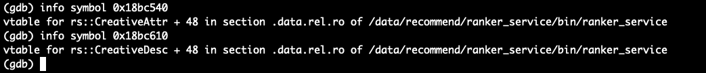
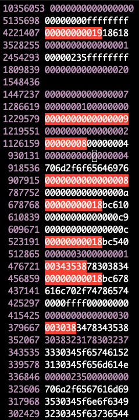

# 简述

```shell
$ pid=$(pgrep ranker_service)
$ pmap -x $pid
9085:   ./bin/ranker_service --cloud_region=aws-se --gray_cloud_list=none
Address           Kbytes     RSS   Dirty Mode  Mapping
0000000000400000   19180    7236       0 r-x-- ranker_service
00000000018bb000     280     168      24 r---- ranker_service
0000000001901000      92      40      40 rw--- ranker_service
0000000001918000     212     120     120 rw---   [ anon ]
0000023412800000  262144  216280  216280 rw---   [ anon ]
000002342f000000  528384  524292  524292 rw---   [ anon ]
0000023453800000  262144  262144  262144 rw---   [ anon ]
0000023469c00000  262144  262144  262144 rw---   [ anon ]
0000023486000000  262144  262144  262144 rw---   [ anon ]
00000234aec00000  524288  518296  518296 rw---   [ anon ]
00000234db400000  262144  150220  150220 rw---   [ anon ]
0000023546400000 23330816 23188160 23188160 rw---   [ anon ]
0000023b50400000  303104  294920  294920 rw---   [ anon ]
0000023b69000000  475136  458768  458768 rw---   [ anon ]
...
$ gcore $pid
```

**dump**

```shell
$ gdb bin/ranker_service core.9085
(gdb) dump binary memory result.bin 0x23546400000 0x23586400000  # dump 1G 内存数据

## dump 内存块 0x23546400000 全部数据
# 计算地址
> hex(0x0000023546400000 + 23330816 * 1024) # python3
'0x23ad6400000'
(gdb) dump binary memory result.bin 0x23546400000 0x23ad6400000  # dump 区块全部数据 23330816KB
```

**统计 vtable**

```shell
$ hexdump result.bin | awk '{printf "%s%s%s%s\n%s%s%s%s\n", $5,$4,$3,$2,$9,$8,$7,$6}' | sort | uniq -c | sort -nr  > hex.t
$ hexdump core.9085 | awk '{printf "%s%s%s%s\n%s%s%s%s\n", $5,$4,$3,$2,$9,$8,$7,$6}' | sort | uniq -c | sort -nr  | head
```





# 参考

- [通过 Core Dump 分析内存泄漏](https://stackoverflow.com/questions/27598986/how-to-analyze-memory-leak-from-coredump)
- [pmap + core dump 排查内存泄漏](https://panzhongxian.cn/cn/2020/12/memory-leak-problem-1/)

