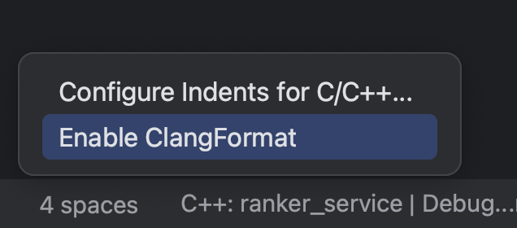

# 风格指南

## Google C++ Style Guide

- [英文](https://google.github.io/styleguide/cppguide.html)
- [中文](https://zh-google-styleguide.readthedocs.io/en/latest/)

# 工程中使用统一代码风格

## .clang-format

安装工具

```shell
brew install clang-format
```

导出指定格式的 .clang-format 配置文件

```shell
clang-format -style=Google -dump-config > .clang-format
clang-format -style=llvm -dump-config > .clang-format
```

格式化文件

```shell
$ cat t.cpp
#include "iostream"
int main() {
return 0;
}
$ clang-format -style=Google t.cpp
#include "iostream"
int main() { return 0; }
```

Inplace 格式化文件

```shell
$ clang-format -style=Google -i t.cpp
```

# 在 IDE 中使用 `.clang-format`

- `CLion` 可以识别并应用项目根目录下的 `.clang-format` 文件，如果没有的话，可以点击右下角的 spaces 信息框，再点击 `Enable ClangFormat`

