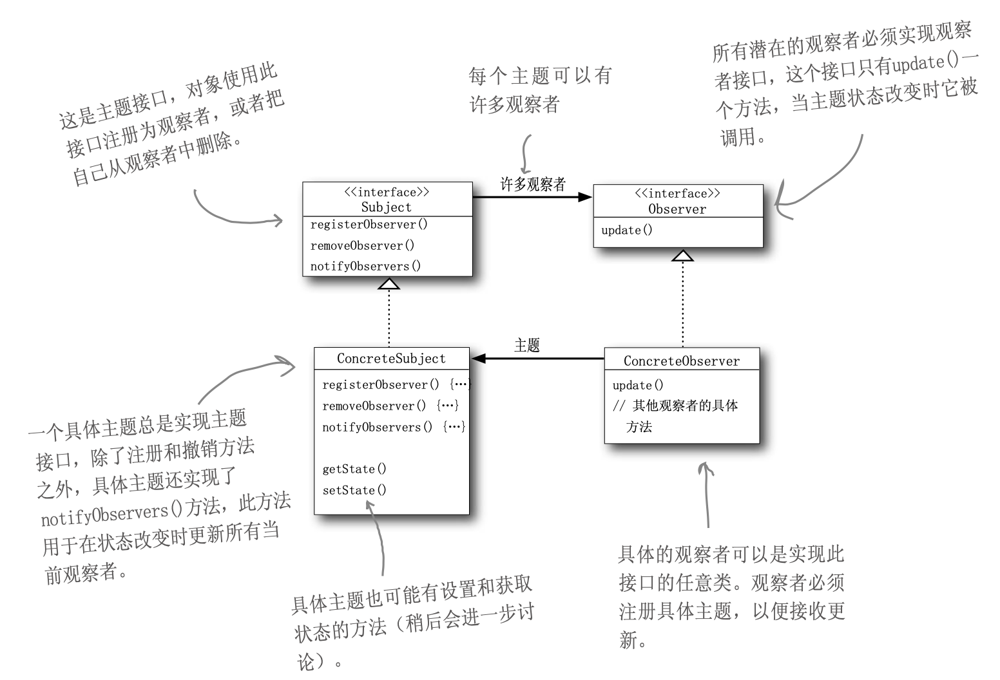
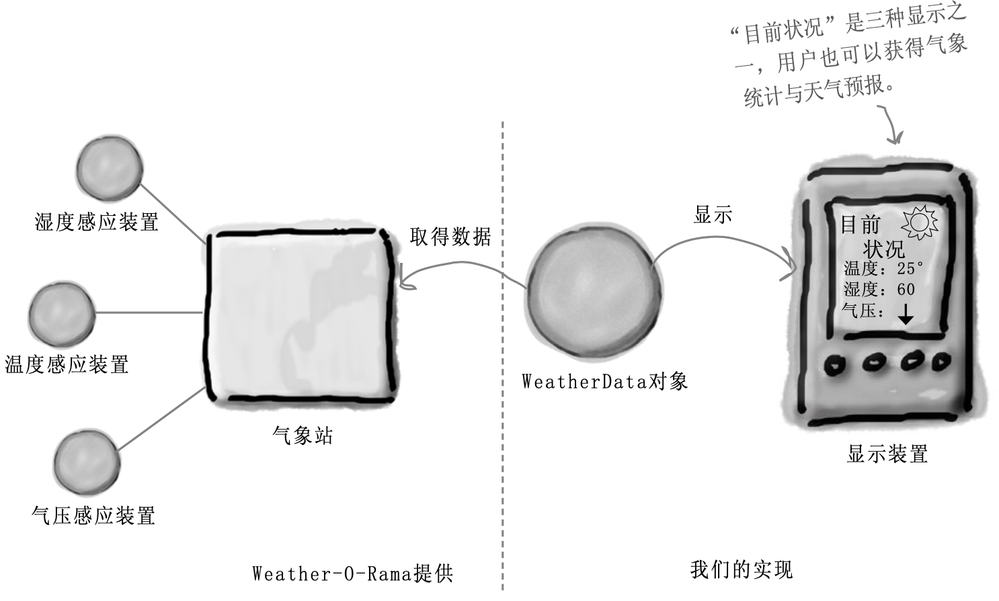
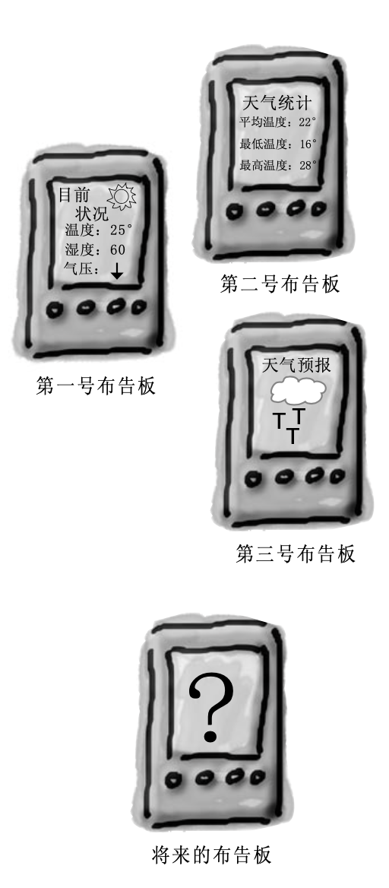
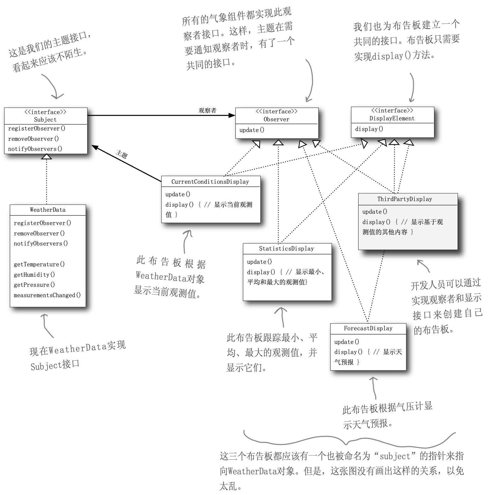

# 定义

主题 + 订阅者 = 观察者模式。**观察者模式** 定义了对象之间的一对多依赖，这样一来，当一个对象改变状态时，它的所有依赖者都会收到通知并自动更新。 



# 松耦合的威力

当两个对象之间松耦合，它们依然可以交互，但是不太清楚彼此的细节。观察者模式提供了一种对象设计，让主题和观察者之间松耦合。松耦合的设计之所以能让 OO 系统更有弹性，能够应对变化，是因为对象之间的互相依赖降到了最低。

**为了交互对象之间的松耦合设计而努力。**

# 气象监测应用



我们需要设计一个气象监测应用，为多种布告板提供数据支持，原始数据从气象站获取。我们可以假定使用 WeatherData 类实现我们的功能，该类有三个 getter 方法，可以从气象站获取数据，这三个 getter 方法如下。

```java
float getTemperatuer();		// 获取温度
float getHumidity();			// 获取湿度
float getPressure();			// 获取气压
```

当气象站更新数据时，会调用 `measurementsChanged()` 方法。我们实现三个使用天气数据的，目前状况、气象统计、天气预报，一但 WeatherData 有数据更新，这些布告板必须马上更新。且，此系统必须可扩展，方便后续定制其他布告板。



类图设计如下。



