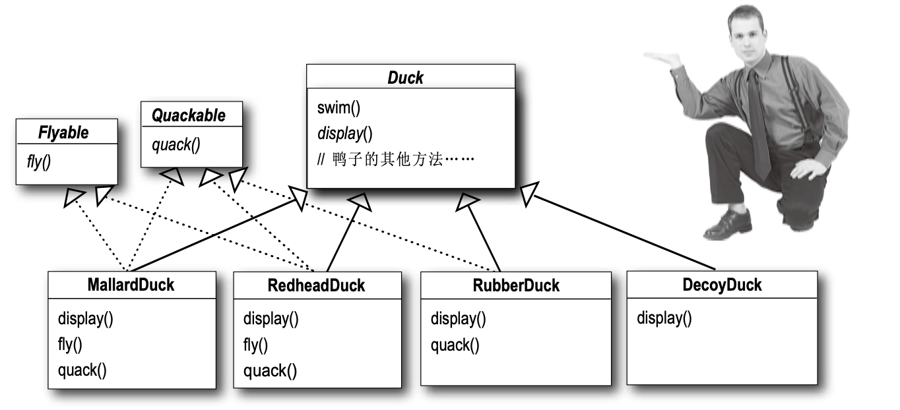
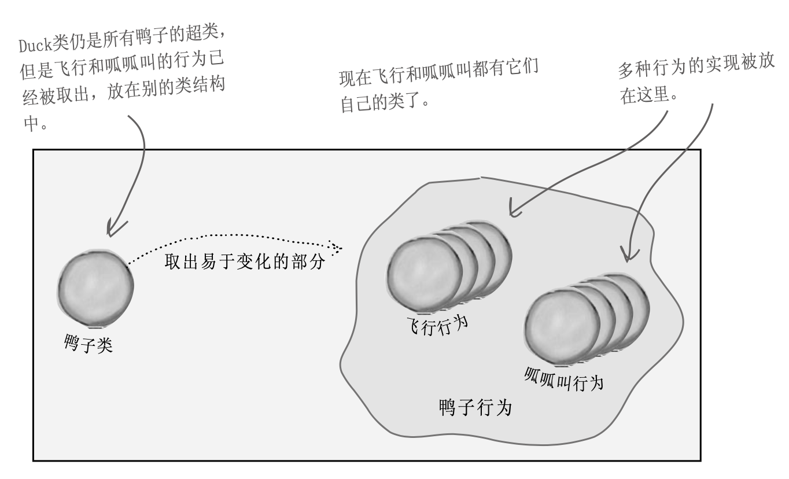
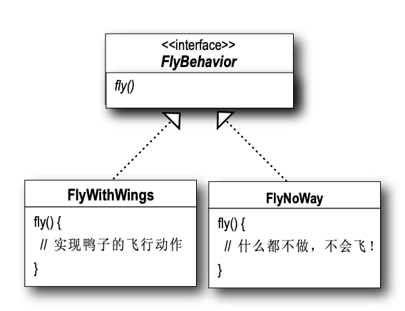
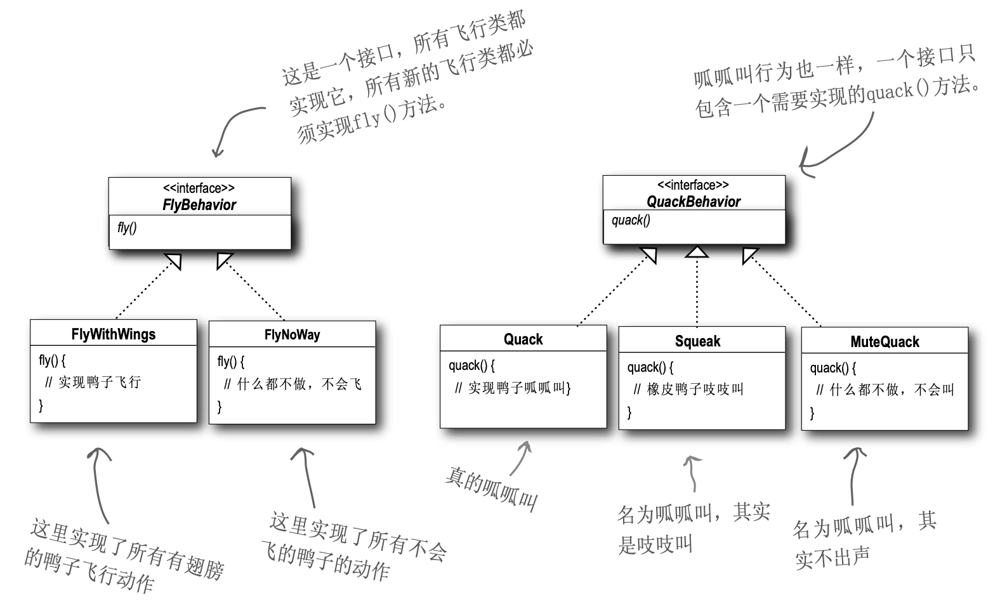
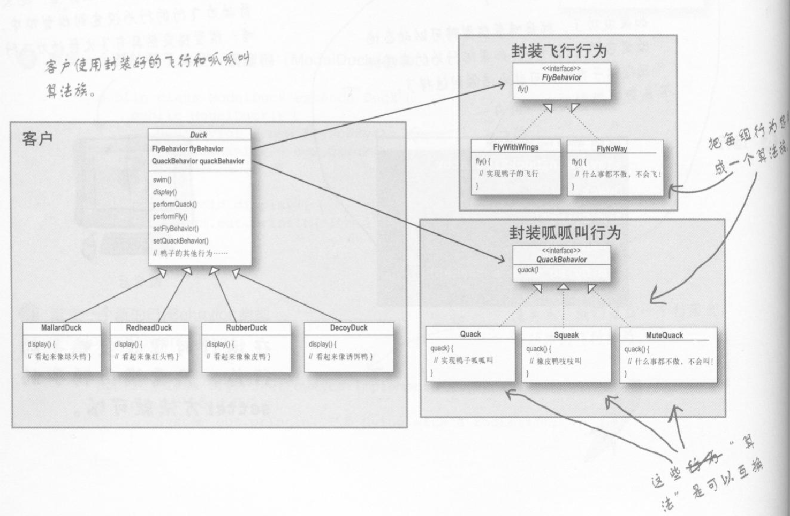

# 目录

- 引言
- 观察者模式

# 引言

设计模式系列，主要参考 《Head First 设计模式》 一书。

# 模拟鸭子

有这样一个需求，需要设计模拟鸭子游戏，游戏中有多种鸭子，鸭子都会叫和游泳，但是有不同的外观。简单的，我们采用 **继承** 来实现。首先，定义抽象类 Duck。

```java
public abstract class Duck {
    public void quack() {
        System.out.println("quack quack!");
    }

    public void swim() {
        System.out.println("I am swimming!");
    }

    abstract void display();
}
```

基于基类Duck，我们创造绿头鸭和红头鸭。

```java
// 绿头鸭
public class MallardDuck extends Duck {
    @Override
    void display() {
        System.out.println("green head");
    }
}

// 红头鸭
public class RedHeadDuck extends Duck {
    @Override
    void display() {
        System.out.println("red head");
    }
}
```

# 会飞的鸭子

基于上面的鸭子，我们还需要添加会飞的技能。借助继承，我们在基类中添加飞行方法。

```java
public abstract class Duck {
    public void quack() {
        System.out.println("quack quack!");
    }

    public void swim() {
        System.out.println("I am swimming!");
    }

    public void fly() {
        System.out.println("I am flying!");
    }

    abstract void display();
}
```

但是，可怕的事情发生了。在添加橡皮鸭的时候，竟然会飞！因为疏于设计，导致局部的修改，影响到了所有的鸭子对象。该怎么办呢？试下 **覆盖** 吧，在橡皮鸭中，实现飞行方法，覆盖父类行为，但是什么都不做。

```java
public class RubberDuck extends Duck {

    @Override
    public void fly() {
        // do nothing
    }

    @Override
    void display() {
        System.out.println("I am rubber duck");
    }
}
```

似乎，解决了问题。是不是可以使用接口呢，只有会飞的鸭子才实现此接口。



但是如此，重复代码会增加，因为对同样的行为需要重复实现，比如需要对所有呱呱叫的鸭子，需要在 `quack` 方法中实现呱呱叫的行为。

问题归零，来重新设计。**继承**不能很好地解决问题，因为鸭子的行为在不断的改变，并且让鸭子实现具有所有行为是不合理的。**接口** 不具有具体实现，所以继承接口无法实现代码复用。

**找出应用中可能需要变化之处，把它们独立出来，不要和那些不需要变化的代码混在一起。** 把会变化的部分取出并封装，好让其他部分不受影响。依据此原则，**把鸭子的行为从 Duck 类中抽取出来**。把 Duck 类中的 `fly` 和 `quack` 会随鸭子不同而变化的行为，从 Duck 类中分开。



我们希望设计具有弹性，可以指定行为到鸭子实例。可以把鸭子的行为放在分开的类中，专门提供某行为接口的实现。**针对接口编程，而不是针对实现编程。**利用接口代表每个行为，比如 `FlyBehavior` 和 `QuackBehavior` ，行为的每个实现都将实现其中的一个接口。这次，鸭子类不负责实现 Flying 和 Quacking 接口，由我们制造一组其他类专门实现 `FlyBehavior` 和 `QuackBehavior`，这称为行为类。



**针对接口编程**真正的意思是**针对超类型 (supertype)编程**。利用**多态**，程序可以针对超类型编程，执行时会根据 实际状况执行到真正的行为。

```java
// 针对实现编程
Dog d = new Dog( ); 
d.bark( );

// 针对接口/超类型编程
Animal animal = new Dog( ); 
animal.makeSound( ); 

// 行时指定具体实现
Animal a = getAnimal( );
a.makeSound( );
```

最终的实现如下。



至此。



**少用继承，多用组合。**

**策略模式** 定义了算法族，分别封装起来，让它们之间可以互相替换，此模式让算法的变化独立于使用算法的客户。

**要点** 良好的OO设计必须具备 **可复用、可扩充、可维护** 三个特性，模式可以让我们构建出具有良好OO设计质量的系统。