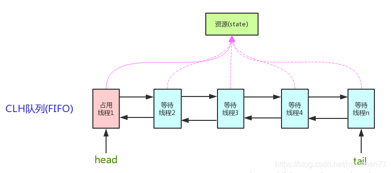

# 锁分类

- 公平锁 / 非公平锁
- 可重入锁 / 不可重入锁
- 独享锁 / 共享锁
- 互斥锁 / 读写锁
- 乐观锁 / 悲观锁
- 分段锁
- 偏向锁 / 轻量级锁 / 重量级锁
- 自旋锁

## 公平锁 & 非公平锁

以多线程申请及获取锁的顺序区分，先申请先得则为公平锁。非公平锁容易造成饥饿现象，但吞吐量优于公平锁（公平锁实现会先判断是否有前驱线程在等待）。

`ReentrantLock`  可通过构造参数指定为公平锁，默认非公平锁，基于AQS实现线程调度。

`synchronized` 没有线程调度机制，所以为非公平锁。

## 可重入锁 & 不可重入锁

可重入锁可重复可递归调用的锁，行为为一个线程可以对同一对象多次加锁。

## 独享锁 & 共享锁

独享锁一次只能被一个线程加锁，共享锁可被多个线程加锁。

## 互斥锁 & 读写锁

**互斥锁**

访问临界资源前加锁，访问后解锁。加锁后，再次加锁会被阻塞，直到当前进程解锁。同一时间，只有一个线程，能够访问被互斥锁保护的资源。

**读写锁**

读写锁由read模式的共享锁和write模式的互斥锁组成，读写锁有三种状态，读加锁状态、写加锁状态、不加锁状态。

## 乐观锁 & 悲观锁

**悲观锁**

总是假设最坏情况，每次去拿数据的时候都认为别人会修改，所以每次在拿数据的时候都会上锁，这样别人想拿这个数据就会阻塞直到它拿到锁（**共享资源每次只给一个线程使用，其它线程阻塞，用完后再把资源转让给其它线程**）。传统的关系型数据库里边就用到了很多这种锁机制，比如行锁，表锁等，读锁，写锁等，都是在做操作之前先上锁。`Java`中`synchronized`和`ReentrantLock`等独占锁就是悲观锁思想的实现。

**乐观锁**

总是假设最好的情况，每次去拿数据的时候都认为别人不会修改，所以不会上锁，但是在更新的时候会判断一下在此期间别人有没有去更新这个数据，可以使用版本号机制和CAS算法实现。乐**观锁适用于多读的应用类型，这样可以提高吞吐量**，像数据库提供的类似于`write_condition`机制，其实都是提供的乐观锁。在`Java`中`java.util.concurrent.atomic`包下面的**原子变量类就是使用了乐观锁的一种实现方式CAS实现的**。

## 分段锁

分段锁是一种锁的设计，通过减小锁的粒度，提升多并发程序性能。

## 偏向锁 & 轻量级锁 & 重量级锁

JVM为了提高锁的获取与释放效率，在对象头中添加字段，使得对象监视器可获取其锁的状态，锁的状态如下。

- 无锁状态
- 偏向锁状态
- 轻量级锁状态
- 重量级锁状态

**偏向锁**

偏向锁是指一段同步代码一直被一个线程所访问，那么该线程会自动获取锁。降低获取锁的代价。

**轻量级**

轻量级锁是指当锁是偏向锁的时候，被另一个线程所访问，偏向锁就会升级为轻量级锁，其他线程会通过自旋的形式尝试获取锁，不会阻塞，提高性能。

**重量级锁**

重量级锁是指当锁为轻量级锁的时候，另一个线程虽然是自旋，但自旋不会一直持续下去，当自旋一定次数的时候，还没有获取到锁，就会进入阻塞，该锁膨胀为重量级锁。重量级锁会让其他申请的线程进入阻塞，性能降低。

## 自旋锁

**自旋锁（spinlock）：是指当一个线程在获取锁的时候，如果锁已经被其它线程获取，那么该线程将循环等待，然后不断的判断锁是否能够被成功获取，直到获取到锁才会退出循环**。

它是为实现保护共享资源而提出一种锁机制。其实，自旋锁与互斥锁比较类似，它们都是为了解决对某项资源的互斥使用。**无论是互斥锁，还是自旋锁，在任何时刻，最多只能有一个保持者，也就说，在任何时刻最多只能有一个执行单元获得锁**。但是两者在调度机制上略有不同。对于互斥锁，如果资源已经被占用，资源申请者只能进入睡眠状态。但是自旋锁不会引起调用者睡眠，如果自旋锁已经被别的执行单元保持，调用者就一直循环在那里看是否该自旋锁的保持者已经释放了锁，”自旋”一词就是因此而得名。

**实现示例**

```java
public class SpinLock {
   private AtomicReference<Thread> cas = new AtomicReference<Thread>();
   public void lock() {
       Thread current = Thread.currentThread();
       // 利用CAS
       while (!cas.compareAndSet(null, current)) {
           // DO nothing
       }
   }
   public void unlock() {
       Thread current = Thread.currentThread();
       cas.compareAndSet(current, null);
   }
}
```

lock() 方法利用的CAS，当第一个线程A获取锁的时候，能够成功获取到，不会进入while循环，如果此时线程A没有释放锁，另一个线程B又来获取锁，此时由于不满足CAS，所以就会进入while循环，不断判断是否满足CAS，直到A线程调用unlock方法释放了该锁。

**问题**

1、如果某个线程持有锁的时间过长，就会导致其它等待获取锁的线程进入循环等待，消耗CPU。使用不当会造成CPU使用率极高。
2、上面Java实现的自旋锁不是公平的，即无法满足等待时间最长的线程优先获取锁。不公平的锁就会存在“线程饥饿”问题。

**优点**

1. 自旋锁不会使线程状态发生切换，一直处于用户态，即线程一直都是active的；不会使线程进入阻塞状态，减少了不必要的上下文切换，执行速度快
2. 非自旋锁在获取不到锁的时候会进入阻塞状态，从而进入内核态，当获取到锁的时候需要从内核态恢复，需要线程上下文切换。（线程被阻塞后便进入内核（Linux）调度状态，这个会导致系统在用户态与内核态之间来回切换，严重影响锁的性能）

**总结**

1. 自旋锁：线程获取锁的时候，如果锁被其他线程持有，则当前线程将循环等待，直到获取到锁。
2. 自旋锁等待期间，线程的状态不会改变，线程一直是用户态并且是活动的(active)。
3. 自旋锁如果持有锁的时间太长，则会导致其它等待获取锁的线程耗尽CPU。
4. 自旋锁本身无法保证公平性，同时也无法保证可重入性。
5. 基于自旋锁，可以实现具备公平性和可重入性质的锁。

# 关键词

- CAS
  - Compare And Swap（比较并交换）
  - AQS 中使用 CAS 设置 State
- AQS
  - `AbstractQueuedSynchronizer` 的简称
  - 提供了原子式管理同步状态、阻塞和唤醒线程功能以及队列模型的简单框架
- CLH
  - CLH（Craig, Landin, and Hagersten locks）：是一个自旋锁，能确保无饥饿性，提供先来先服务的公平性。
- ReentrantLock
  - 可重入锁，线程可对一个临界资源重复加锁
- synchronized
  - 可重入独享锁
- volatile
- ReeReentrantLock
  - 可重入独享锁，AQS
- ReentrantReadWriteLock
  - 可重入共享锁，AQS

## synchronized

jdk 1.5 之前，`synchronized` 是一种独占式的重量级锁，底层使用系统的 mutex lock 实现。jdk 1.6 之后，做了大量优化，加入了CAS，轻量级锁和偏向锁的功能，性能上已经跟ReentrantLock相差无几。

**同步代码块**

monitorenter指令插入到同步代码块的开始位置，monitorexit指令插入到同步代码块的结束位置，JVM需要保证每一个monitorenter都有一个monitorexit与之相对应。任何对象都有一个monitor与之相关联，当且一个monitor被持有之后，他将处于锁定状态。线程执行到monitorenter指令时，将会尝试获取对象所对应的monitor所有权，即尝试获取对象的锁。

**同步方法**

synchronized方法则会被翻译成普通的方法调用和返回指令如:invokevirtual、areturn指令，有一个ACC_SYNCHRONIZED标志，JVM就是通过该标志来判断是否需要实现同步的，具体过程为：当线程执行该方法时，会先检查该方法是否标志了ACC_SYNCHRONIZED，如果标志了，线程需要先获取monitor，获取成功后才能调用方法，方法执行完后再释放monitor，在该线程调用方法期间，其他线程无法获取同一个monitor对象。其实本质上和synchronized块相同，只是同步方法是用一种隐式的方式来实现，而不是显式地通过字节码指令。

| 锁对象       | 粒度                  |
| ------------ | --------------------- |
| 普通同步方法 | **当前实例对象**      |
| 静态同步方法 | **当前类的class对象** |
| 同步方法块   | 关键词括号内的对象    |

```java
public class TestLock {
    private static final ExecutorService es = Executors.newFixedThreadPool(16);

    void sleep() {
        try {
            Thread.sleep(5000);
        } catch (Exception e) {
            e.printStackTrace();
        }
    }

    void fe() {
        System.out.println("fe: " + LocalDateTime.now());
        sleep();
    }

    synchronized void fd() {
        System.out.println("fd: " + LocalDateTime.now());
    }

    synchronized void fc() {
        System.out.println("fc: " + LocalDateTime.now());
    }

    synchronized void fb() {
        System.out.println("fb: " + LocalDateTime.now());
        fc();
        es.submit(this::fd);
        sleep();
    }

    synchronized void fa() {
        System.out.println("fa: " + LocalDateTime.now());
        sleep();
    }

    public static void main(String[] args) {
        TestLock tl = new TestLock();
        es.submit(tl::fa);
        es.submit(tl::fb);
        es.submit(tl::fe);
    }
}

// output
fe: 2021-03-11T19:57:10.698877
fa: 2021-03-11T19:57:10.698912
fb: 2021-03-11T19:57:15.703141
fc: 2021-03-11T19:57:15.703565
fd: 2021-03-11T19:57:20.708362
  
// description
1. 普通同步方法，锁粒度为当前实例对象
2. synchronized 为可重入锁，在 fb 中调用 fc 需要重复为当前实例对象上锁
3. 重入锁不适用于子线程
```

## AQS

AQS：AbstractQuenedSynchronizer抽象的队列式同步器。是除了java自带的synchronized关键字之外的锁机制。

核心思想，如果被请求的共享资源空闲，那么将当前请求资源的线程设置为有效的工作线程，将共享资源设置为锁定状态；如果共享资源被占用，就需要一定的阻塞等待机制来保证锁分配。这个机制主要用的是CLH队列的变体实现的，将暂时获取不到锁的线程加入到队列中。



**AQS是将每一条请求共享资源的线程封装成一个CLH锁队列的一个结点（Node），来实现锁的分配。**

CLH：Craig、Landin and Hagersten队列，是单向链表，AQS中的队列是CLH变体的虚拟双向队列（FIFO），AQS是通过将每条请求共享资源的线程封装成一个节点来实现锁的分配。

AQS使用一个volatile的int类型的成员变量来表示同步状态，通过内置的FIFO队列来完成资源获取的排队工作，通过CAS完成对State值的修改。

## CAS

`CAS`是英文单词`Compare and Swap`（比较并交换），是一种有名的无锁算法。无锁编程，即不使用锁的情况下实现多线程之间的变量同步，也就是在没有线程被阻塞的情况下实现变量的同步，所以也叫非阻塞同步（`Non-blocking Synchronization`）。CAS算法涉及到三个操作数

1. 需要读写的内存值 V

2. 进行比较的值 A

3. 拟写入的新值 B

更新一个变量的时候，只有当变量的预期值A和内存地址V当中的实际值相同时，才会将内存地址V对应的值修改为B，否则不会执行任何操作。一般情况下是一个自旋操作，即不断的重试。

## 指令重排

为了提高程序执行的性能，编译器和执行器（处理器）通常会对指令做一些优化（重排序）。

## volatile

并发编程的三大特性，原子性、可见性、有序性。synchronized可保证三大特性（保护的代码块通知只能有一个线程执行，单线程没有指令重排的问题），volatile 可以保证可见性（把工作内存中的最新变量强制刷新至主存）和有序性（编译器在生成字节码时，在指令序列中添加“**内存屏障**”来禁止指令重排序）。

# 对比

## ReentrantLock VS Synchronized

| -          | ReentrantLock                  | Synchronized     |
| ---------- | ------------------------------ | ---------------- |
| 锁实现机制 | AQS                            | 监视器模式       |
| 灵活性     | 支持响应中断、超时、尝试获取锁 | 不灵活           |
| 释放形式   | 必须显式调用 unlock 释放锁     | 自动释放监视器   |
| 锁类型     | 公平锁 & 非公平锁              | 非公平锁         |
| 条件队列   | 可关联多个条件队列             | 关联一个条件队列 |
| 可重入性   | 可重入                         | 可重入           |

# 关联

- ConcurrentHashMap
  - Jdk 1.7 VS Jdk 1.8

## ConcurrentHashMap

**JDK 1.7**

Jdk 1.7 中，HashMap 底层为数组+链表实现，ConcurrentHashMap与其不同的是，添加了 Segment 作为数组+链表的上层结构，Concurrent 继承 ReentrantLock，对 Segment 加锁，实现不同 Segment 可以同时读写。在写入获取key所在Segment是需要保证可见性，ConcurrentHashMap使用如下方法保证可见性，取得最新的Segment。

```java
Segment<K,V> s = (Segment<K,V>)UNSAFE.getObjectVolatile(segments, u)
```

写入 Segment 时，需要获取锁，先使用自旋锁，超过重试次数后，通过 lock 获取锁（会被阻塞，切换至内核态等待）。

**JDK 1.8**

Jdk 1.8 中的 ConcurrentHashMap 刨除了 Segment 的设计，直接 <大数组+[链表|红黑树]> 的方式，如果数组对应的链表超过一定阈值后，转换为红黑树。大数组使用 volatile 关键字修饰。

对于写操作，key对应的数组元素，使用 synchronized 关键字申请锁（当然，如果为null，则不需要加锁），然后进行操作。

对于读操作，数组使用 volatile 保证可见性，数组的每个元素为Node实例（jdk 1.7 为 HashEntry），他的 key 和 hash 值都使用 final 修饰，无需担心可见性。value 和下一个元素的引用由 volatile 修饰，保证可见性。

```java
static class Node<K,V> implements Map.Entry<K,V> {
  final int hash;
  final K key;
  volatile V val;
  volatile Node<K,V> next;
}
```

对于 key 对应的数组元素的可见性，使用 Unsafe 的 getObjectVolatile 方法保证。

```java
static final <K,V> Node<K,V> tabAt(Node<K,V>[] tab, int i) {
  return (Node<K,V>)U.getObjectVolatile(tab, ((long)i << ASHIFT) + ABASE);
}
```

## mutex lock

所谓锁，在计算机中，本质是内存中的一块空间，其值被赋予了加锁/未加锁的含义，其底层实现，是基于计算机系统中的原子操作。

mutex lock 核心包含两点。

- Compare And Set
  - 互斥锁是对临界区的保护，能否进入临界区即能否获取到锁，思路都是判断并置位一个标志位，这个标志位本身可以是一个普通的内存变量，关键在于，对于这个变量的"判断并置位"操作需要是原子的。
  - 计算机实现原子操作，对于单核机器，关中断防止调度即可；多核理论上可使用 spinlock 保护，实际一般通过原子汇编语言实现，比如x86的tsl指令（test and set），可以用一条“无法继续分割的”汇编指令实现判断变量值并根据是否为0进行置位，具体这个指令实现原子性一般通过锁总线实现，也就是我执行这条指令时，其它核都不能访问这个地址了。
- 根据所是否获得，决定执行策略
  - 如果锁持有，则继续运行
  - 如果所没有获取到，常规做法是将当前任务挂起，并附在 mutex 变量对应的链表上，一旦锁被释放，查找锁上挂起的任务并唤醒

# 参考

- https://www.cnblogs.com/jyroy/p/11365935.html
- https://mp.weixin.qq.com/s/KxYZlBu0ctB50XtkbfB4iQ
- https://www.cnblogs.com/hustzzl/p/9343797.html
- https://www.cnblogs.com/barrywxx/p/8678698.html
- https://www.cnblogs.com/xckxue/p/8685675.html
- https://blog.csdn.net/liao0801_123/article/details/85888657
- https://stackoverflow.com/questions/7855700/why-is-volatile-used-in-double-checked-locking
- https://tech.meituan.com/2019/12/05/aqs-theory-and-apply.html
- https://mp.weixin.qq.com/s?__biz=MjM5NjQ5MTI5OA==&mid=2651749434&idx=3&sn=5ffa63ad47fe166f2f1a9f604ed10091
- http://www.jasongj.com/java/concurrenthashmap/
- https://www.zhihu.com/question/332113890/answer/762392859

