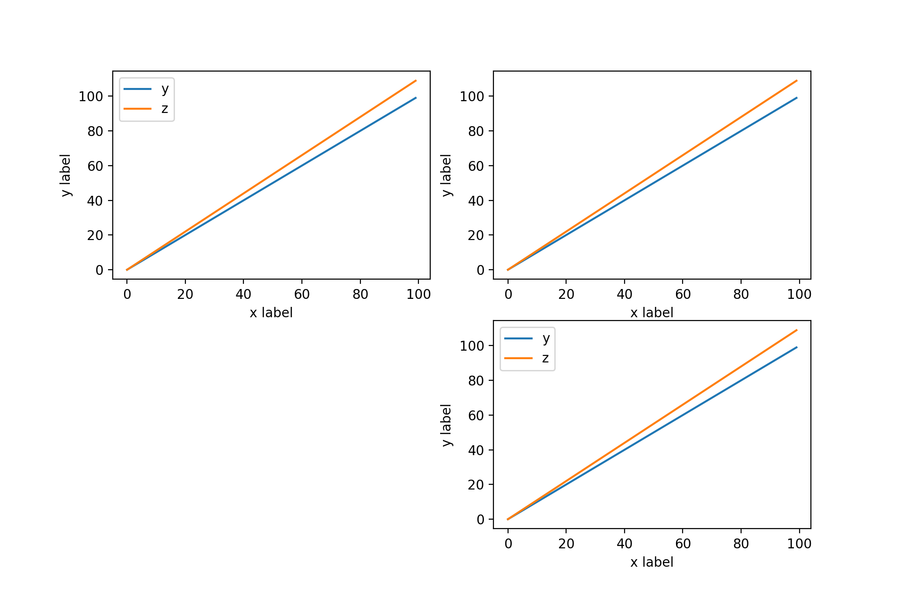

# 参数

## alpha

- 透明度
- `float [0, 1]`

## bins

- 分段区间
- 可以是一个整数或一个序列
- 如果是整数n，将会均匀分为n个区间，否则按指定的序列进行分段

# 配置

## subplot

绘制子图。

**原型**

```python
subplot(nrows, ncols, index, **kwargs)
```

**示例**

```python
import matplotlib.pyplot as plt

y = [i for i in range(100)]
z = [i * 1.1 for i in range(100)]

plt.subplot(2, 2, 1)
plt.xlabel('x label')
plt.ylabel('y label')
plt.plot(y, label='y')
plt.plot(z, label='z')
plt.legend()

#### no legend
plt.subplot(2, 2, 2)
plt.xlabel('x label')
plt.ylabel('y label')
plt.plot(y, label='y')
plt.plot(z, label='z')

plt.subplot(2, 2, 4)
plt.xlabel('x label')
plt.ylabel('y label')
plt.plot(y, label='y')
plt.plot(z, label='z')
plt.legend()

# no NO.3 subplot 
plt.show()
```



```python
# 数据来自鸢尾花数据集，绘制散点图
columns = ['Id', 'SepalLengthCm', 'SepalWidthCm', 'PetalLengthCm', 'PetalWidthCm', 'Label']
for i in range(2, 5):
    plt.subplot(1, 3, i - 1)
    plt.scatter(features[:, 1], features[:, i], c=labels, s=50, cmap='viridis')
    plt.title(columns[i])
plt.show()

# 自定义 subplot size
start = 2
end = 5
fg, axs = plt.subplots(end - start, end - start, figsize=(25, 25))
for i in range(start, end):
    for j in range(start, end):
        axs[i - start, j - start].scatter(features[:, 1], features[:, i], c=labels, s=25, cmap='viridis')
        axs[i - start, j - start].set_title(columns[i] + ' - ' + columns[j])
```

