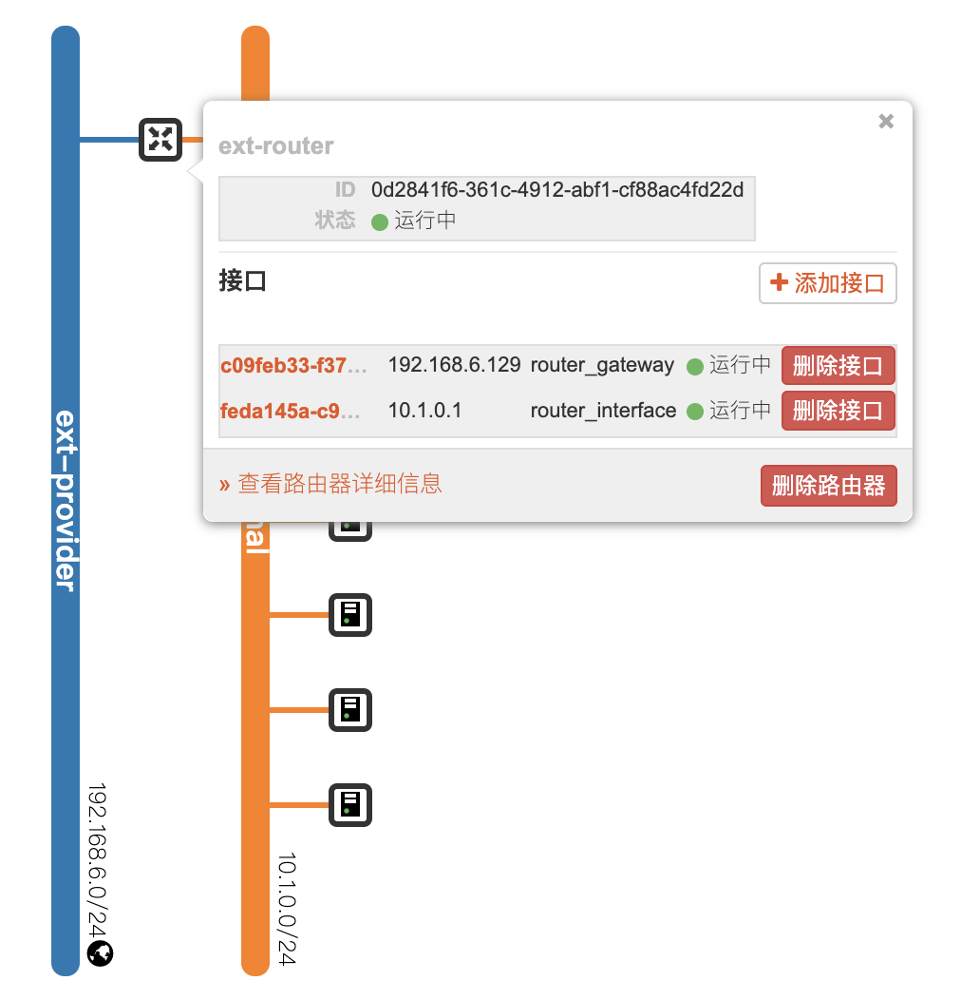

[toc]

# 搭建

## 节点

```shell
# 这里有三个节点, dp1 dp2 dp3
~$ cat /etc/hosts
...
10.1.0.191   dp1
10.1.0.229   dp2
10.1.0.110   dp3
```

将节点信息在各节点的 `/etc/hosts` 内配置。

## 安装 jdk

```shell
# centos 8
sudo dnf install java-11-openjdk-devel
```

## 配置免密登录

```shell
ssh-keygen -t rsa -c "email" # 或者直接 ssh-keygen
ssh-copy-id -i ~/.ssh/id_rsa.pub user@host
```

## 下载 hadoop

```shell
wget https://dlcdn.apache.org/hadoop/common/hadoop-3.3.3/hadoop-3.3.3.tar.gz
```

## 添加环境变量

```shell
sudo vim /etc/profile
# 添加如下内容
export HADOOP_HOME=/usr/local/hadoop-3.3.3
export PATH=${HADOOP_HOME}/bin:$PATH
```

## 修改 hadoop 配置

```shell
cd ${HADOOP_HOME}/etc/hadoop
```

**hadoop-env.sh**

```shell
export JAVA_HOME=/usr/lib/jvm/java-11-openjdk  # openjdk
```

**core-site.xml**

```xml
<configuration>
    <property>
        <!--指定 namenode 的 hdfs 协议文件系统的通信地址-->
        <name>fs.defaultFS</name>
        <value>hdfs://dp1:8020</value>
    </property>
    <property>
        <!--指定 hadoop 集群存储临时文件的目录-->
        <name>hadoop.tmp.dir</name>
        <value>/data/hadoop/tmp</value>
    </property>
</configuration>
```

**hdfs-site.xml**

```xml
<property>
      <!--namenode 节点数据（即元数据）的存放位置，可以指定多个目录实现容错，多个目录用逗号分隔-->
    <name>dfs.namenode.name.dir</name>
    <value>/data/hadoop/namenode/data</value>
</property>
<property>
      <!--datanode 节点数据（即数据块）的存放位置-->
    <name>dfs.datanode.data.dir</name>
    <value>/data/hadoop/datanode/data</value>
</property>
```

**yarn-site.xml**

```xml
<configuration>
    <property>
        <!--配置 NodeManager 上运行的附属服务。需要配置成 mapreduce_shuffle 后才可以在 Yarn 上运行 MapReduce 程序。-->
        <name>yarn.nodemanager.aux-services</name>
        <value>mapreduce_shuffle</value>
    </property>
    <property>
        <!--resourcemanager 的主机名-->
        <name>yarn.resourcemanager.hostname</name>
        <value>dp1</value>
    </property>
</configuration>
```

**mapred-site.xml**

```xml
<configuration>
    <property>
        <!--指定 mapreduce 作业运行在 yarn 上-->
        <name>mapreduce.framework.name</name>
        <value>yarn</value>
    </property>
</configuration>
```

**workers**

```shell
dp1
dp2
dp3
```

## 分发 hadoop

```shell
# 需要在 dp2、dp3 修改 /usr/local/ 目录的写入权限
scp -r /usr/local/hadoop-3.3.3 dp2:/usr/local/
scp -r /usr/local/hadoop-3.3.3 dp3:/usr/local/
```

## 初始化

```shell
# 在 dp1 上执行
hdfs namenode -format
```

## 启动集群

```shell
# ${HADOOP_HOME}/sbin 目录下
# 启动dfs服务
start-dfs.sh
# 启动yarn服务
start-yarn.sh
```

## 查看集群

```shell
$ jps
71938 NodeManager
71285 DataNode
70519 ResourceManager
72124 Jps
71135 NameNode
71550 SecondaryNameNode
```

## 访问

| 端口 | 说明                |
| ---- | ------------------- |
| 8088 | 资源管理界面        |
| 8020 | name node rpc 端口  |
| 9870 | name node http 端口 |
| 9864 | data node http 端口 |

## 配置自启动

```shell
crontab -e
# 添加下面一行
@reboot bash /usr/local/hadoop-3.3.3/sbin/start-dfs.sh && bash /usr/local/hadoop-3.3.3/sbin/start-yarn.sh
```

## Client

如果需要从本地机器向远程的 hadoop 集群传输文件，可以再从线上下载一份 hadoop 程序（保持配置），然后做下面的更改。

- 配置好 PATH 
- 修改 `hadoop-env.sh` 里面的 JAVA_HOME
- `/etc/hosts` 添加对应的主机记录

这里需要注意的是，hadoop 集群可能是用的内网 ip，比如我搭建的 hadoop 集群在 openstack 上面，ip 用的是 `10.1.0.x`。如果是连接在外部网络的机器（192.168.6.x），是不能直接访问的。

```shell
# 本地机器 ip
192.168.6.13

# hadoop 集群
10.1.0.191   dp1
10.1.0.229   dp2
10.1.0.110   dp3
```

如果直接使用下面命令。

```shell
hdfs dfs -copyFromLocal /local/path/to/file /remote/path/to/save
hdfs dfs -copyToLocal /remote/path/to/file /local/path/to/save
```

会报下面的错误。

```shell
➜  ~ hdfs dfs -copyFromLocal /Users/wii/heap /tmp/
2022-06-04 23:20:22,272 WARN util.NativeCodeLoader: Unable to load native-hadoop library for your platform... using builtin-java classes where applicable
2022-06-04 23:21:23,169 WARN hdfs.DataStreamer: Exception in createBlockOutputStream blk_1073741843_1019
org.apache.hadoop.net.ConnectTimeoutException: 60000 millis timeout while waiting for channel to be ready for connect. ch : java.nio.channels.SocketChannel[connection-pending remote=/10.1.0.191:9866]
	at org.apache.hadoop.net.NetUtils.connect(NetUtils.java:589)
	at org.apache.hadoop.hdfs.DataStreamer.createSocketForPipeline(DataStreamer.java:253)
	at org.apache.hadoop.hdfs.DataStreamer.createBlockOutputStream(DataStreamer.java:1774)
	at org.apache.hadoop.hdfs.DataStreamer.nextBlockOutputStream(DataStreamer.java:1728)
	at org.apache.hadoop.hdfs.DataStreamer.run(DataStreamer.java:713)
	...
```

可以看到，会直接访问 10.1.0.191 ，显然是有问题的，因为外部网络没办法直接访问 openstack 的 internal network，解决方案是设置一下路由，下面是 openstack 的网络拓扑。



内部网络是通过一个路由（192.168.6.129）和外部网络连接，下面是在本地添加静态路由的代码。

```shell
sudo route add -net 10.1.0.0 -netmask 255.255.0.0 192.168.6.129
# 下面是删除路由的代码
sudo route -v delete -net 10.1.0.0 -gateway 192.168.6.129
```

也可以在路由器配置。


再去 ping 就可以了。

```shell
➜  ~ ping 10.1.0.191
PING 10.1.0.191 (10.1.0.191): 56 data bytes
64 bytes from 10.1.0.191: icmp_seq=0 ttl=63 time=4.142 ms
64 bytes from 10.1.0.191: icmp_seq=1 ttl=63 time=3.630 ms
64 bytes from 10.1.0.191: icmp_seq=2 ttl=63 time=2.651 ms
^C
--- 10.1.0.191 ping statistics ---
3 packets transmitted, 3 packets received, 0.0% packet loss
round-trip min/avg/max/stddev = 2.651/3.474/4.142/0.619 ms
```

还有一个问题就是，hadoop 集群不要使用外部网络 ip，这样在传输数据的时候都要走一遍外部网络，效率极低。

# MR 作业

## 配置

作业提交 / 环境变量配置集群属性等。

```shell
# 代码中获取配置
Configuration conf = getConf();

# 添加配置
conf.set(key, value)
```

## Job

```shell
# setJarByClass
通过指定类名，获取需要分发到其他节点的Jar包，来执行map、reduce操作。

# setMapperClass
mapper 操作类

# setMapOutputKeyClass
mapper 输出的key类型

# setMapOutputValueClass
mapper 输出的value类型

# setReducerClass
reduce 操作类

# setOutputKeyClass
reduce 输出key类型

# setOutputValueClass
reduce 输出value类型

# setInputFormatClass
输入文件格式

# setOutputFormatClass
输出文件格式

# setNumReduceTasks
设置 reduce 任务数量

# setJobSetupCleanupNeeded
每个task, 是否执行 setup / cleanup 操作

# setSortComparatorClass
设置排序阶段比较器

# setReduceSpeculativeExecution
设置是否开启reduce阶段的推测执行

# setCombinerClass
设置map阶段combine的类；combine运行在reduce之前，也被称为semi-reducer；输入来自map class，输出发送给实际的reduce作为输入。
# 参考: https://www.tutorialspoint.com/map_reduce/map_reduce_combiners.htm

# setCombinerKeyGroupingComparatorClass
设置combine阶段比较器

# setGroupingComparatorClass	
对发往 reduce 的键值对进行分组操作
```

## 文件操作

```shell
# 获取 FileSystem
FileSystem fs = FileSystem.get(conf);

# 判断是否存在
fs.exists(path)

# 删除
fs.delete(path, true);	# (path, recursive)
```
