# 模块

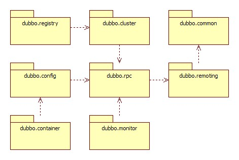

- `dubbo-common` : Util 类和通用模型
- `dubbo-remoting` : **远程通讯模块**，提供通用的客户端和服务端的通讯能力；相当于 dubbo 协议的实现，如果 RPC 使用 RMI 协议则不需要此包；最小原则，可以只看 `dubbo-remoting-api + dubbo-remoting-netty4` 和 `dubbo-remoting-zookeeper` 
- `dubbo-rpc` : **远程调用模块**，抽象各种协议，以及动态代理，只包含一对一调用，不关心集群管理；从包图可以看出，`dubbo-rpc` 是 dubbo 的中心
  - `dubbo-rpc-api` : 抽象各种协议以及动态代理，实现一对一调用
- `dubbo-cluster` : **集群模块**，提供多个服务方伪装为一个提供方能力，包括：负载均衡、容错、路由等，集群的地址列表可以静态配置，也可以由注册中心下发
  - 容错：`Cluster` 接口 + `cluster.support` 包；Cluster 将 Directory 中的多个 Invoker 伪装成一个 Invoker（Java 动态代理），对上层透明；伪装过程中包含了容错逻辑
  - 目录（directory）：`Directory` 接口 + `cluster.directory` 包；Directory 代表了多个 Invoker，可以看做动态变化的 Invoker List，每个 Invoker 对应一个服务端节点
  - 路由（router）：`Router` 接口 + `cluster.router` 包；负责从多个 Invoker 中按路由规则选出子集，用于调用
  - 配置：`Configurator` 接口 + `cluster.configurator` 包
  - 负载均衡（loadbalance）：`LoadBalance` 接口和 `cluster.loadbalance` 包；负责从多个 Invoker 中根据负载均衡算法，选出具体的一个用于本次调用
  - 合并结果（merger）：`Merger` 接口 + `cluster.merger` 包；合并返回结果，用于分组聚合

- `dubbo-registry` : **注册中心模块**，基于注册中心下发地址的集群方式，以及对各种注册中心的抽象
- `dubbo-monitor` : 监控模块，统计服务调用次数，调用时间，调用链路跟踪的服务
- `dubbo-config` : 配置模块，是 dubbo 对外的 API，用户通过 Config 使用 dubbo，隐藏 dubbo 的所有细节
- `dubbo-container` : 容器模块，是一个 Standlone 容器，以简单的 Main 加载 Spring 启动（用于代替容器启动），因为服务通常不需要 Tomcat、JBoss 等Web 容器的特性，没必要用 Web 容器取加载服务
- `dubbo-filter`：**过滤器模块**，提供了内置过滤器；
  - `doubbo-filter-cache` ：缓存过滤器
  - `dubbo-filter-validation` ：参数验证过滤器
- `dubbo-plugin` ：插件模块，提供内置的插件
  - `dubbo-qos` ：提供在线运维命令

# BOM

BOM（Bill Of Materials），为了防止用 Maven 管理 Spring 项目时，不同的项目依赖了不同版本的 Spring，可以使用 Maven BOM 来解决这一问题。

## doubbo-dependencies-bom

[`dubbo-dependencies-bom/pom.xml`](https://github.com/alibaba/dubbo/blob/4bbc0ddddacc915ddc8ff292dd28745bbc0031fd/dependencies-bom/pom.xml)  ，**统一**定义了 Dubbo 依赖的三方库的版本号。

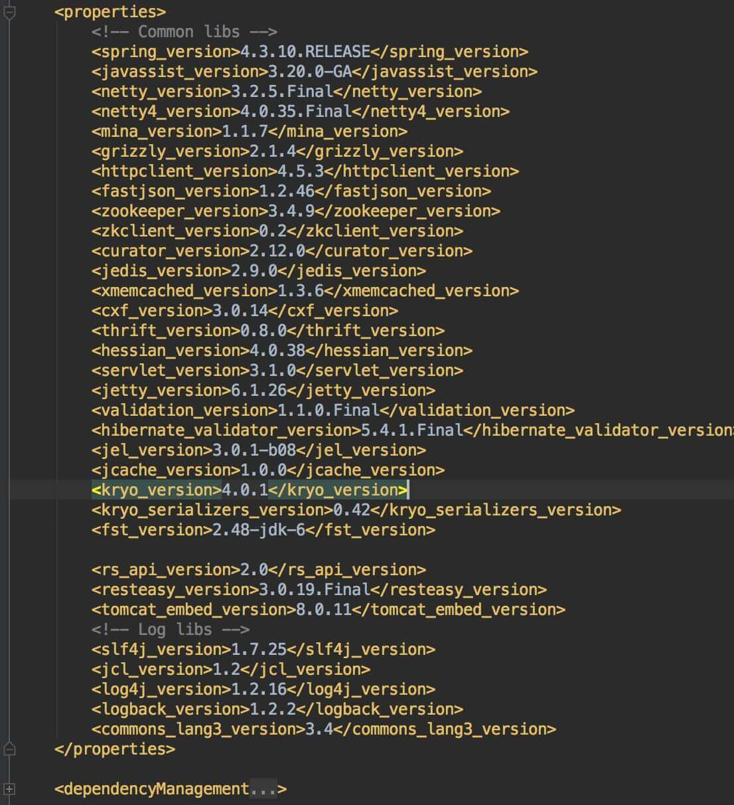`dubbo-parent` ，会引入该 BOM。

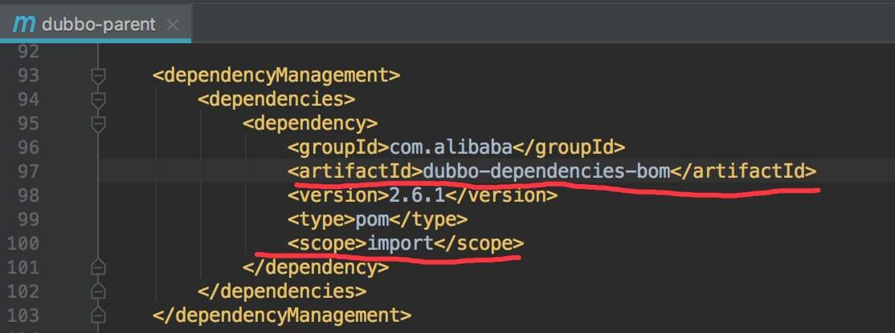

## dubbo-bom

[`dubbo-bom/pom.xml`](https://github.com/alibaba/dubbo/blob/4bbc0ddddacc915ddc8ff292dd28745bbc0031fd/bom/pom.xml)  ，**统一**定义了 Dubbo 的版本号。

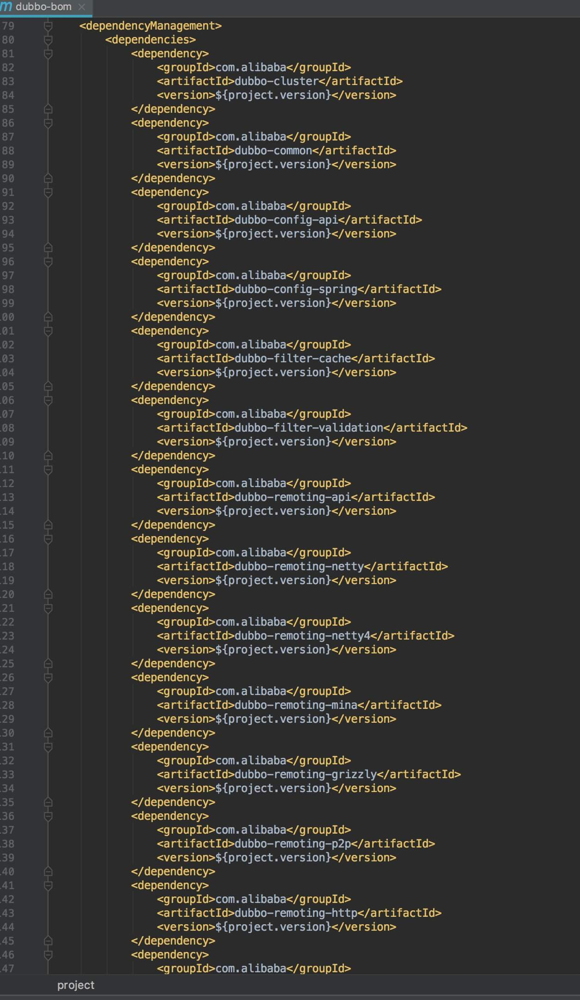

`dubbo-demo` 和 `dubbo-test` 会引入该 BOM 。以 `dubbo-demo` 为例。

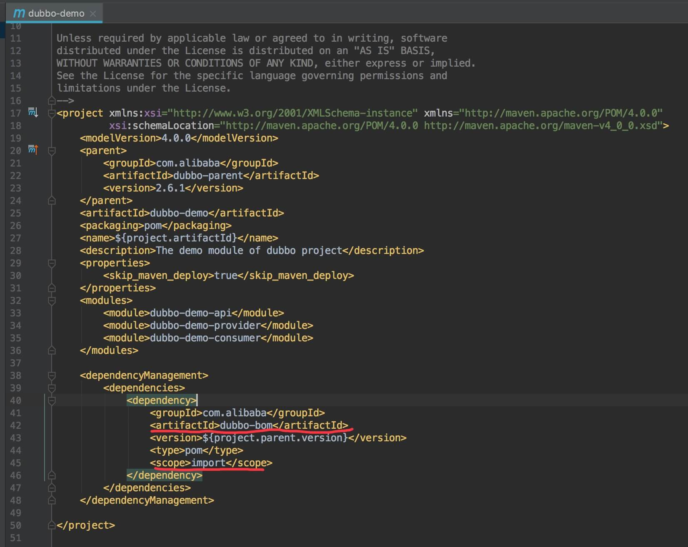

## dubbo-parent

Dubbo 的 Maven 模块，都会引入该 pom 文件。以 `dubbo-cluster` 为例。

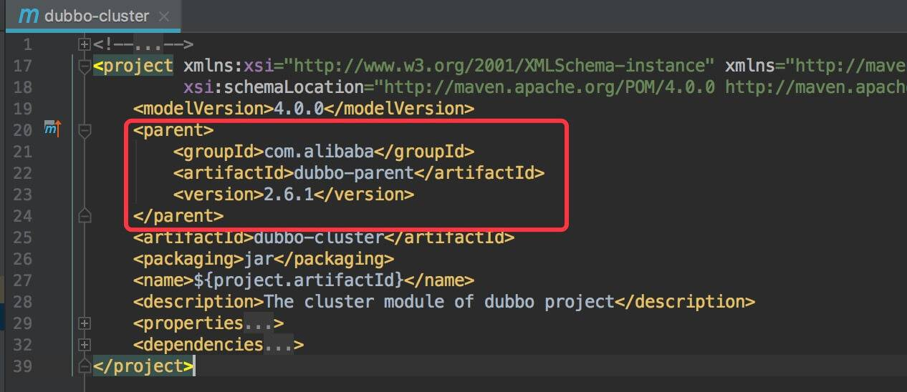

## dubbo-all

`dubbo/all/pom.xml` ，定义了 dubbo 的打包脚本。我们在使用 dubbo 库时，引入该 pom 文件。

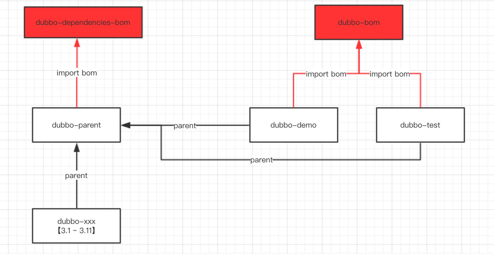

# 流程

- 图中左边淡蓝背景的为服务消费方使用的接口，右边淡绿色背景的为服务提供方使用的接口，位于中轴线上的为双方都用到的接口。
- 图中从下至上分为十层，各层均为单向依赖，右边的黑色箭头代表层之间的依赖关系，每一层都可以剥离上层被复用，其中，Service 和 Config 层为 API，其它各层均为 SPI。
- 图中绿色小块的为扩展接口，蓝色小块为实现类，图中只显示用于关联各层的实现类。
- 图中蓝色虚线为初始化过程，即启动时组装链，红色实线为方法调用过程，即运行时调时链，紫色三角箭头为继承，可以把子类看作父类的同一个节点，线上的文字为调用的方法。

**各层说明**

- **config 配置层**：对外配置接口，以 `ServiceConfig`, `ReferenceConfig` 为中心，可以直接初始化配置类，也可以通过 spring 解析配置生成配置类；由 `dubbo-config` 模块实现
- **proxy 服务代理层**：服务接口透明代理，生成服务的客户端 Stub 和服务器端 Skeleton, 以 `ServiceProxy` 为中心，扩展接口为 `ProxyFactory`
- **registry 注册中心层**：封装服务地址的注册与发现，以服务 URL 为中心，扩展接口为 `RegistryFactory`, `Registry`, `RegistryService`
- **cluster 路由层**：封装多个提供者的路由及负载均衡，并桥接注册中心，以 `Invoker` 为中心，扩展接口为 `Cluster`, `Directory`, `Router`, `LoadBalance`
- **monitor 监控层**：RPC 调用次数和调用时间监控，以 `Statistics` 为中心，扩展接口为 `MonitorFactory`, `Monitor`, `MonitorService`
- **protocol 远程调用层**：封装 RPC 调用，以 `Invocation`, `Result` 为中心，扩展接口为 `Protocol`, `Invoker`, `Exporter`
- **exchange 信息交换层**：封装请求响应模式，同步转异步，以 `Request`, `Response` 为中心，扩展接口为 `Exchanger`, `ExchangeChannel`, `ExchangeClient`, `ExchangeServer`
- **transport 网络传输层**：抽象 mina 和 netty 为统一接口，以 `Message` 为中心，扩展接口为 `Channel`, `Transporter`, `Client`, `Server`, `Codec`
- **serialize 数据序列化层**：可复用的一些工具，扩展接口为 `Serialization`, `ObjectInput`, `ObjectOutput`, `ThreadPool`

**关系说明**

- 在 RPC 中，Protocol 是核心层，只要 Protocol + Invoker + Exporter 就可以完成非透明的 RPC 调用，然后在 Invoker 的主过程上添加 Filter 拦截点
- Cluster 是外围概念，所以 Cluster 的目的是将多个 Invoker 伪装成一个 Invoker，这样其它人只要关注 Protocol 层 Invoker 即可
- **Proxy 层**封装了所有接口的透明化代理，而在其它层都以 Invoker 为中心，只有到了暴露给用户使用时，才用 Proxy 将 Invoker 转成接口，或将接口实现转成 Invoker

## 依赖关系

- 图中小方块 Protocol, Cluster, Proxy, Service, Container, Registry, Monitor 代表层或模块，蓝色的表示与业务有交互，绿色的表示只对 Dubbo 内部交互。
- 图中背景方块 Consumer, Provider, Registry, Monitor 代表部署逻辑拓扑节点。
- 图中蓝色虚线为初始化时调用，红色虚线为运行时异步调用，红色实线为运行时同步调用。
- 图中只包含 RPC 的层，不包含 Remoting 的层，Remoting 整体都隐含在 Protocol 中。

## 调用链

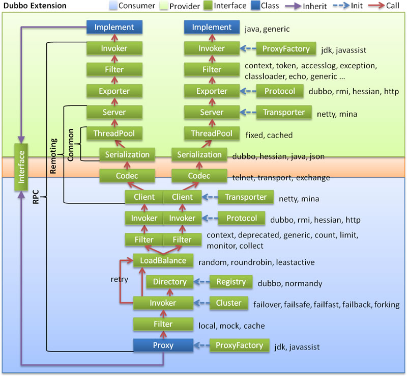

- 垂直分层如下：
  - 下方 **淡蓝背景**( Consumer )：服务消费方使用的接口
  - 上方 **淡绿色背景**( Provider )：服务提供方使用的接口
  - 中间 **粉色背景**( Remoting )：通信部分的接口
- 自 LoadBalance 向上，每一行分成了**多个**相同的 Interface ，指的是**负载均衡**后，向 Provider 发起调用。
- 左边 **括号** 部分，代表了垂直部分更**细化**的分层，依次是：Common、Remoting、RPC、Interface 。
- 右边 **蓝色虚线**( Init ) 为初始化过程，通过对应的组件进行初始化。例如，ProxyFactory 初始化出 Proxy 。

## 暴露服务时序

展开总设计图左边服务提供方暴露服务的蓝色初始化链，时序图如下。

## 引用服务时序

展开总设计图右边服务消费方引用服务的蓝色初始化链，时序图如下。

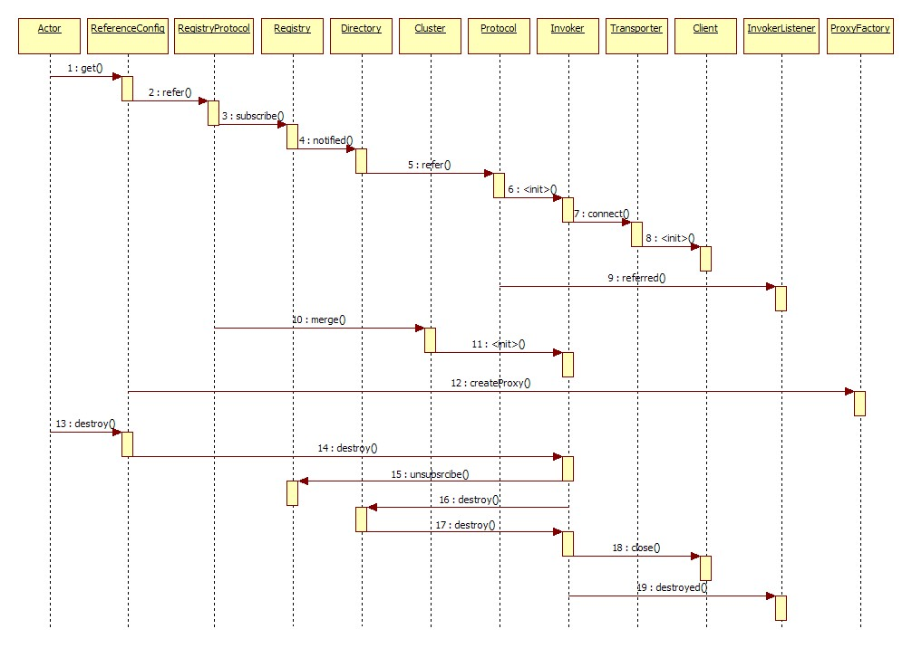

## 领域模型

### Invoker

Invoker 是实体域，它是 Dubbo 的核心模型，其它模型都向它靠扰，或转换成它，它代表一个可执行体，可向它发起 invoke 调用，它有可能是一个本地的实现，也可能是一个远程的实现，也可能一个集群实现。

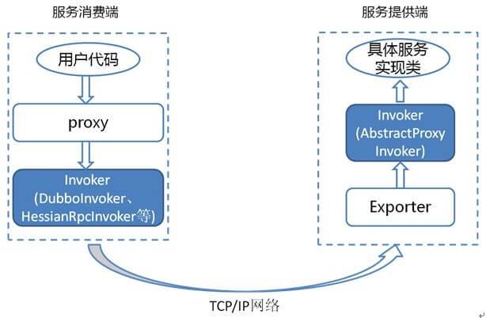

类图。

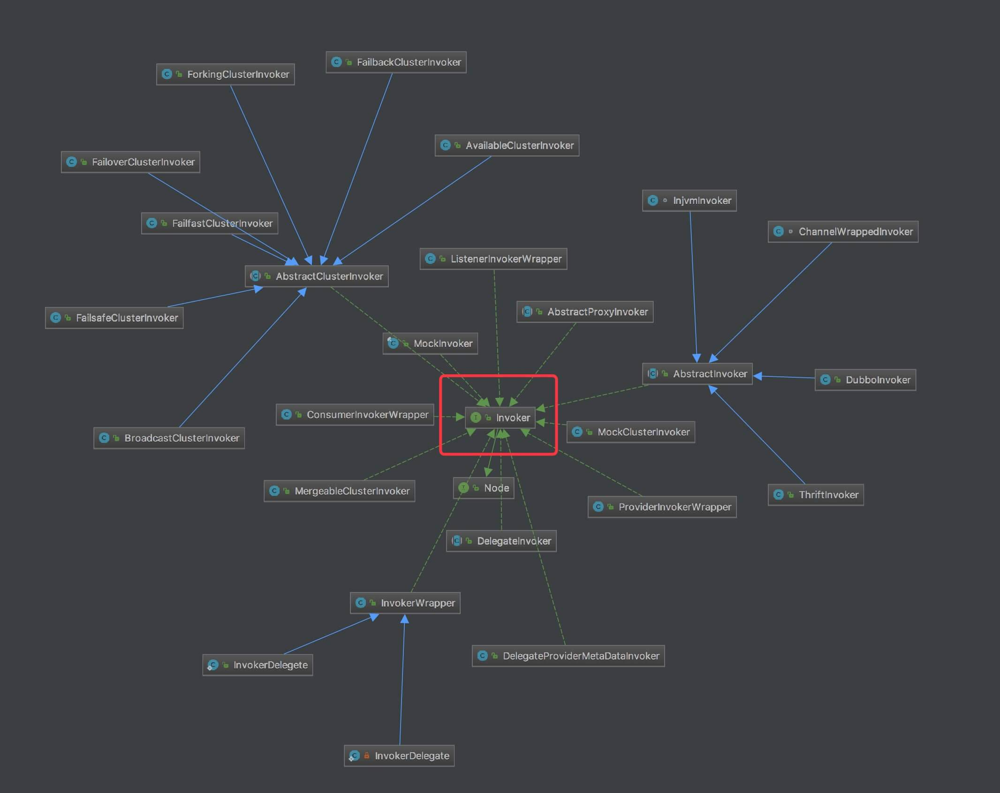

### Invocation

Invocation 是会话域，它持有调用过程中的变量，比如方法名，参数等。

### Result

Result 是会话域，它持有调用过程中返回值，异常等。

### Filter

过滤器接口，和我们平时理解的 [`javax.servlet.Filter`](https://docs.oracle.com/javaee/5/api/javax/servlet/Filter.html) 基本一致。

### ProxyFactory

代理工厂接口。服务消费着引用服务的 **主过程** 如下图。

从图中我们可以看出，方法的 `invoker` 参数，通过 Protocol 将 **Service接口** 创建出 Invoker 。通过创建 Service 的 Proxy ，实现我们在业务代理调用 Service 的方法时，**透明的内部转换成调用** Invoker 的 `#invoke(Invocation)` 方法。

服务提供者暴露服务的 **主过程** 如下图。

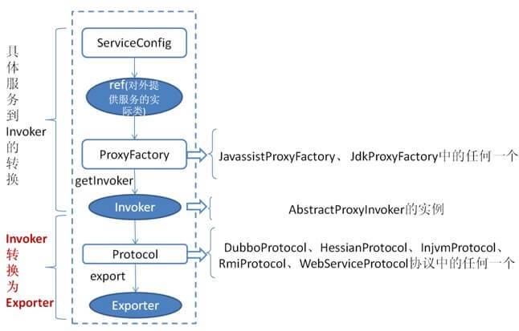

从图中我们可以看出，该方法创建的 Invoker ，下一步会提交给 Protocol ，从 Invoker 转换到 Exporter 。

类图如下。

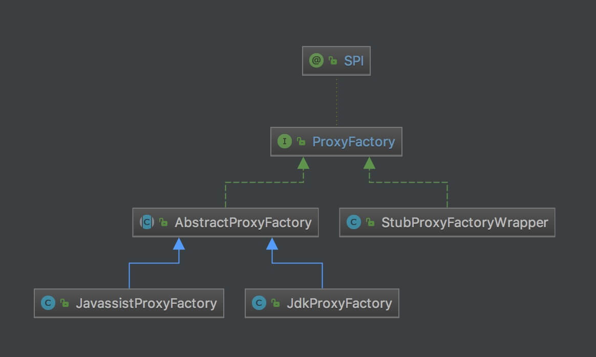

从图中，我们可以看出 Dubbo 支持 Javassist 和 JDK Proxy 两种方式生成代理。

### Protocol

Protocol 是服务域，它是 Invoker 暴露和引用的主功能入口。它负责 Invoker 的生命周期管理。

Dubbo 处理**服务暴露**的关键就在 Invoker 转换到 Exporter 的过程。下面我们以 Dubbo 和 RMI 这两种典型协议的实现来进行说明。

- **Dubbo 的实现**
  Dubbo 协议的 Invoker 转为 Exporter 发生在 DubboProtocol 类的 export 方法，它主要是打开 socket 侦听服务，并接收客户端发来的各种请求，通讯细节由 Dubbo 自己实现。
- **RMI 的实现**
  RMI 协议的 Invoker 转为 Exporter 发生在 RmiProtocol 类的 export 方法，它通过 Spring 或 Dubbo 或 JDK 来实现 RMI 服务，通讯细节这一块由 JDK 底层来实现，这就省了不少工作量。

### Exporter

Exporter ，Invoker 暴露服务在 Protocol 上的对象。

### InvokerListener

Invoker 监听器。

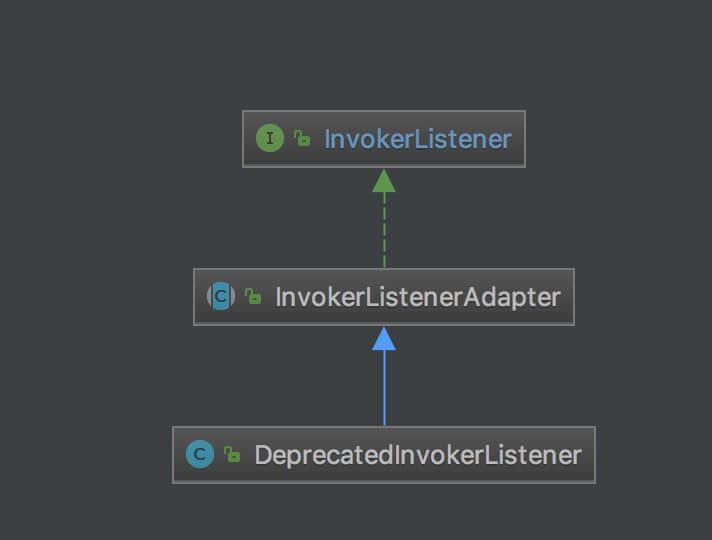

### ExporterListener

Exporter 监听器。

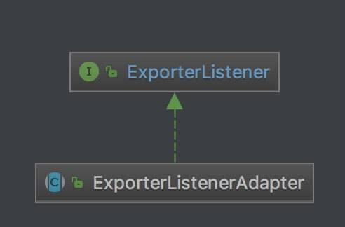

# 配置

dubbo 支持多种配置方式：

- API 配置
- 属性配置
- XML 配置
- 注解配置

所有配置项分为三大类。

- 服务发现：表示该配置项用于服务的注册与发现，目的是让消费方找到提供方。
- 服务治理：表示该配置项用于治理服务间的关系，或为开发测试提供便利条件。
- 性能调优：表示该配置项用于调优性能，不同的选项对性能会产生影响。

所有配置最终都将转换为 Dubbo URL 表示，并由服务提供方生成，经注册中心传递给消费方，各属性对应 URL 的参数，参见配置项一览表中的**对应URL参数**列。

首先看下 `dubbo-config-api` 项目结构。

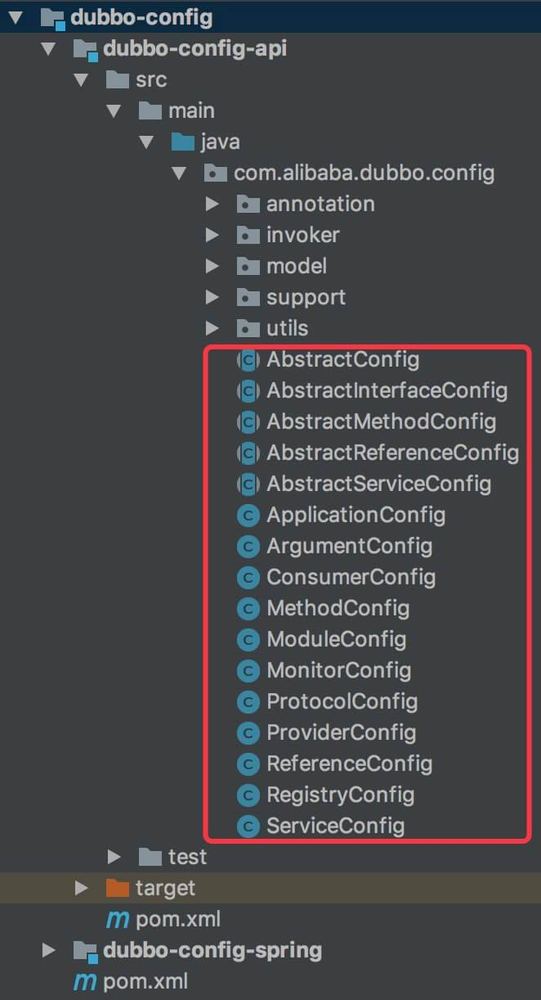

整理下配制间的关系。

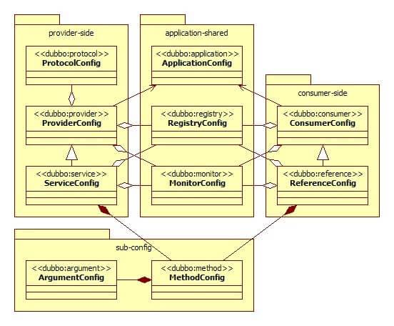

配置可分为四部分。

- application-shared

- provider-side

- consumer-side

- sub-config

配置类关系如下。

# 扩展

做框架应该考虑的一些问题。

- 避免不必要的引用
- 依赖接口，而不是具体的实现

## 扩展点

系统通过扩展机制，来横向扩展系统功能，只要符合对应扩展规范，扩展的过程无需修改系统代码。所谓扩展点，是系统定义的，可以支持扩展的点（流程的某个步骤、代码的某个点）。

dubbo 提供了大量扩展点。

- 协议扩展
- 调用拦截扩展
- 引用监听扩展
- 暴露监听扩展
- 集群扩展
- 路由扩展
- 负载均衡扩展
- 合并结果扩展
- 注册中心扩展
- 监控中心扩展
- 扩展点加载扩展
- 动态代理扩展
- 编译器扩展
- 消息派发扩展
- 线程池扩展
- 序列化扩展
- 网络传输扩展
- 消息交换扩展
- 组网扩展
- Telnet 命令扩展
- 容器扩展
- 页面扩展
- 缓存扩展
- 验证扩展
- 日志适配扩展

## 改进

dubbo 借鉴 JDK 标准的 SPI（Service Provider Interface）扩展点机制，重新实现了一套 SPI 机制，做了如下改进。

- JDK 标准的 SPI 会一次性实例化扩展点所有实现，如果有扩展实现初始化很耗时，但如果没用上也加载，会很浪费资源。

- 如果扩展点加载失败，连扩展点的名称都拿不到了。比如：JDK 标准的 ScriptEngine，通过 getName() 获取脚本类型的名称，但如果 RubyScriptEngine 因为所依赖的 jruby.jar 不存在，导致 RubyScriptEngine 类加载失败，这个失败原因被吃掉了，和 ruby 对应不起来，当用户执行 ruby 脚本时，会报不支持 ruby，而不是真正失败的原因。

- 增加了对扩展点 IoC 和 AOP 的支持，一个扩展点可以直接 setter 注入其它扩展点。

## 代码结构

ubbo SPI 在 `dubbo-common` 的 [`extension`](https://github.com/YunaiV/dubbo/tree/6b8e51ac55880a0f10a34f297d0869fcdbb42369/dubbo-common/src/main/java/com/alibaba/dubbo/common/extension) 包实现，如下图所示。

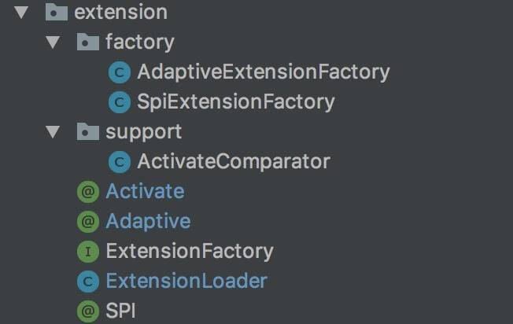

## 注解

### @SPI

扩展点接口的标识。

### @Adaptive

自适应拓展信息的标记。

可添加**类**或**方法**上，分别代表了两种不同的使用方式。标记在拓展接口的**方法**上，代表**自动生成代码实现**该接口的 Adaptive 拓展实现类；标记在**类**上，代表**手动实现**它是一个拓展接口的 Adaptive 拓展实现类。

一个拓展接口，有且仅有一个 Adaptive 拓展实现类。

### @Active

自动激活条件的标记。

# 说明

- 部分内容来自 [芋道源码](https://www.iocoder.cn/)