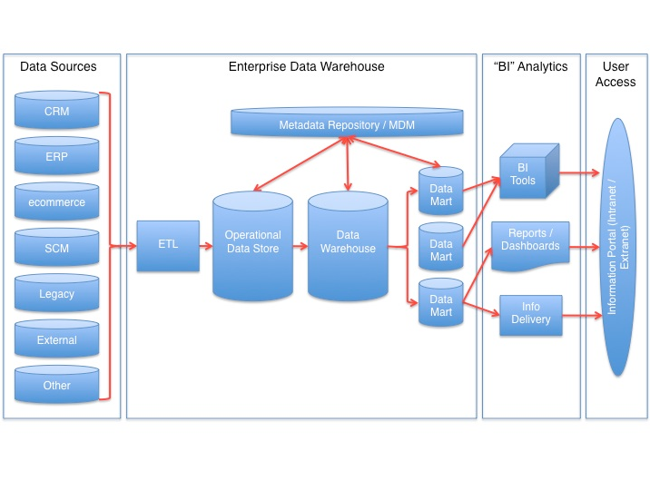
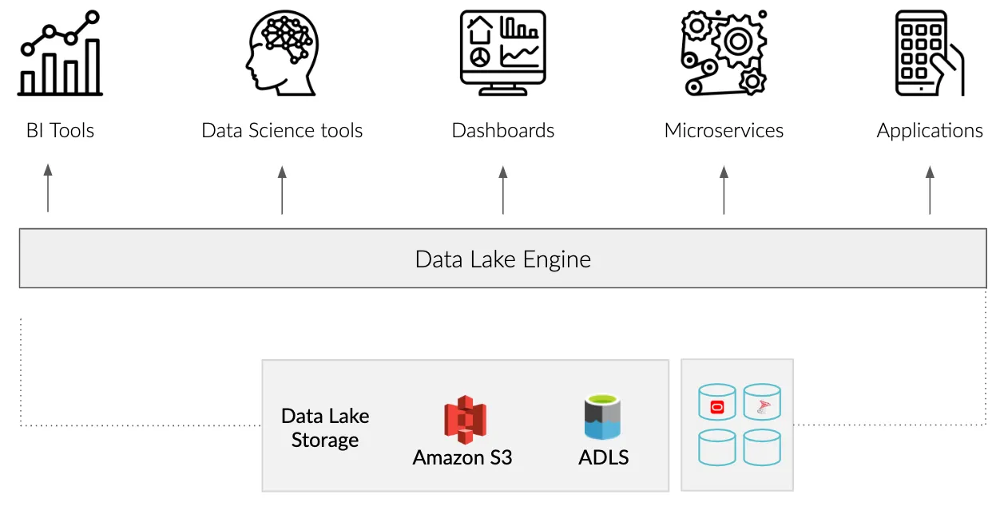

# 一站式平台

- [WeDataSphere](https://github.com/WeBankFinTech/WeDataSphere)
- [LakeSoul](https://github.com/lakesoul-io/LakeSoul)

# 查询工具
- [Zeppelin](https://zeppelin.apache.org/)

# OLAP

| 工具       | 特点 |
| ---------- | ---- |
| Hive       |      |
| Impala     |      |
| Kylin      |      |
| ClickHouse |      |
| Spark SQL  |      |
| Presto     |      |
| Druid      |      |

# 存储

| 工具       | 特点 |
| ---------- | ---- |
| Kudu       |      |
| Cassandra  |      |
| ScyllaDB   |      |
| PostgreSQL |      |
| MongoDB    |      |
| HBase      |      |

# 数据仓库

## 参考

- [data-warehouse-layers](https://hightouch.com/blog/data-warehouse-layers)

# 数据湖

| 工具    | 特点 |
| ------- | ---- |
| Hudi    |      |
| Iceberg |      |

# 参考

- [ClickHouse Integrations](https://clickhouse.com/docs/en/integrations)
