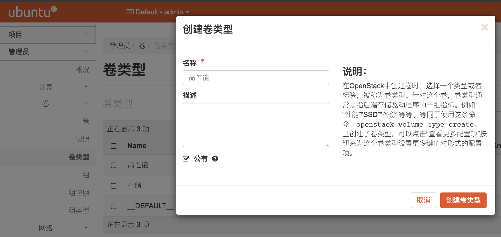
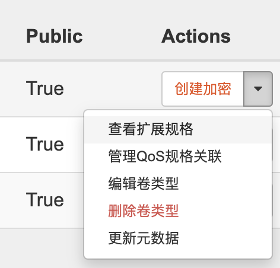
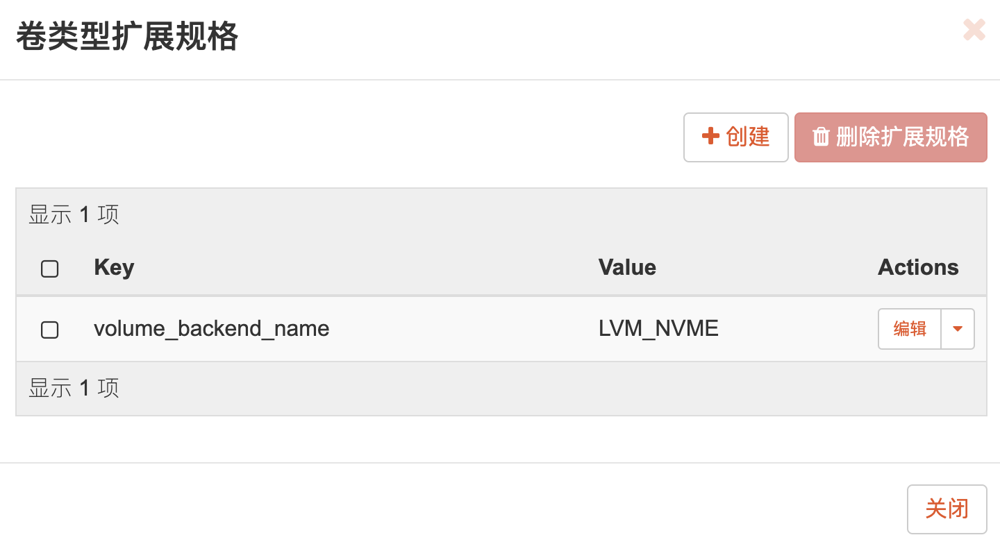
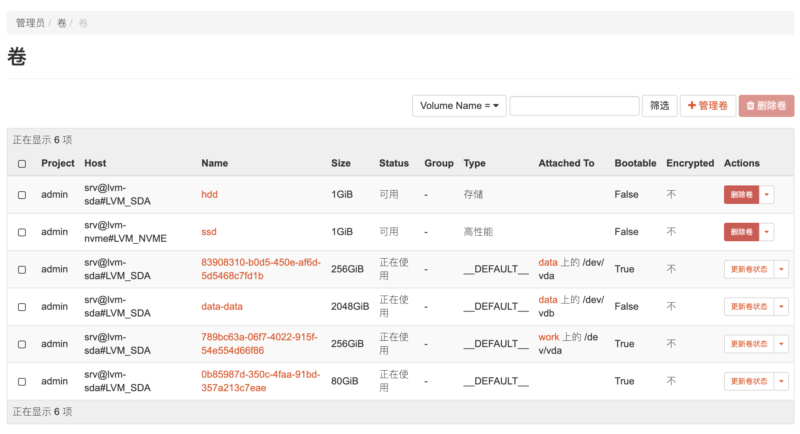
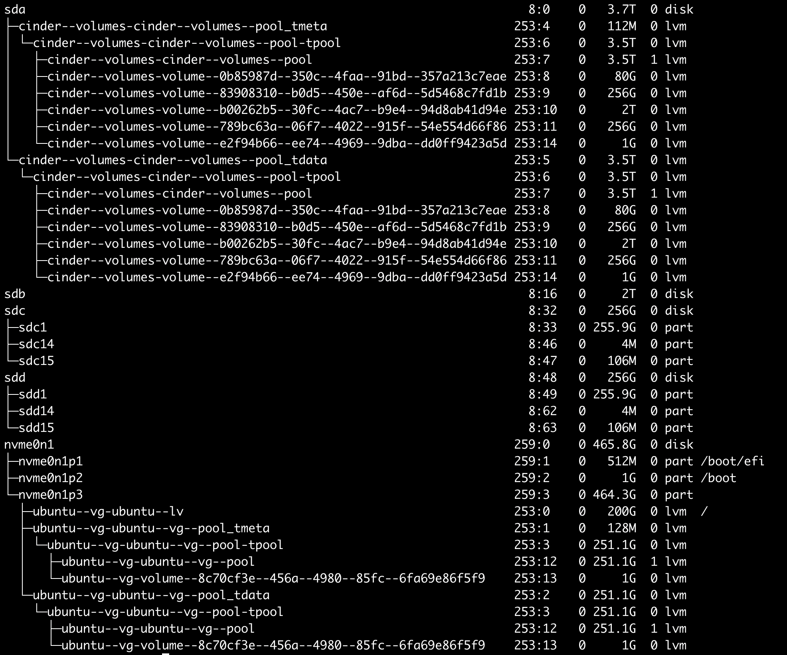

> 在添加前，需要对磁盘分区，并创建 lvm。

# 描述

一台机器，两块存储盘，一个 HDD，一个SSD。HDD 用来做存储，SSD用来做系统盘。

# 目标

安装系统时可以指定把卷创建在 SSD 盘中，在 HDD 盘上创建存储盘，并挂载到机器。

# 操作

## 初始化硬盘

```shell
# lsblk
...
nvme1n1                                         259:0    0 931.5G  0 disk
└─nvme1n1p1                                     259:1    0 931.5G  0 part /data
...

## 使用 nvme1n1 来创建 lvm 卷，卷组为 cinder-nvme
# umount /dev/nvme1n1p1
# vim /etc/lvm/lvm.conf
## 修改 devices.filter, 包含该设备
filter = ["a|/dev/sda|", "a|/dev/nvme1n1|", "r|.*|"]
## 创建 PV (Physical Volume)
# pvcreate /dev/nvme1n1
## 查看信息
# pvdisplay /dev/nvme1n1
## 创建 volumn group (VG)
# vgcreate cinder-nvme /dev/nvme1n1
## 再次查看信息
# pvdisplay /dev/nvme1n1
```

## 配置多存储

openstack cinder 支持一台机器上配置多块存储（multiple backends），编辑 `/etc/cinder/cinder.conf`。

```shell
[DEFAULT]
...
enabled_backends = lvm-nvme,lvm-sda

...

[lvm-nvme]
volume_driver = cinder.volume.drivers.lvm.LVMVolumeDriver
volume_group = cinder-nvme
target_protocol = iscsi
target_helper = tgtadm
volume_backend_name = LVM_NVME

[lvm-sda]
volume_driver = cinder.volume.drivers.lvm.LVMVolumeDriver
volume_group = cinder-volumes
target_protocol = iscsi
target_helper = tgtadm
volume_backend_name = LVM_SDA
```

这里配置了两个 backends，lvm-nvme 和 lvm-sda，前者为固态硬盘，后者为机械硬盘。

## 创建卷类型

### 命令行方式

```shell
# 创建卷类型
$ openstack --os-username admin --os-tenant-name admin volume type create 存储
# 设置扩展参数，将该类型卷绑定到特定的 backends
$ openstack --os-username admin --os-tenant-name admin volume type set 存储 \
  --property volume_backend_name=LVM_SDA
  
# 同样的方式，绑定另一块盘
$ openstack --os-username admin --os-tenant-name admin volume type create 高性能
$ openstack --os-username admin --os-tenant-name admin volume type set 高性能 \
  --property volume_backend_name=LVM_NVME
```

### 界面操作



在 管理员 / 卷 / 卷类型 中，创建卷类型 高性能和存储。



点击卷类型的操作菜单，选择「查看扩展规格」。



创建扩展，key 为 `volume_backend_name`，值为LVM_SDA（存储）和 LVM_NVME（高性能）。

## 创建卷

在菜单 项目 / 卷 下，创建卷。


指定类型为「高性能」。同理创建其他卷，类型选择「存储」。

# 效果



最终，在 LVM_SDA 上面创建了 hdd 卷，在 LVM_NVME 上面创建了 ssd 卷。对于卷列表中的 host，其格式为 `host@backend-name#pool`，比如 `srv@lvm-sda#LVM_SDA`。

使用  `lsblk` 查看卷信息。



# 参考

- https://openstack.by/biblioteka/openstack/admin-guide/docs.openstack.org/admin-guide/blockstorage-multi-backend.html
