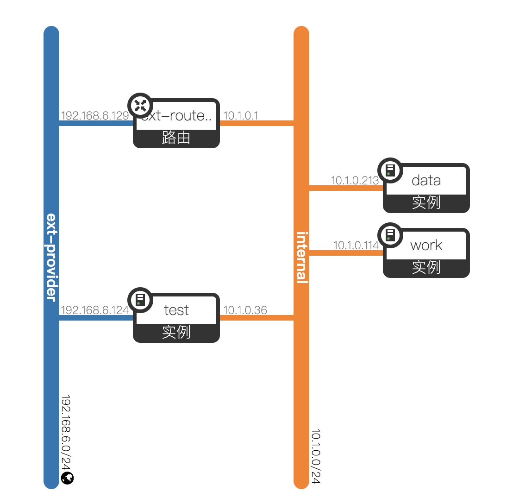
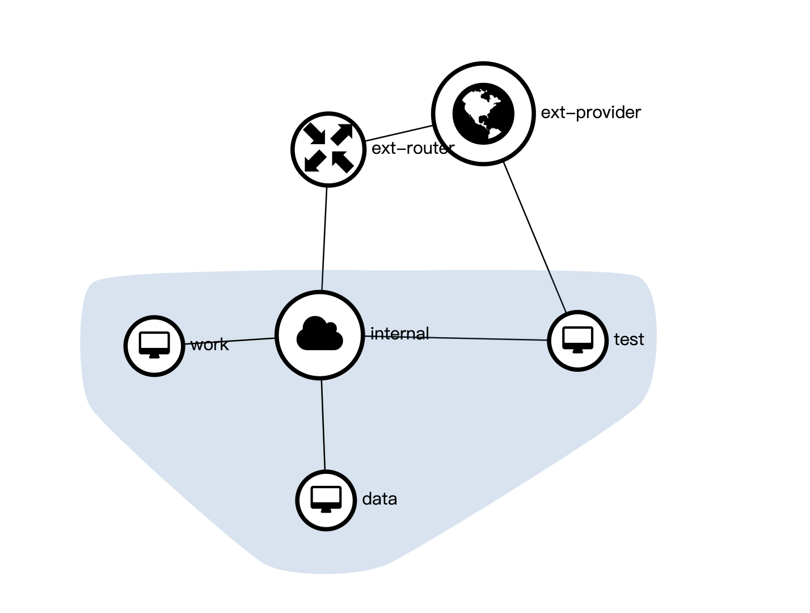
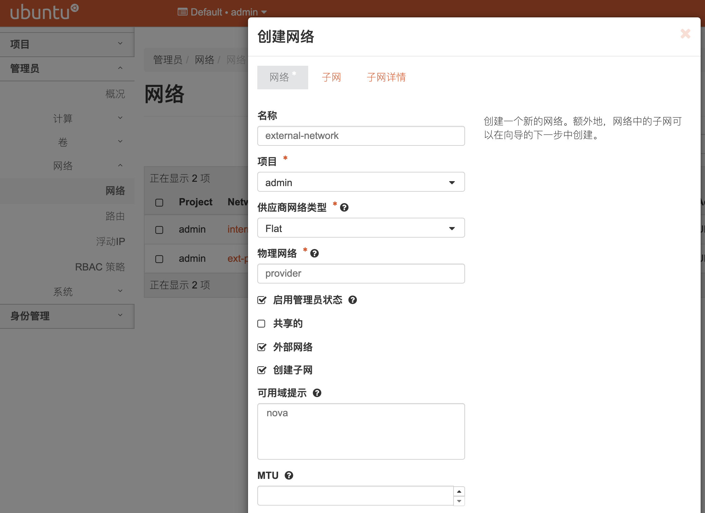
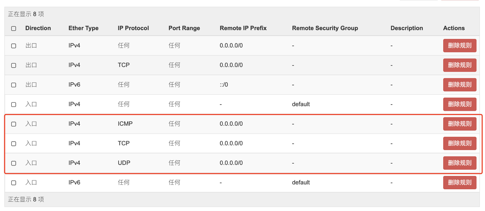

# 网络

网络类型设置主要参考两篇文章，[设置网络硬件接口 provider](https://docs.openstack.org/install-guide/launch-instance-networks-provider.html#launch-instance-networks-provider) 和 [设置自服务虚拟网络](https://docs.openstack.org/install-guide/launch-instance-networks-selfservice.html)。

## 类型

- local
- flat
- vlan
- vxlan
- gre
- geneve

# 连接外网 & 分配外网IP

openstack 配置的是 self-service 网络模式，外网是指虚拟网络外的网络，这里是路由器的网络 `192.168.6.1/24`。

## 配置

### 物理机网络接口设置

这里以 ubuntu 20.04 为例，物理机有两个网口（enp4s0、enp5s0）。

```shell
# /etc/netplan/99-config.xml
network:
  version: 2
  renderer: networkd
  ethernets:
    enp5s0:
      addresses:
        - 192.168.6.33/24
      gateway4: 192.168.6.1
      
# /etc/netplan/00-installer-config.yaml
network:
  ethernets:
    enp4s0:
      dhcp4: false
  version: 2
```

这里是把 enp5s0 网口设置为固定 ip，关闭 enp4s0 的 dhcp 且不分配 ip。

neutron 的配置要关注 `/etc/neutron/plugins/ml2` 的内容。

```shell
# cat ml2_conf.ini | grep -v '#' | grep '\S'
[DEFAULT]
[ml2]
type_drivers = flat,vlan,vxlan
tenant_network_types = vxlan
mechanism_drivers = linuxbridge,l2population
extension_drivers = port_security
[ml2_type_flat]
flat_networks = provider
[ml2_type_geneve]
[ml2_type_gre]
[ml2_type_vlan]
[ml2_type_vxlan]
vni_ranges = 1:1000
[ovs_driver]
[securitygroup]
enable_ipset = true
[sriov_driver]

# cat linuxbridge_agent.ini | grep -v '#' | grep '\S'
[DEFAULT]
[agent]
[linux_bridge]
physical_interface_mappings = provider:enp4s0
[network_log]
[securitygroup]
enable_security_group = true
firewall_driver = neutron.agent.linux.iptables_firewall.IptablesFirewallDriver
enable_ipset = true
[vxlan]
enable_vxlan = true
local_ip = 192.168.6.33
l2_population = true
```

在 `linuxbridge_agent.ini` 配置的 `physical_interface_mappings = provider:enp4s0` 中的 `provider:enp4s0` ，冒号前面是新增的接口名称，enp4s0 为系统显示的硬件网络接口。

在 `ml2_conf.ini` 中配置 `flat_networks = provider` ，指定 flat 类型接口使用的网络接口。

### sysctl.conf

编辑 `/etc/sysctl.conf`，设置 `net.ipv4.ip_forward=1` 。

## 网络拓扑





> 注意
>
> - 创建外部网络用 FLAT 类型，物理网络填 provider（和 linuxbridge_agent.ini 中配置的一致）
> - 创建内部网络用 VXLAN 类型

## 连接外网

首先，要在管理员下创建外部网络。



连接外网有两种方式，一种是实例直连新建的外部网络，一种是创建内部网络，内部网络通过路由连接外部网络。

网络拓扑图中，test 主机是直连外部网络，可以分配 192.168.6.* 地址，以及访问外网，data 和 work 连接内部网络（10.1.0.0/24），然后内部网络通过路由连接外部网络。

## 分配外部网络 ip

 分配外部网络地址有两种方式，直连外部网络和 floating ip。

直连外部网络是给实例添加接口，并指定网络为外部网络，这样在实例里面查看网络信息可以查看到分配的外网 ip。使用 floating ip 的话，将 floating ip 实例分配的内网 ip 绑定，实例内并不能看到 floating ip，外部可以通过 floating ip 访问实例。

## 最后一步

openstack 默认的安全组禁止所有请求访问，需要添加入口权限。



