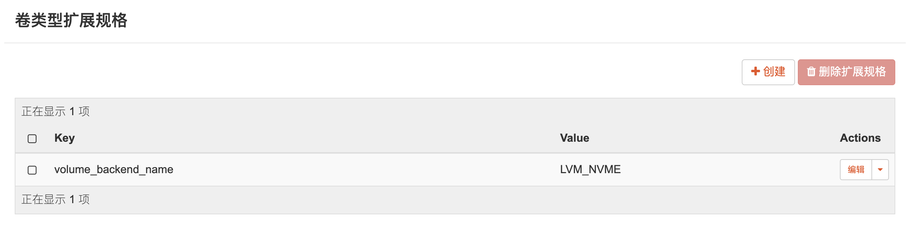

# 无法删除卷

使用界面删除卷时，一致失败，查看 cinder-volumn 日志，错误是卷在使用。

```shell
...
2021-12-05 14:05:42.521 14117 ERROR oslo_messaging.rpc.server Command: sudo cinder-rootwrap /etc/cinder/rootwrap.conf lvremove --config activation { retry_deactivation = 1} devices { ignore_suspended_devices = 1} -f cinder-volumes/volume-0b85987d-350c-4faa-91bd-357a213c7eae
2021-12-05 14:05:42.521 14117 ERROR oslo_messaging.rpc.server Exit code: 5
2021-12-05 14:05:42.521 14117 ERROR oslo_messaging.rpc.server Stdout: ''
2021-12-05 14:05:42.521 14117 ERROR oslo_messaging.rpc.server Stderr: '  Logical volume cinder-volumes/volume-0b85987d-350c-4faa-91bd-357a213c7eae in use.\n'
...
```

## 查找占用卷的进程

```shell
root@srv:/home/wii# blkid
...
/dev/mapper/cinder--volumes-volume--0b85987d--350c--4faa--91bd--357a213c7eae: UUID="2021-08-24-09-09-05-00" LABEL="Ubuntu-Server 20.04.3 LTS amd64" TYPE="iso9660" PTUUID="7fcaeaa1" PTTYPE="dos"
...
root@srv:/home/wii# lsof /dev/mapper/cinder--volumes-volume--0b85987d--350c--4faa--91bd--357a213c7eae
COMMAND  PID USER   FD   TYPE DEVICE SIZE/OFF NODE NAME
tgtd    1887 root   17u   BLK 253,10      0t0  442 /dev/mapper/../dm-10
```

可以看到，是 tgt 服务一直在占用。

```shell
root@srv: service stop tgt
```

再删除卷，然后启动 tgt 服务。

```shell
root@srv: service start tgt
```

# 系统盘使用高性能盘

如果存储服务区分 ssh 和 hdd，又希望系统盘能用 ssd，可以修改卷的类型扩展参数。



LVM_NVME 要在 cinder 的配置进行配置，对应的是 ssd 磁盘。