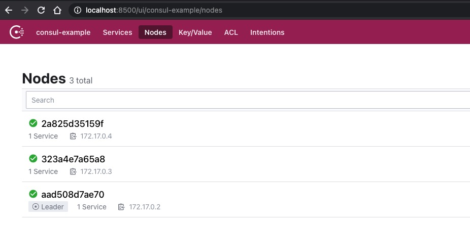
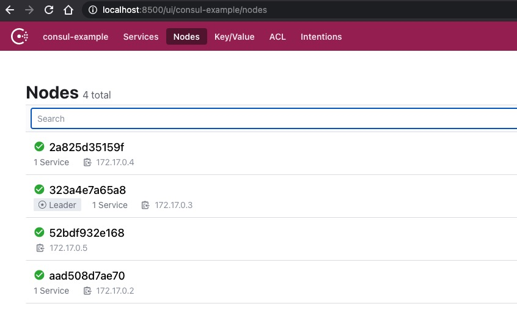
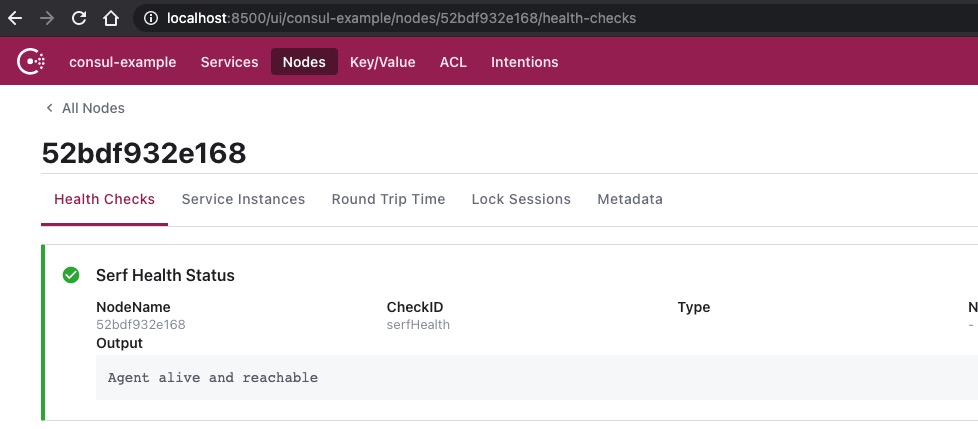

部署Consul可能会有一些坑，每个坑都可能导致非常严重的事故。

# 配置

配置详情参考[官方文档](https://www.consul.io/docs/agent/options)。在配置Consul集群时，重点在初始化集群。初始化一个Consul集群，首先需要部署**主节点**，并选举出**Leader**，然后部署**代理节点**，加入集群。

部署主节点初始化集群，有两种方式。一种是指定Leader，并首先部署（bootstrap设置为true），其他主节点配置加入指定的Leader；另一种是不指定Leader（bootstrap设置为false），在主节点达到期望的数量时（bootstrap_expect），自动选举。第二种相对一第一种，更简单，且不容易出错。

## master

```json
{
    "client_addr": "0.0.0.0",
    "datacenter": "consul-example",
    "data_dir": "/srv/consul/consul.d",
    "domain": "dev",
    "dns_config": {
        "enable_truncate": true,
        "only_passing": true
    },
    "enable_syslog": true,
    "encrypt": "MUEfHaiegJAg9oKogQYG9G5xDg3Bp1eBe/wd4OpoWwE=",
    "leave_on_terminate": true,
    "log_level": "INFO",
    "rejoin_after_leave": true,
    "server": true,
    "bootstrap": false,
    "bootstrap_expect": 3,
    "retry_join": [
        "172.17.0.2",
        "172.17.0.3",
        "172.17.0.4"
    ],
    "ui": true
}
```

**注意事项**

- **在docker中，enable_syslog 需要设置为false，否则可能会启动失败**
- **encrypt 需要使用命令 `consul keygen` 重新生成并更新**

## agent

```json
{
    "client_addr": "0.0.0.0",
    "datacenter": "consul-example",
    "data_dir": "/srv/consul/consul.d",
    "domain": "dev",
    "dns_config": {
        "enable_truncate": true,
        "only_passing": true
    },
    "enable_syslog": true,
    "encrypt": "MUEfHaiegJAg9oKogQYG9G5xDg3Bp1eBe/wd4OpoWwE=",
    "leave_on_terminate": true,
    "log_level": "INFO",
    "rejoin_after_leave": true,
    "server": false,
    "bootstrap": false,
    "retry_join": [
        "172.17.0.2",
        "172.17.0.3",
        "172.17.0.4"
    ],
    "ui": false
}
```

# 部署

## 下载容器

```shell
$ docker pull ubuntu:18.04
```

# 主节点

## 创建容器

```shell
$ docker run -it -d --restart=always -p 8500:8500 --name=consul-srv1 ubuntu:18.04 # 绑定端口，用于访问界面
$ docker run -it -d --restart=always -p 8501:8501 --name=consul-srv2 ubuntu:18.04 # 可以不绑定端口
$ docker run -it -d --restart=always -p 8502:8502 --name=consul-srv3 ubuntu:18.04 # 可以不绑定端口
```

## 获取IP

```shell
# 登录容器
$ docker exec -it consul-srv1 /bin/bash

# 初始化容器
$ apt update && apt install -y iproute2 wget unzip vim

# 获取IP
## 1. 通过 hosts 文件获取
$ cat /etc/hosts
127.0.0.1	localhost
::1	localhost ip6-localhost ip6-loopback
fe00::0	ip6-localnet
ff00::0	ip6-mcastprefix
ff02::1	ip6-allnodes
ff02::2	ip6-allrouters
172.17.0.2	e7cdefc0954c
## 2. 通过 ip 命令获取
$ apt update && apt install iproute2
$ ip address
...
inet 172.17.0.2/16
...
```

| 容器        | ip         |
| ----------- | ---------- |
| consul-srv1 | 172.17.0.2 |
| consul-srv2 | 172.17.0.3 |
| consul-srv3 | 172.17.0.4 |

## 初始化

```shell
# 创建服务目录
$ mkdir /srv/consul && cd /srv/consul
# 下载 consul
$ wget https://releases.hashicorp.com/consul/1.9.0/consul_1.9.0_linux_amd64.zip
# 解压
$ unzip consul_1.9.0_linux_amd64.zip
# 添加配置文件
$ vim config.json
# 写入配置文件，把 enable_syslog 设为 false

# 添加启动脚本
$ vim run-consul.sh # 输入如下内容
[ ! -d /srv/consul/consul.d ] && mkdir /srv/consul/consul.d
config_dir="/srv/consul/config.json"
host_name="`hostname --fqdn`"
host_ip=`hostname -I | awk '{print $1}'`
consul agent -config-dir="$config_dir" -bind=$host_ip
```

## 启动

```shell
$ export PATH=.:$PATH && bash run-consul.sh
```

**访问UI界面**

浏览器打开地址 http://localhost:8500/。



# 代理节点

## 创建容器

```shell
$ docker run -it -d --restart=always --name=consul-agt1 ubuntu:18.04
```

## 初始化

首先登陆容器。

```shell
# 登录容器
$ docker exec -it consul-agt1 /bin/bash

# 初始化容器
$ apt update && apt install -y iproute2 wget unzip vim
```

初始化和主节点一致。

## 启动

```shell
$ export PATH=.:$PATH && bash run-consul.sh
```

访问界面，可以看到Agent信息。





# 更换主节点

如果我们想更换掉所有的主节点，需要如下步骤。

- 部署新的主节点服务，并加入到集群，同步集群数据
- 更新所有代理节点的主节点配置文件，并重启
- 下线旧主节点

# 说明

- bootstrap_expect 主要作用于集群初始化阶段，只有发现足够的主节点，才会启动选主程序，并初始化。集群初始化后，停止所有主节点，并启动其中一个， 会根据历史数据，启动集群，此时 bootstrap_expect 配置的值没有意义。

# 最佳实践

- 设置 encrypt，不同机房，使用不同 datacenter 名称，避免跨环境注册，服务混合
- 设置 `limits.http_max_conns_per_client` ，默认 200，极有可能不够用，出现各种问题