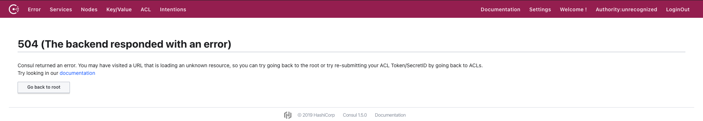
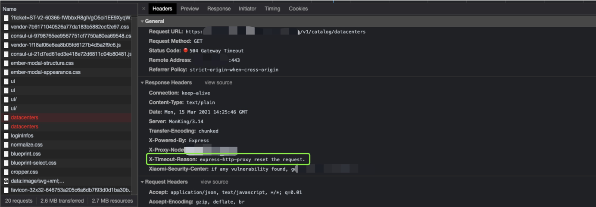
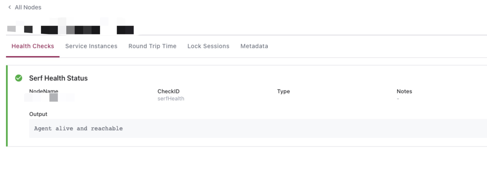
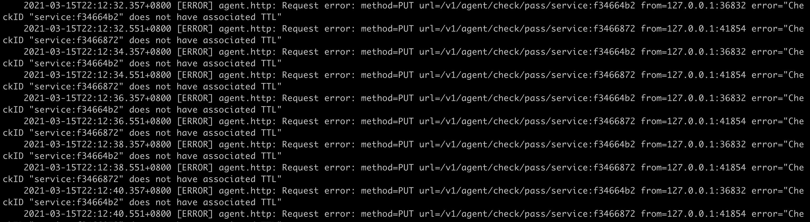
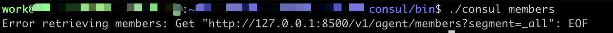
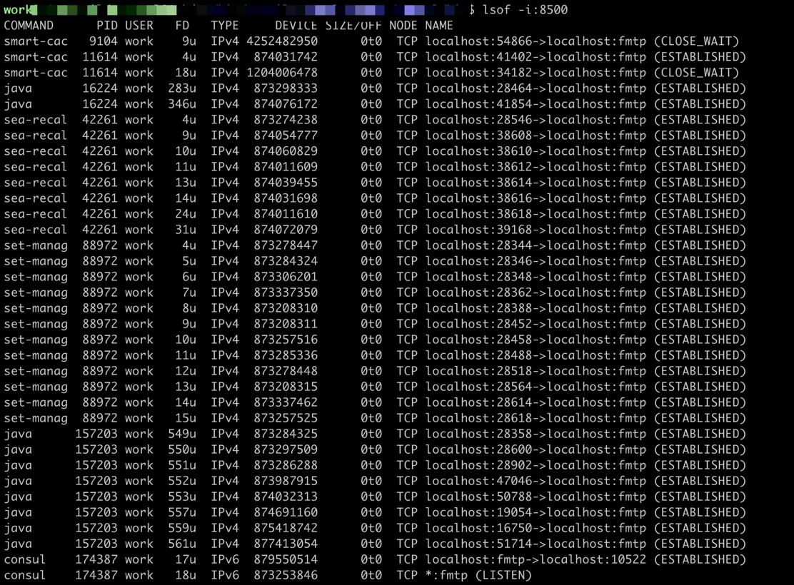
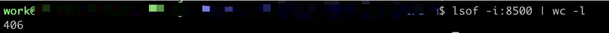
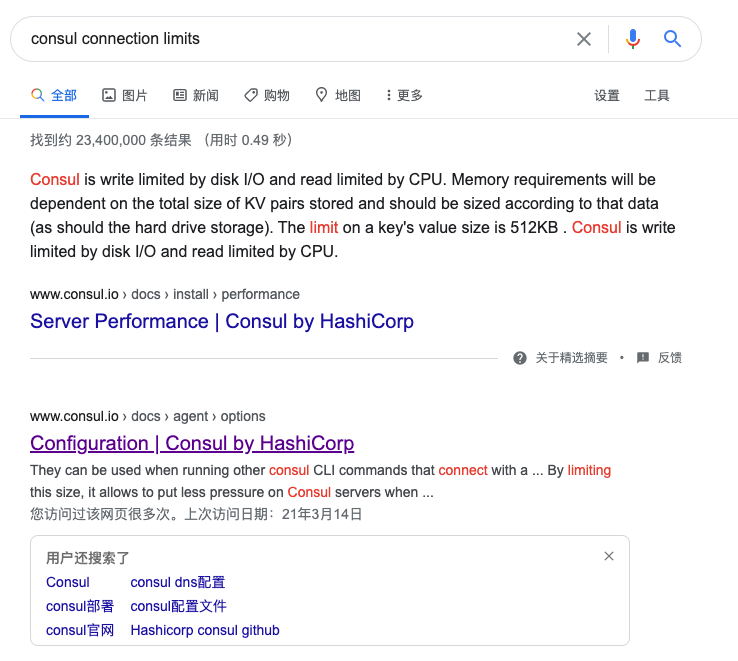
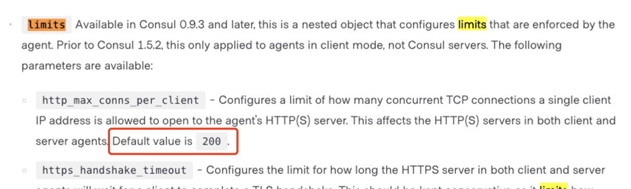

# 一次服务无法注册的故障

## 现象

### 前端

我们的 consul dashboard（基于 consul ui 源码，新增了权限控制，独立部署）突然出现 504 异常。



打开浏览器调试器的 network，查看异常的请求。



`/v1/*` 接口，向部署的node应用发送请求，node 应用再将请求通过插件（ `express-http-proxy` ）代理转发至 consul server。

很奇怪，其他所有机房都没有问题。而且，多刷几次，偶尔可以正常响应。

### 服务

这一台机器的 Java 服务报了奇怪的 `\n not found: limit=0 content=�~@�` 异常。

```
[ERROR 2021-03-15 20:21:39.114] com...init(ConsulBase.java:58) [[consul] init consul base failed, e=[com.orbitz.consul.ConsulException: Error connecting to Consul
        at com.orbitz.consul.AgentClient.ping(AgentClient.java:69)
        at com.orbitz.consul.Consul$Builder.build(Consul.java:708)
        ...
Caused by: java.io.IOException: unexpected end of stream on http://127.0.0.1:8500/...
        at okhttp3.internal.http1.Http1ExchangeCodec.readResponseHeaders(Http1ExchangeCodec.kt:205)
        at okhttp3.internal.connection.Exchange.readResponseHeaders(Exchange.kt:105)
        ...
        at okhttp3.RealCall.getResponseWithInterceptorChain(RealCall.kt:184)
        at okhttp3.RealCall.execute(RealCall.kt:66)
        at retrofit2.OkHttpCall.execute(OkHttpCall.java:186)
        at com.orbitz.consul.AgentClient.ping(AgentClient.java:62)
        ... 14 more
Caused by: java.io.EOFException: \n not found: limit=0 content=�~@�
        at okio.RealBufferedSource.readUtf8LineStrict(RealBufferedSource.kt:231)
        at okhttp3.internal.http1.Http1ExchangeCodec.readHeaderLine(Http1ExchangeCodec.kt:210)
        at okhttp3.internal.http1.Http1ExchangeCodec.readResponseHeaders(Http1ExchangeCodec.kt:181)
        ... 35 more
```

看样子，是无法连接consul，接口异常？此外，由于无法连接consol，报了一堆无法找到服务端的RPC异常，这也正常，注册中心连不上，肯定也就拿不到服务列表。

我们的 C++ 服务（ 使用库`ppconsul` ），直接报了无法注册的异常。

```shell
E0315 19:28:54.129444 11661 ...cpp:456] [consul] register local consul agent failed!
```

## 解决

首先，尝试重启 consul server。不重启还好，一重启，这台机器之前注册的服务全没了，怎么重启服务都注册不上。



随后，查看consul日志，伴随着不太明了的异常。



于是，想通过consul程序，看下members，确认加入了集群，但是.... 



他，出错了，很奇怪的错。

```shell
Error retrieving members: Get "http://127.0.0.1:8500/v1/agent/members?segment=_all": EOF
```

到这里，可以想到的是，是consul接口出问题。开始的时候前端请求异常，应该也是因为代理请求consul接口，出错导致的。凡事都有个但是，排查端口发现，有正常的连接建立啊。



而且呢，还很多。



等等... 难道... 是因为... 太多了？赶紧搜下。



好吧，找到了这里。



单个 IP 限制的最大连接数，是 200。行吧。改大试试吧。

```json
{
    "client_addr": "0.0.0.0",
    "datacenter": "...",
    "data_dir": "...",
    "domain": "...",
    "dns_config": {
        "enable_truncate": true,
        "only_passing": true
    },
    "limits": {
        "http_max_conns_per_client": 500
    },
    "enable_syslog": true,
    "encrypt": "...",
    "leave_on_terminate": true,
    "log_level": "INFO",
    "rejoin_after_leave": true,
    "server": true,
    "bootstrap": false,
    "bootstrap_expect": 3,
    "retry_join": [
        "...",
        "...",
        "...",
        "...",
        "...",
    ],
    "ui": false
}
```

至此，好了。