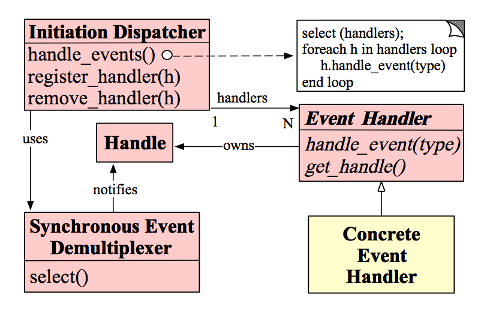
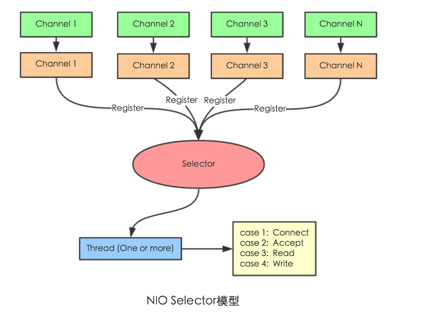
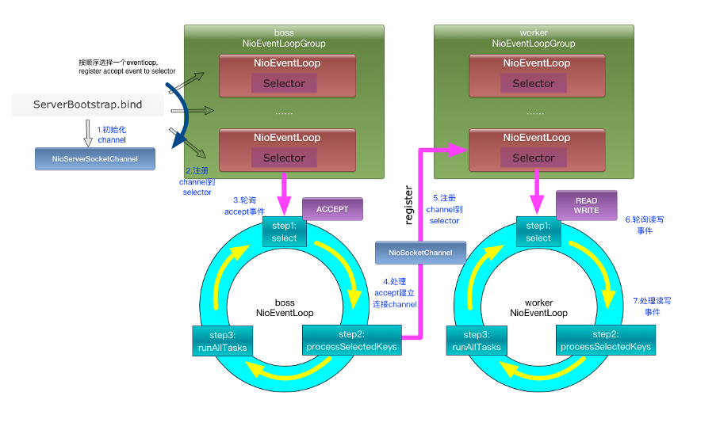

# 简介

简单的说，netty 提供了一个NIO（异步非阻塞IO）网络框架，基于此可以轻松地开发高性能的网络应用。

# 优点

- 支持多种协议，且有统一的API
- 强大的线程模型
- 高性能

# 常见问题

## reactor 

reactor 模式是事件驱动的一种实现，将服务端接受请求和事件处理分离，从而提升系统处理并发的能力，java的NIO的reactor模式是基于系统内核的多路复用技术实现的。

reactor模式有三个组件，Handler、Demultiplexer、Reactor，核心是 IO复用 + 非阻塞编程 + bind/function。

## reactor 和 I/O多路复用

reactor 是一种网络编程模式，其底层多使用系统实现的I/O多路复用能力。

## 高性能原因

- 基于Reactor模式实现的 **NIO**（异步阻塞IO），IO多路复用
- TCP接受和发送缓冲区使用**直接内存**代替堆内存，避免了内存复制
- 使用内存池的方式，**循环利用 ByteBuf**
- **环形数组缓冲区**实现无锁化并发编程
- 关键资源的处理使用单线程串行化，避免使用锁

## 线程模型

在 Netty 主要靠 NioEventLoopGroup 线程池来实现具体的线程模型的 。我们实现服务端的时候，一般会初始化两个线程组，Boss Group 和 Worker Group，前者用于接收连接，后者负责具体的处理，交由对应的 Handler 处理。

Netty 可以实现多种线程模型，单线程、多线程、主从多线程模型。

## 启动流程

- 创建两组线程组，Boss 和 Worker
- 创建服务端启动引导/辅助类 ServerBootstrap
- 为引导类设置线程组
- 绑定端口，得到 ChannelFuture 对象
- 阻塞等待 Future 对象，知道服务器 Channel 关闭
- 关闭线程组

## 默认线程数量

CPU核心数 * 2。

## 处理流程

## BIO / NIO / AIO

- BIO：阻塞IO
- NIO：非阻塞IO
- AIO：异步非阻塞IO

## netty 中的 selector

Selector 能够检测多个注册的通道上是否有事件发生（多个Channel以事件的方式可以注册到同一个Selector），如果有事件发生，便获取事件然后针对每个事件进行相应的处理。这样就可以只用一个单线程去管理多个通道，也就是管理多个连接和请求。

## netty 的核心组件

- Channel
  - Netty 的网络操作抽象类，包含了基本的I/O操作，bind、connect、read、write 等，降低了直接使用 Socket 的复杂度
  - 与 EventLoop 一起处理I / O
- ChannelHandler
  - 用于处理各种事件，以支持各种协议和处理数据的方式
  - 比如，连接、数据接收、异常、数据转换等
- ChannelPipeline
  - 提供了 ChannelHandler 链的容器
- EventLoop
  - EventLoop 定义了Netty的核心抽象，用于处理连接的生命周期中所发生的事件
  - 负责监听网络事件，并调用事件处理器进行相关的 I/O 操作的处理

## Channel 和 EventLoop 联系

Channel 是为 Netty 网络操作的抽象类，EventLoop 负责处理注册到其上的Channel，处理I/O操作，两者配合完成I/O操作

## EventloopGroup 和 EventLoop 关系

EventLoopGroup 是一组 EventLoop 的抽象，提供了 next 接口，从一组 EventLoop 中按规则选择一个 EventLoop 来处理任务。

## BootStrap 和 ServerBootStrap 

BootStrap 通过 connect 方法连接远程主机，作为TCP协议的客户端，或通过bind方法绑定本地端口，作为UDP协议的一端。只需配置一组 EventLoopGroup。

ServerBootStrap 通过 bind 方法绑定本地端口，等待客户端连接。需配置两组 EventLoopGroup ，一个用于接收，一个用于处理，即 Boss EventLoopGroup 和 Worker EventLoopGroup。

## 应用场景

- RPC框架的网络通讯工具
- 搭建网络应用，http 或其他

# 参考

- https://www.cnblogs.com/lihonglin2016/p/9774957.html
- https://zhuanlan.zhihu.com/p/148726453
- https://www.jianshu.com/p/eef7ebe28673
- https://www.zhihu.com/question/320829696
- http://www.blogjava.net/DLevin/archive/2015/09/02/427045.html