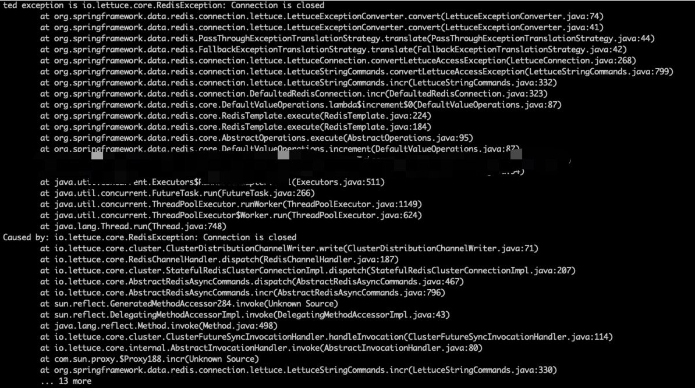

# 服务停止时Redis连接池断开异常

## 问题描述

使用Spring Boot的RedisTemplate、RedisLockRegistry，在停止服务时，由于Redis连接早于应用逻辑断开，导致打印 Redis 连接断开异常，具体异常日志如下。

```java
org.springframework.data.redis.RedisSystemException: Redis exception; ness
ted exception is io.lettuce.core.RedisException: Connection is closed
        at org.springframework.data.redis.connection.lettuce.LettuceExceptionConverter.convert(LettuceExceptionConverter.java:74)
        at org.springframework.data.redis.connection.lettuce.LettuceExceptionConverter.convert(LettuceExceptionConverter.java:41)
        at org.springframework.data.redis.PassThroughExceptionTranslationStrategy.translate(PassThroughExceptionTranslationStrategy.java:44)
        at org.springframework.data.redis.FallbackExceptionTranslationStrategy.translate(FallbackExceptionTranslationStrategy.java:42)
        at org.springframework.data.redis.connection.lettuce.LettuceConnection.convertLettuceAccessException(LettuceConnection.java:268)
        at org.springframework.data.redis.connection.lettuce.LettuceStringCommands.convertLettuceAccessException(LettuceStringCommands.java:799)
        at org.springframework.data.redis.connection.lettuce.LettuceStringCommands.incr(LettuceStringCommands.java:332)
        at org.springframework.data.redis.connection.DefaultedRedisConnection.incr(DefaultedRedisConnection.java:323)
        at org.springframework.data.redis.core.DefaultValueOperations.lambda$increment$0(DefaultValueOperations.java:87)
        at org.springframework.data.redis.core.RedisTemplate.execute(RedisTemplate.java:224)
        at org.springframework.data.redis.core.RedisTemplate.execute(RedisTemplate.java:184)
        at org.springframework.data.redis.core.AbstractOperations.execute(AbstractOperations.java:95)
        at org.springframework.data.redis.core.DefaultValueOperations.increment(DefaultValueOperations.java:87)
        ...
        at java.util.concurrent.Executors$RunnableAdapter.call(Executors.java:511)
        at java.util.concurrent.FutureTask.run(FutureTask.java:266)
        at java.util.concurrent.ThreadPoolExecutor.runWorker(ThreadPoolExecutor.java:1149)
        at java.util.concurrent.ThreadPoolExecutor$Worker.run(ThreadPoolExecutor.java:624)
        at java.lang.Thread.run(Thread.java:748)
Caused by: io.lettuce.core.RedisException: Connection is closed
        at io.lettuce.core.cluster.ClusterDistributionChannelWriter.write(ClusterDistributionChannelWriter.java:71)
        at io.lettuce.core.RedisChannelHandler.dispatch(RedisChannelHandler.java:187)
        at io.lettuce.core.cluster.StatefulRedisClusterConnectionImpl.dispatch(StatefulRedisClusterConnectionImpl.java:207)
        at io.lettuce.core.AbstractRedisAsyncCommands.dispatch(AbstractRedisAsyncCommands.java:467)
        at io.lettuce.core.AbstractRedisAsyncCommands.incr(AbstractRedisAsyncCommands.java:796)
        at sun.reflect.GeneratedMethodAccessor284.invoke(Unknown Source)
        at sun.reflect.DelegatingMethodAccessorImpl.invoke(DelegatingMethodAccessorImpl.java:43)
        at java.lang.reflect.Method.invoke(Method.java:498)
        at io.lettuce.core.cluster.ClusterFutureSyncInvocationHandler.handleInvocation(ClusterFutureSyncInvocationHandler.java:114)
        at io.lettuce.core.internal.AbstractInvocationHandler.invoke(AbstractInvocationHandler.java:80)
        at com.sun.proxy.$Proxy188.incr(Unknown Source)
        at org.springframework.data.redis.connection.lettuce.LettuceStringCommands.incr(LettuceStringCommands.java:330)
        ... 13 more
```



## 解决方案

解决思路是让Redis连接断开时间晚于服务Bean实例销毁时间，这里的解决方案是使用 `@DependsOn` 注解，`DependsOn` 既可以保证依赖Bean早于当前Bean创建，同时也会保证依赖Bean晚于当前Bean销毁，在使用redisTemplate或redisLockRegistry，或二者的Bean类，添加注解，示例如下，按需选择其一或两个。

```java
@DependsOn({"redisTemplate", "redisLockRegistry"})
```

# 接口返回 null 字段

```yaml
# 添加如下配置
spring:
  jackson:
    default-property-inclusion: non_null
```

# 跨域

```java
// 添加如下注解
@CrossOrigin(maxAge = 1, methods = {RequestMethod.POST, RequestMethod.GET})
@RequestMapping(value = "info", method = {
        RequestMethod.POST, RequestMethod.GET
}, produces = MediaType.APPLICATION_JSON_VALUE)
```

