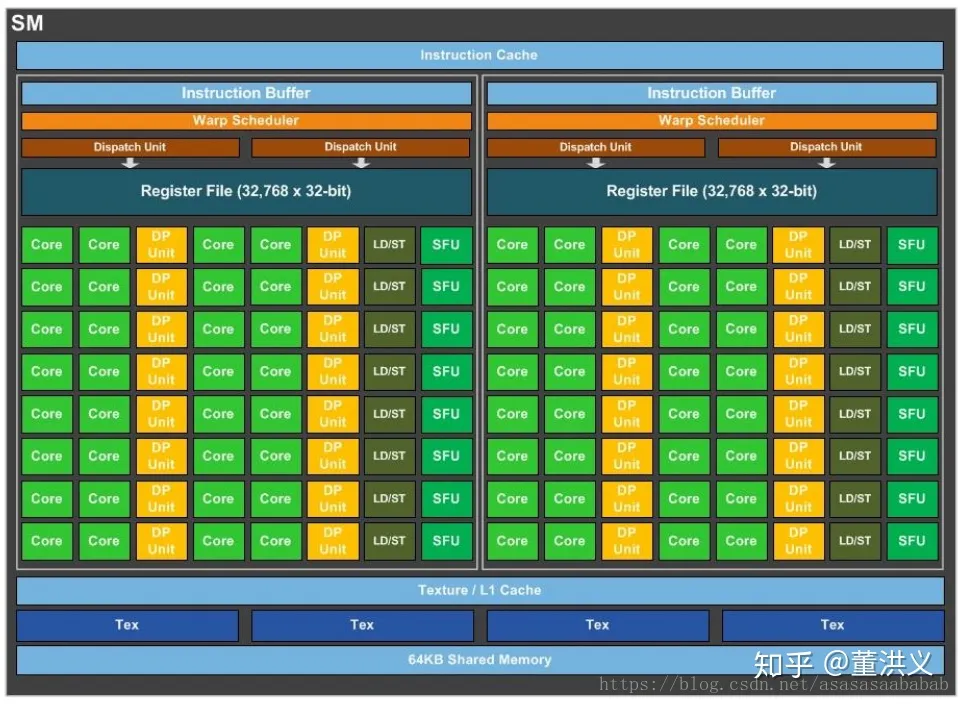

# 概念

## 核函数

核函数是运行在 GPU 设备上的函数，使用 `__global__` 定义，且返回类型必须是 `void`。

## 硬件相关

### Streaming Multiprocessor（SM）

- 多个 SP 加上其他资源组成一个 SM
- 其他资源包括
    - warp scheduler
    - register
    - shared memery

### Streaming Processor（SP）

- 也称为 CUDA core
- 最基本的处理单元

# GPU 中的内存

- 全局内存（Global Memory）
    - GPU 上所有线程共享访问
- 共享内存（Shared Memory）
    - 位于 SM 中的一块高速缓存内存
    - 由线程块中的线程共享
- 寄存器（Register）
    - 每个线程都有对应的本地寄存器缓存

# 通信

- block 内的线程可以同步也可以通过 shared memory 通信
- grid 内的线程共享 global memory

# 线程组织

- thread
    - 最小任务单元
- block
    - 分配给 SM 执行
    - 每个线程块最多有 1024 个线程
    - 可以是一维、二维、三维
- warp
    - block 中的线程以 warp 为单位进行分组
    - warp 大小为 32（当前）
    - 同一个 warp 中的 thread 以不同数据资源执行相同指令（SIMT，单指令多线程）
    - GPU 执行程序时的调度、执行的基本单元
    - 由 SM 的硬件 warp scheduler 负责调度
- grid
    - 单独的 kernel 启动的所有线程组成一个 grid
    - grid 中所有线程共享 global memory
    - 多个 block 组成一个线程网格 grid
    - 可以是一维、二维、三维

**其他**

- 核函数中 <grid, block>
    - grid
        - block 的组织方式
        - 可以是一至三维
    - block
        - thread 的组织方式
        - 可以是一至三维
- 指定网格结构
    - `dim3 grid(8, 4, 2);`

# CHATGPT

## 如何提高 gpu 的吞吐能力

要提高 GPU 的吞吐能力，可以考虑以下几个方面的优化：

1. 并行化和向量化：利用 GPU 的并行处理能力和 SIMD（Single Instruction, Multiple Data）特性，尽可能将任务划分为独立的子任务，并对数据进行向量化操作。这样可以最大程度地利用 GPU 的计算资源。
2. 内存访问优化：合理管理数据的访问模式，尽量减少内存访问的延迟和带宽消耗。可以使用共享内存来提高访问速度，通过数据重用和局部性原则减少全局内存访问次数。
3. 内核函数设计：设计高效的内核函数，在保持功能完整性的同时，最大限度地减少同步和分支等开销。避免线程间冲突和竞争条件，提高执行效率。
4. 内存传输优化：尽量减少 CPU 和 GPU 之间的数据传输，可以通过使用异步内存传输、数据压缩、数据预取等技术来减少传输时间和带宽占用。
5. 算法选择和优化：针对具体的问题和数据特点，选择适合 GPU 并行计算的算法和数据结构。根据硬件架构的特点，对算法进行调整和优化，例如减少不必要的计算步骤、减少数据依赖等。
6. 合理利用异构计算：除了 GPU，可以结合 CPU 和其他加速器（如FPGA）进行协同计算，充分利用不同硬件之间的优势来提高整体系统的吞吐能力。
7. 使用专门的优化工具和库：针对特定的 GPU 架构和编程模型，使用专门的优化工具和库，例如 NVIDIA 的 CUDA Toolkit 提供的性能分析工具和优化指南。

以上是一些常见的方法，但具体的优化策略会取决于具体的应用场景和问题需求。在实际优化过程中，通过性能分析和测试来识别瓶颈，并基于具体情况采取相应的优化手段是非常重要的。

