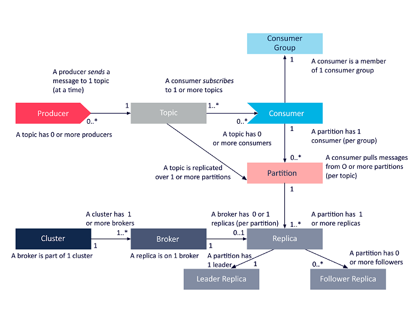

# 概念

## 基础

- broker
- topic
- partition
- segment
- replication
- consumer
  - consumer
  - consumer group
  - consumer instance
  - offset
- producer

### broker

broker 是一个 kafka 进程，多个 broker 组成了一个 kafka 集群。在 conumer 和 producer 中，使用如下方式指定多个 broker。

```java
Properties props = new Properties();
props.put("bootstrap.servers", "localhost:9092,localhost:9093");
```

### topics

主题，标识了一个消息队列。producer 产生数据时需要指定，consumer 消费时也需要指定，两者指定的 topic 匹配来达到数据的流通。

### producer

生产者，产生消息的实例。producer 需要指定 topic，可选地将消息写入哪个 partition，通过指定 `partitioner.class` 选项实现。

```java
Properties props = new Properties();
props.put("bootstrap.servers", "localhost:9092");
props.put("acks", "all");
props.put("retries", 0);
props.put("batch.size", 16384);
props.put("linger.ms", 1);
props.put("partitioner.class", "com.example.MyPartitioner");
props.put("buffer.memory", 33554432);
props.put("key.serializer", "org.apache.kafka.common.serialization.StringSerializer");
props.put("value.serializer", "org.apache.kafka.common.serialization.StringSerializer");
Producer<String, String> producer = new KafkaProducer<>(props);
```

### consumer

#### consumer

消费者，逻辑概念，指从消息队列获取消息的实例。consumer 必须指定 topic，可选地指定 partition。

```java
Properties props = new Properties();
props.setProperty("bootstrap.servers", "localhost:9092");
props.setProperty("group.id", "test-group");
props.setProperty("enable.auto.commit", "false");
props.setProperty("key.deserializer", "org.apache.kafka.common.serialization.StringDeserializer");
props.setProperty("value.deserializer", "org.apache.kafka.common.serialization.StringDeserializer");

KafkaConsumer<String, String> consumer = new KafkaConsumer<>(props);
//don't call consumer#subscribe()
//assigning partition-id=1
consumer.assign(Collections.singleton(new TopicPartition("topic", 1)));
while (true) {
    ConsumerRecords<String, String> records = consumer.poll(Duration.ofSeconds(2));
    for (ConsumerRecord<String, String> record : records) {
        // todo sth.
    }
    consumer.commitSync(); // enable.auto.commit 设置为 false 时必须
}
```

#### consumer instance

consumer instance 是一个消费实例，具体地是某个程序的某个进程/线程。

#### consumer group

consumer group 是一个逻辑概念，由一个或多个 consumer instance 组成，这种组成是通过 consumer instance 消费时指定 cosumer group 来隐式加入的。

#### offset

offset 标记了一个 consumer group 消费消息的偏移量。偏移量信息保存在 zookeeper 中，保存的信息有过期时间，默认的过期时间在 kafka 的配置文件中，配置项为 `offsets.retention.minutes`，下面是一个示例。

```properties
# file: kafka/config/server.properties
offsets.retention.minutes=1440
```

默认的过期时间是 1440 分钟，即 24 小时。

### partition

分区（partition）是物理概念，topic 是逻辑概念，一个 topic 有至少一个 partition，每个 partition 会对应某个 broker 磁盘上的一些区域（更具体地，对应一个文件夹）。

可以将 topic 划分为多个分区，根据分区规则把消息存储到某个分区，如果分区规则能将消息均匀地分散到各 partition，这个过程就可以看做负载均衡和水平扩展。

同时，consumer 可以从一个或者多个 partition 中消费消息。


### segment

segment 是 partition细分的物理概念，包括`.index`文件（索引文件）和`.log`文件（数据文件）。

- [Ref](https://blog.csdn.net/lp284558195/article/details/80297208)

### replication

可以通过为 topic 设置多个 replication，来保证数据可靠性，多个 replication 是主从关系，主挂后，从从中选举新的主。

## Kafka Stream

### 流处理拓扑

- 流（Stream）代表一个无边界的、持续更新的数据集，是有序的、可重放的、不可变数据记录的容错序列，数据记录是一个键值对
- 流处理应用（Stream Processing Application）是任何使用 Kafka Stream Library 的程序，通过一个或多个处理拓扑（Processor Topologies）定义计算逻辑，一个计算拓扑是一个流处理器（节点）的图，通过流（边）来连接
- 流处理器（Stream Processor）是处理拓扑中的一个节点，表示一个数据转换的处理步骤，通过从拓扑中的上游节点接受一个输入记录，应用操作到记录，可能产生一个或多个记录到它的下游节点

拓扑中有两种特殊的处理器。

- 源处理器（Source Processor），没有上游处理器，通过消费一个或多个 Kafka Topic ，向它所在的拓扑中构造一个输入流，将记录传递给下游节点
- SinK 处理器（Sink Processor），没有下游处理器，发送所有从上游节点接受到的记录到指定的 Kafka Topic 内

在普通的处理器内，可以访问其他远程系统。


# 架构



# 参考

- https://kafka.apache.org/20/documentation/streams/architecture
- https://www.instaclustr.com/apache-kafka-architecture/
- http://cloudurable.com/blog/kafka-architecture/index.html
- https://www.zhihu.com/question/28925721