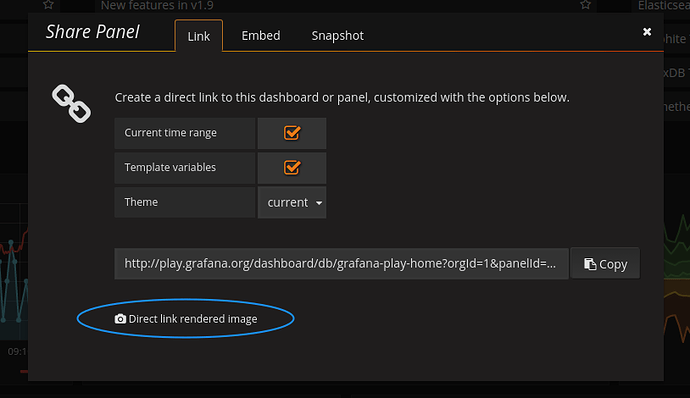

# 安装

可以从 [清华源](https://mirrors.tuna.tsinghua.edu.cn/grafana/) 下载。

```shell
# centos
wget https://mirrors.tuna.tsinghua.edu.cn/grafana/yum/rpm/grafana-7.5.3-1.x86_64.rpm
sudo npm install grafana-7.5.3-1.x86_64.rpm
```

# 插件

# Grafana Image Renderer 



```shell
# 需要安装的依赖
yum install -y libXcomposite libXdamage libXtst cups libXScrnSaver pango atk adwaita-cursor-theme adwaita-icon-theme at at-spi2-atk at-spi2-core cairo-gobject colord-libs dconf desktop-file-utils ed emacs-filesystem gdk-pixbuf2 glib-networking gnutls gsettings-desktop-schemas gtk-update-icon-cache gtk3 hicolor-icon-theme jasper-libs json-glib libappindicator-gtk3 libdbusmenu libdbusmenu-gtk3 libepoxy liberation-fonts liberation-narrow-fonts liberation-sans-fonts liberation-serif-fonts libgusb libindicator-gtk3 libmodman libproxy libsoup libwayland-cursor libwayland-egl libxkbcommon m4 mailx nettle patch psmisc redhat-lsb-core redhat-lsb-submod-security rest spax time trousers xdg-utils xkeyboard-config alsa-lib
```

## 安装

```shell
grafana-cli plugins install grafana-image-renderer
```

