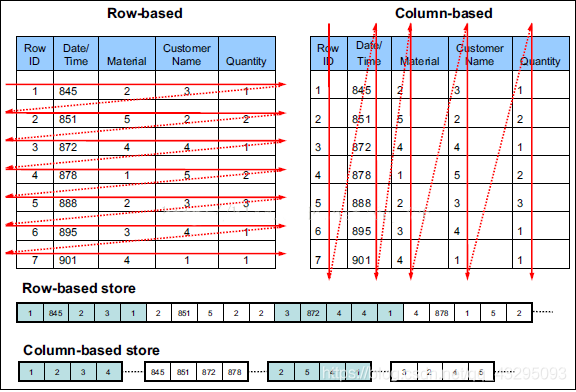

# 行、列存储

行存储和列存储用于描述数据组织方式，通常，行存储存取单位是整条记录，列存储存储单位是数据记录的一列。



| 姓名  | 年龄 | 省份 |
| ----- | ---- | ---- |
| Li    | 25   | 山东 |
| Zhao  | 23   | 北京 |
| Zhang | 22   | 辽宁 |

以上面数据为例，基于行存储，数据可能组织如下。

```
Li,25,山东
Zhao,23,北京
Zhang,22,辽宁
```

基于列存储，数据可能组织如下。

```
Li,Zhao,Zhang
25,23,22
山东,北京,辽宁
```

两者各有优劣，对比如下。

|对比项| 行存储                         | 列存储         |
| ----- | ------------------------------ | -------------- |
|格式| 按行存储 | 按列，每一列单独存储 |
| 粒度 | 记录                   | 记录单列 |
| 索引 | 需要额外索引提高效率 | 数据即索引 |
|读取| 读取整条记录，可能存在冗余读取 | 按列多次读取，性能可能会更差 |
|写入| 一次写入，数据完整性更容易保证        | 按列多次写入，性能可能会更差 |
|**性能**| 建立索引、物化视图、冗余读写消耗大量资源 | 无需索引、视图 |
|**扩展**| 随着数据量增加为维持性能需要大量膨胀数据库 | 可横向扩展 |
|应用| OLTP | OLAP |
|全量操作| 全量更新、聚合字段效率差 | 粒度更细，效率较高 |
|**压缩**| 压缩率较低 | 每一列数据同质，无二义性，且顺序存储，可达到较高压缩率 |

关系型数据库一般采用行存储，存储结构化数据，随着数据量增加，要提升性能需要付出很大的代价。列存储数据库一般具备可伸缩、可分区的特点，可以高效实现数据序列化、存储、检索。

## 数据库示例

| 行存储  | 列存储 |
| ------- | ------ |
| MySQL   | HBase  |
| MongoDB |        |

# 参考

- https://blog.csdn.net/qq_43295093/article/details/85226756

