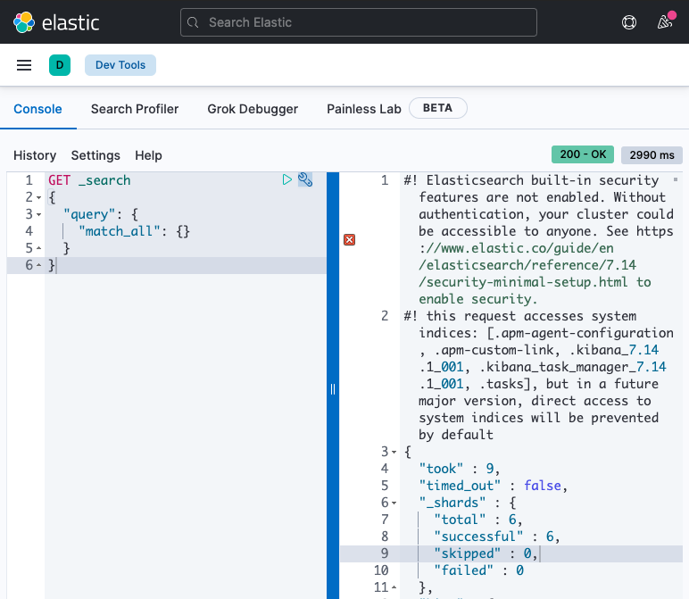

# 安装

[官网](https://www.elastic.co/cn/downloads/elasticsearch)给了丰富的安装方式。

## Centos 7

**添加仓库**

```shell
$ sudo vim /etc/yum.repos.d/elasticsearch.repo
[elasticsearch]
name=Elasticsearch repository for 7.x packages
baseurl=https://artifacts.elastic.co/packages/7.x/yum
gpgcheck=1
gpgkey=https://artifacts.elastic.co/GPG-KEY-elasticsearch
enabled=0
autorefresh=1
type=rpm-md
```

**安装**

```shell
$ sudo yum install --enablerepo=elasticsearch elasticsearch
```

**systemd 配置**

```shell
$ sudo systemctl daemon-reload
$ sudo systemctl enable elasticsearch.service
```

**启动**

```shell
sudo systemctl start elasticsearch.service
```

# 配置

## 添加用户

文档参考[这里](https://www.elastic.co/guide/en/elasticsearch/reference/master/users-command.html)。

> 对于使用 yum 在 centos 7 安装的 es 来说，可执行程序在 `/usr/share/elasticsearch/bin` 下。

```shell
# 命令格式
$ bin/elasticsearch-users
([useradd <username>] [-p <password>] [-r <roles>]) |
([list] <username>) |
([passwd <username>] [-p <password>]) |
([roles <username>] [-a <roles>] [-r <roles>]) |
([userdel <username>])

# 创建管理员
$ bin/elasticsearch-users useradd wii -p <password> -r superuser
```

> **角色** 内置角色在[这里](https://www.elastic.co/guide/en/elasticsearch/reference/7.14/built-in-roles.html)。
>
> - `superuser` : 管理员，所有权限

## 安装 Kibana

### yum 安装

```shell
# install public signing key
$ rpm --import https://packages.elastic.co/GPG-KEY-elasticsearch

# 添加源
$ vim /etc/yum.repo.d/kibana.repo
[kibana-7.x]
name=Kibana repository for 7.x packages
baseurl=https://artifacts.elastic.co/packages/7.x/yum
gpgcheck=1
gpgkey=https://artifacts.elastic.co/GPG-KEY-elasticsearch
enabled=1
autorefresh=1
type=rpm-md

# 安装
$ yum install kibana
$ chkconfig --add kibana

# systemd
$ sudo /bin/systemctl daemon-reload
$ sudo /bin/systemctl enable kibana.service
```

## 启动 Kibana

```shell
$ sudo systemctl start kibana.service
```

## 配置

```yaml
# file: /etc/kibana/kibana.yml
# 添加如下内容
server.host: "0.0.0.0"
```

## 访问

[http://host:5601](http://host:5601)

# 使用

## 数据

## 工具

在 Kibana 首页，打开 Dev Tools，或者直接访问 `http://host:5601/app/dev_tools#/console`。



左侧为请求，右侧为响应。

请求的第一行，为**请求方法及 URL**，下方为**数据**。

## 写入数据

## 查询

```json
GET index_article/_search
{
  "query": {
    "match_all": {}
  }
}
```

