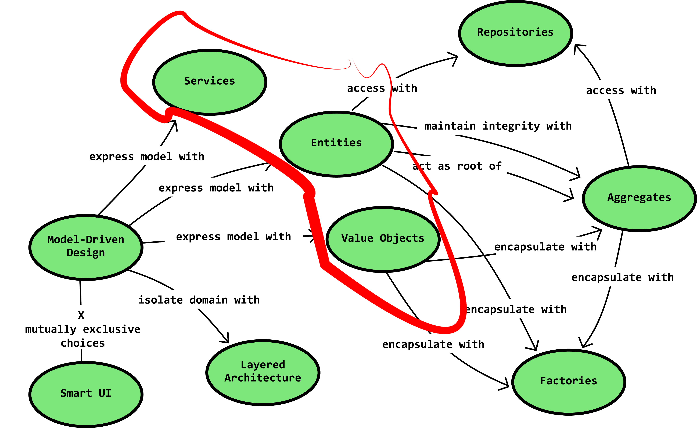

领域驱动设计（DDD，Domain-Driven Design）是帮助开发大型系统的原则和模式的集合。DDD 更像一种方法论，指导我们开发大型的系统。

软件系统设计理念经历了 POP（面向过程编程）、OOP（面向对象编程）、DDD（领域驱动设计） 的转变。POP 设计，通过构建函数、分层，划分模块等方式，分解软件系统的复杂度。OOP 把软件的设计从功能维度提升到实体维度，进一步分解软件系统的复杂度，并以一种更易于理解的方式来组织软件系统。

随着软件系统规模的不断扩大，面临着实体爆炸的问题，在一个单一的逻辑范畴内，处理所有的实体，到了极其复杂的程度。DDD 通过把系统从需求维度划分为不同的领域，每个领域进行单独的设计，域之间通过暴露接口来进行协作。

# 核心概念

## Bounded Context

# 参考

- [Domain-driven design essentials - Key Concepts](https://penchev.com/posts/domain-driven-design-essentials/)