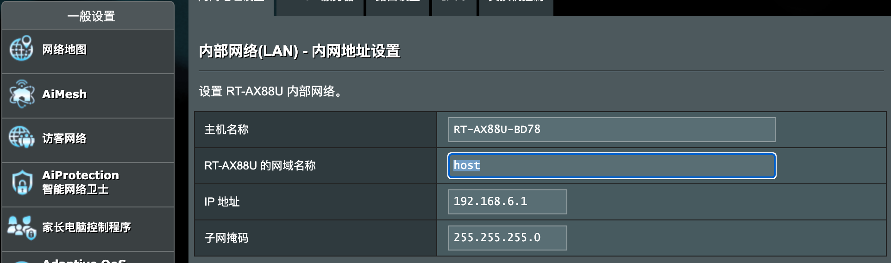
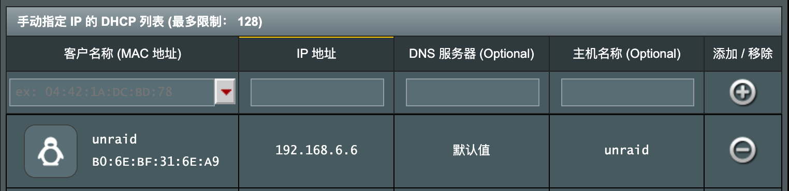
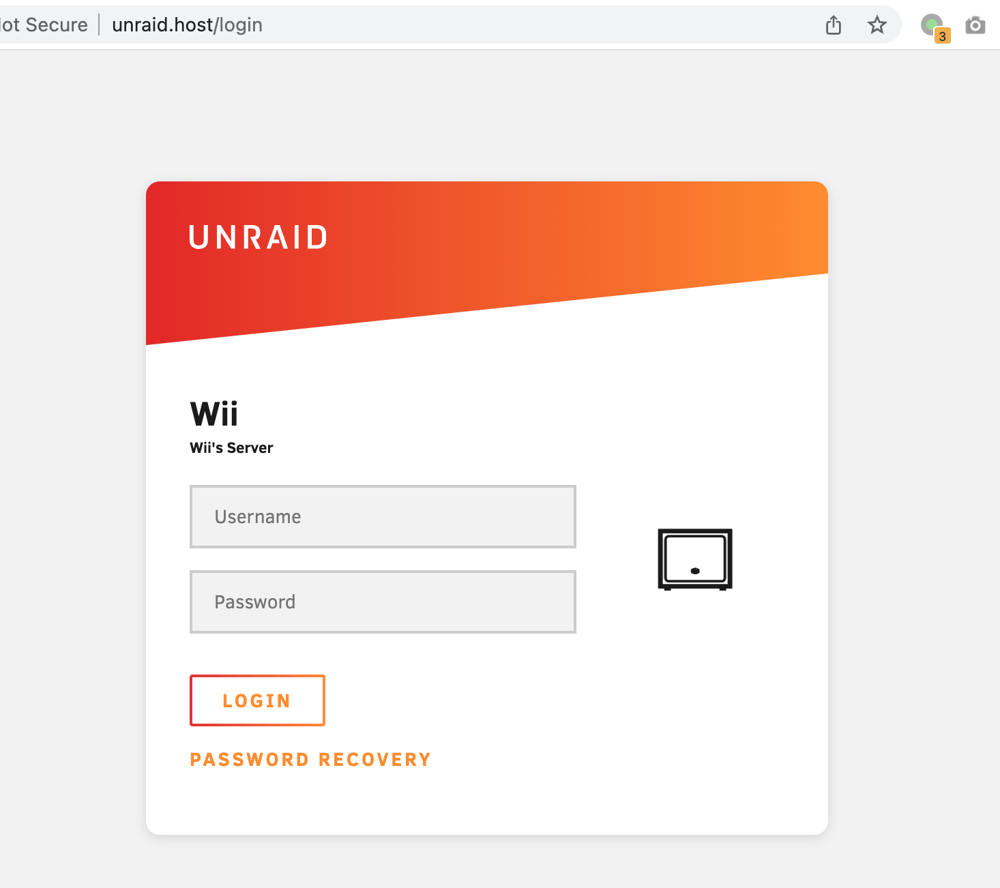

# 通过域名解析内网机器

打开 **高级设置 / 内部网络**，修改路由器网络名称为 `host`。

> 这里选 host 是应为 host 是合法的定级域名，浏览器输入不添加协议头 (`http://` 等) 时不会调用搜索。



**修改机器名称**

在下面的 **手动指定 IP 的 DHCP 列表** 中添加内网机器记录。



**检查 Hosts**

```shell
$ ssh admin@192.168.6.1

$ cat /etc/hosts
127.0.0.1 localhost.localdomain localhost
192.168.6.1 RT-AX88U-BD78.host RT-AX88U-BD78
192.168.6.1 RT-AX88U-BD78.local
192.168.6.1 router.asus.com
192.168.6.1 www.asusnetwork.net
192.168.6.1 www.asusrouter.com
192.168.6.6 unraid.host
...
```

**浏览器访问**



# 注意

上面示例使用了 host，但是出现了一些意外的情况。有一台新的机器初始化，不知道为何，连接公司网络后，网络连接配置里面的 Search Domain 仍然保留了 host，按道理来说，更换网络后 Search Domain 会从新的网络获取。如果继续配置 Search Domain 为 host，那么会出现这么一种情况：如果访问的域名不存在，那么会尝试搜索 `domain.host`，然而 `.host` 是一个可用的顶级域名，然后出现了跳转到 `domain.host` ，有些公司的 `dOmain` 恰巧被一些大聪明利用，就出现了实际不存在但是会跳转到不可言状的站点（比如访问 `git.compony.com` 有可能被解析为 `git.compony.com.host` 并被重定向到某些网站）。

总是，不用 `.host`，选择一个和顶级域名不冲突的 search domain。