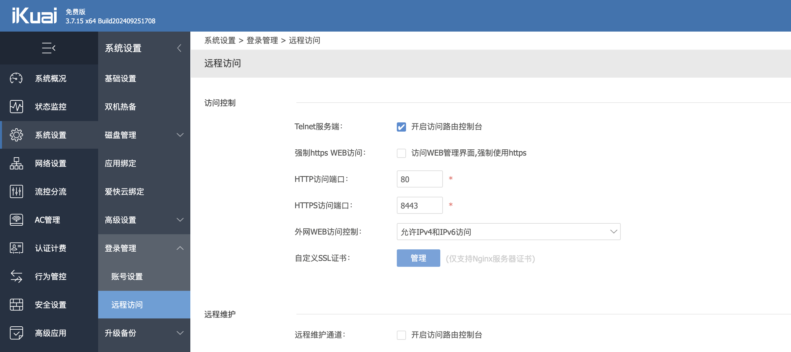
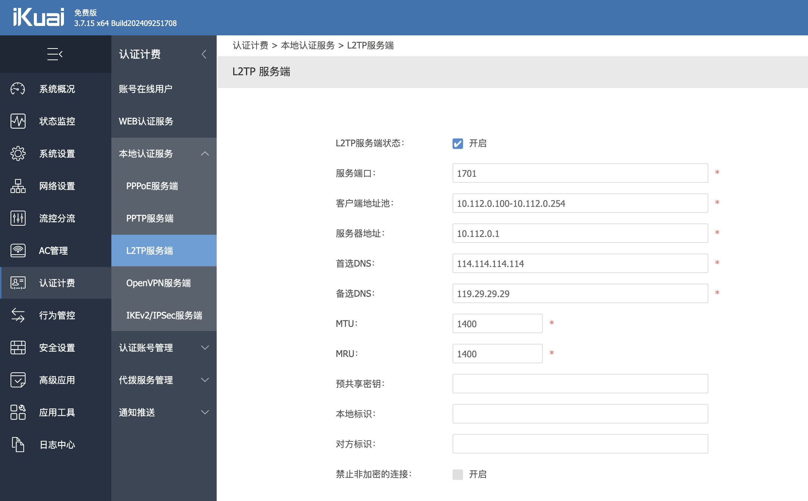
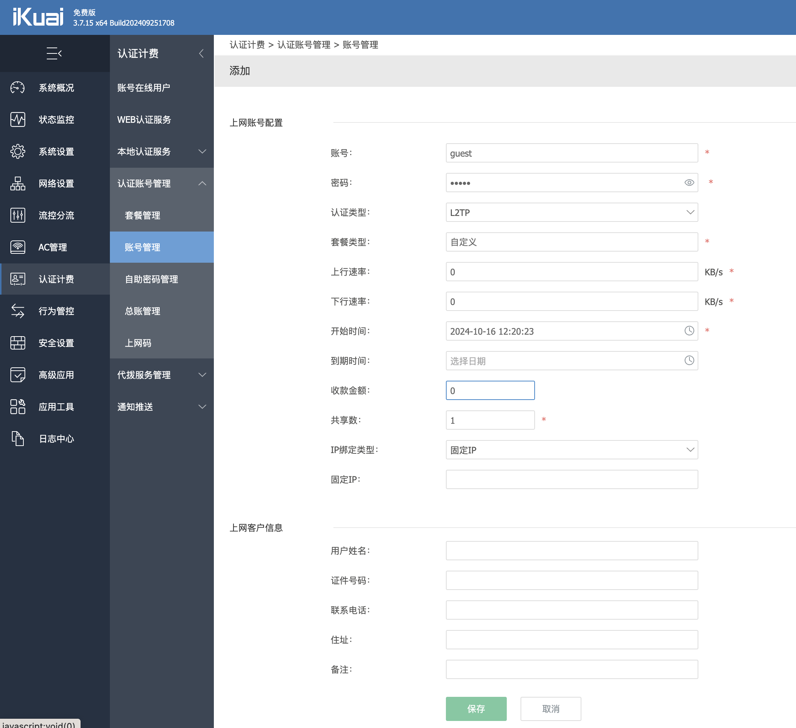
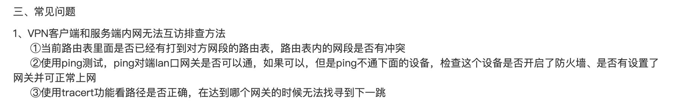
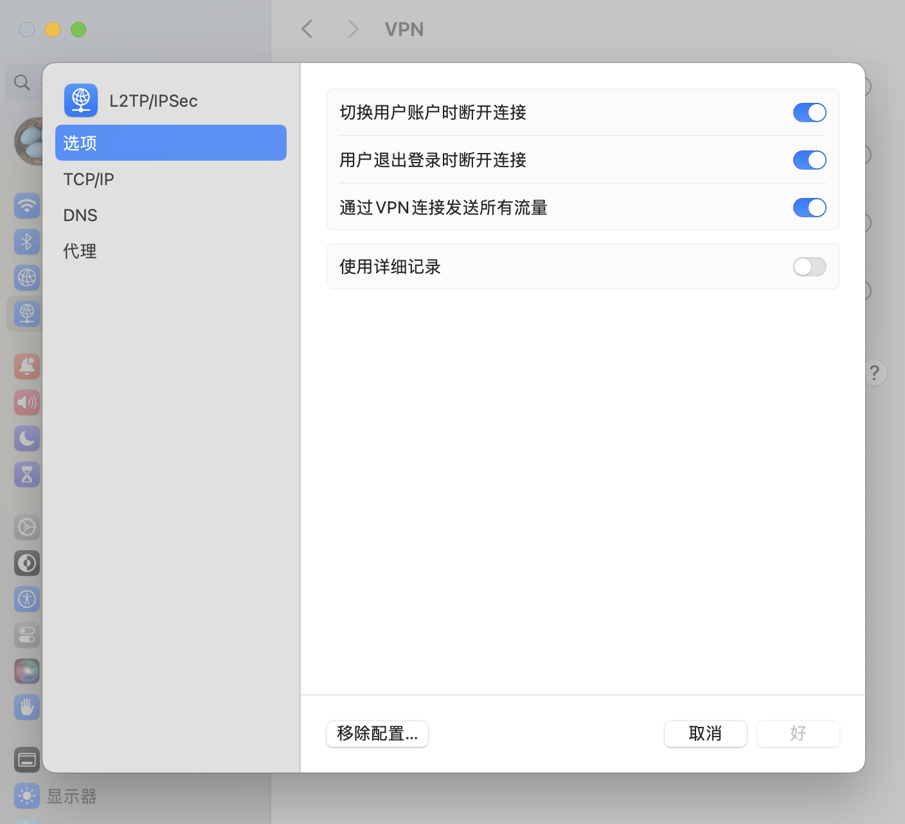

# 远程访问

## 生成证书

```shell
$ openssl req -x509 -days 7200 -newkey rsa:2048 -keyout server.key -out server.crt -nodes -subj "/C=CN/ST=Beijing/L=Beijing/O=Wii/OU=IT/CN={your.domain}" -addext "subjectAltName = DNS:{your.domain}"
```

将生成的 crt 和 key 文件内容拷贝到爱快远程访问的证书管理里面。



## 证书认证问题导致的无法访问

Chrome 浏览器 + Mac OS 会触发这个问题，访问方式如下。

- 点击页面空白处（位置随意）
- 然后使用键盘输入 `thisisunsafe` （对，没有任何输入框，盲输。注意，一定要先点击页面空白处）

或者使用 Safari 浏览器（或者其他），在显示详细信息里面点继续访问即可。

# VPN

## L2TP 服务端

只需要启动服务端、添加账号，无需其他配置。

### 启动服务端



> - 预共享密钥选填

### 配置账号



> 1. 输入账号密码
> 2. 输入收款金额 0

## 问题排查

### 无法访问内网

#### 官网排查手册



#### 客户端排查

Mac os 用户，需要开启 VPN 里面的 **通过 VPN 连接发送所有流量**，如果不开启的话部分内网 ip 网段可能不走 VPN，导致无法访问远端内网。

