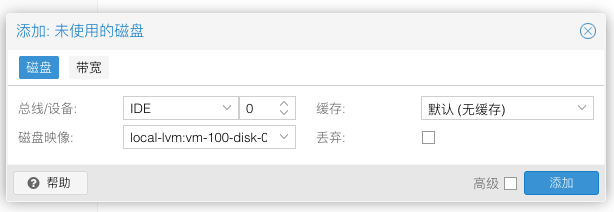
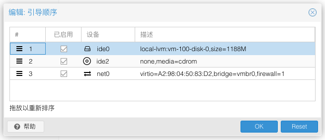

# 镜像

- [lede](https://github.com/coolsnowwolf/lede)
- [immortalwrt](https://github.com/immortalwrt/immortalwrt)
    - [下载镜像](https://downloads.immortalwrt.org/releases/23.05.4/targets/x86/64/)


# 主题

- https://github.com/jerrykuku/luci-theme-argon

# LEDE

## 更新源配置

**腾讯**

```shell
src/gz openwrt_core https://mirrors.cloud.tencent.com/openwrt/releases/22.03.2/targets/x86/64/packages
src/gz openwrt_base https://mirrors.cloud.tencent.com/openwrt/releases/22.03.2/packages/x86_64/base
src/gz openwrt_luci https://mirrors.cloud.tencent.com/openwrt/releases/22.03.2/packages/x86_64/luci
src/gz openwrt_packages https://mirrors.cloud.tencent.com/openwrt/releases/22.03.2/packages/x86_64/packages
src/gz openwrt_routing https://mirrors.cloud.tencent.com/openwrt/releases/22.03.2/packages/x86_64/routing
src/gz openwrt_telephony https://mirrors.cloud.tencent.com/lede/snapshots/packages/x86_64/telephony
```

**清华源**

```shell
src/gz openwrt_core https://mirrors.cloud.tencent.com/lede/snapshots/targets/x86/64/packages
src/gz openwrt_base https://mirrors.cloud.tencent.com/lede/snapshots/packages/x86_64/base
src/gz openwrt_helloworld https://mirrors.cloud.tencent.com/lede/snapshots/packages/x86_64/helloworld
src/gz openwrt_kenzo https://mirrors.cloud.tencent.com/lede/snapshots/packages/x86_64/kenzo
src/gz openwrt_luci https://mirrors.cloud.tencent.com/lede/releases/18.06.9/packages/x86_64/luci
src/gz openwrt_packages https://mirrors.cloud.tencent.com/lede/snapshots/packages/x86_64/packages
src/gz openwrt_routing https://mirrors.cloud.tencent.com/lede/snapshots/packages/x86_64/routing
src/gz openwrt_small https://mirrors.cloud.tencent.com/lede/snapshots/packages/x86_64/small
src/gz openwrt_telephony https://mirrors.cloud.tencent.com/lede/snapshots/packages/x86_64/telephony
```

# PVE

## 查看 debian 版本

```shell
# 1. 查看文件 release 文件
$ cat /etc/os-release
PRETTY_NAME="Debian GNU/Linux 11 (bullseye)"
NAME="Debian GNU/Linux"
VERSION_ID="11"
VERSION="11 (bullseye)"
VERSION_CODENAME=bullseye
ID=debian
HOME_URL="https://www.debian.org/"
SUPPORT_URL="https://www.debian.org/support"
BUG_REPORT_URL="https://bugs.debian.org/"

# 2. 通过 lsb-release 命令
$ apt update
$ apt install lsb-release
$ lsb_release -a
No LSB modules are available.
Distributor ID:	Debian
Description:	Debian GNU/Linux 11 (bullseye)
Release:	11
Codename:	bullseye
```

## 修改 debian 更新源

参考[这里](https://mirrors.tuna.tsinghua.edu.cn/help/debian/)。

```shell
# 安装依赖
apt update
apt install apt-transport-https ca-certificates -y

# 修改源文件
$ mv /etc/apt/sources.list /etc/apt/sources.list.back
$ vi /etc/apt/sources.list
## 输入如下内容 (注意版本, 下面是 bullseye)
deb https://mirrors.tuna.tsinghua.edu.cn/debian/ bullseye main contrib non-free
deb-src https://mirrors.tuna.tsinghua.edu.cn/debian/ bullseye main contrib non-free
deb https://mirrors.tuna.tsinghua.edu.cn/debian/ bullseye-updates main contrib non-free
deb-src https://mirrors.tuna.tsinghua.edu.cn/debian/ bullseye-updates main contrib non-free
deb https://mirrors.tuna.tsinghua.edu.cn/debian/ bullseye-backports main contrib non-free
deb-src https://mirrors.tuna.tsinghua.edu.cn/debian/ bullseye-backports main contrib non-free
deb https://mirrors.tuna.tsinghua.edu.cn/debian-security bullseye-security main contrib non-free
deb-src https://mirrors.tuna.tsinghua.edu.cn/debian-security bullseye-security main contrib non-free
```

**更新**

```shell
apt update
apt upgrade -y
```

## 修改更新源

参考[这里](https://mirrors.tuna.tsinghua.edu.cn/help/proxmox/)。

**proxmox 更新**

```shell
# 添加源文件
vi /etc/apt/sources.list.d/pve-no-subscription.list
# 输入 (注意 debian 版本)
deb https://mirrors.tuna.tsinghua.edu.cn/proxmox/debian bullseye pve-no-subscription 
```

**CT 模板加速**

```shell
cp /usr/share/perl5/PVE/APLInfo.pm /usr/share/perl5/PVE/APLInfo.pm_back
sed -i 's|http://download.proxmox.com|https://mirrors.tuna.tsinghua.edu.cn/proxmox|g' /usr/share/perl5/PVE/APLInfo.pm
```

> 重启生效。

## 从 qcow2 启动 openwrt

**1. 拷贝镜像至 pve**

```shell
scp openwrt-x86-64-generic-squashfs-combined-efi.qcow2 root@192.168.6.60:
```

**2. 创建虚拟机**

不用添加硬盘盒配置 CD/DVD 驱动器。

**3. 挂载镜像为磁盘**

```shell
# qcow2
qm importdisk 100 openwrt-x86-64-generic-squashfs-combined-efi.qcow2 local-lvm
# img
qm importdisk 100 openwrt-x86-64-generic-squashfs-combined-efi.img local-lvm
```

> 这里的 100 是虚拟机 ID
>
> local-lvm 是存储池名称


**4. 为虚拟机添加硬盘**


选中未使用的磁盘，并点击编辑。



类型选择 IDE。

**5. 修改引导**




启用新添加的硬盘，并把优先级设为最高（拖动序号前的三条横杠）。

**6. 启动虚拟机**

保存上述更改，启动虚拟机即可。

## 硬盘直通

```shell
$ vi /etc/default/grub
# 修改 GRUB_CMDLINE_LINUX_DEFAULT 为如下
GRUB_CMDLINE_LINUX_DEFAULT="quiet intel_iommu=on"

# 更新 grub
$ update-grub
```

## 修改网络地址

```shell
$ vim /etc/config/network 
# 修改对应的网络接口地址, 比如 eth0
$ /etc/init.d/network restart 
```

## 修改密码

```shell
$ passwd root
```

# Openwrt

## 初始化

### 修改网络配置

`/etc/config/network`

```shell
# interface 'lan'
option ipaddr ... # 修改这里
```

```shell
$ service network reload
$ service network restart
```

### 修改密码

```shell
$ passwd root
```


## 安装应用 

```shell
opkg install <package>
opkg install <package.ipk>
opkg install <http://path/to/package.ipk>
```

## 扩容 overlay

**已验证的镜像类型**

```shell
openwrt-...-...-generic-squashfs-combined-efi.img
```

**扩容**

```shell
# 扩容镜像
dd if=/dev/zero bs=1G count=30 >> openwrt-22.03.2-x86-64-generic-squashfs-combined-efi.img
# 分区
$ parted openwrt-22.03.2-x86-64-generic-squashfs-combined-efi.img
...
(parted) print
...
Number  Start   End     Size    File system  Name  Flags
128     17.4kB  262kB   245kB                      bios_grub
 1      262kB   17.0MB  16.8MB  fat16              legacy_boot
 2      17.0MB  126MB   109MB

(parted) resizepart 2 100%
(parted) print
...
Number  Start   End     Size    File system  Name  Flags
128     17.4kB  262kB   245kB                      bios_grub
 1      262kB   17.0MB  16.8MB  fat16              legacy_boot
 2      17.0MB  32.3GB  32.3GB

(parted) quit

# [pve] 加载镜像为虚拟机磁盘
qm importdisk 103 openwrt-22.03.2-x86-64-generic-squashfs-combined-efi.img local-lvm
```

## 旁路由

- 网络 / 接口 / LAN
    - 基本设置
        - ipv4 地址，修改为主路由局域网合法且未被占用地址（如 192.168.6.2~192.168.6.254）
        - 网关，主路由 ip 地址（如 192.168.6.1）
        - 广播地址，如 192.168.6.255
        - DNS 服务器，主路由 ip 地址
        - IPv6 分配长度，已禁用
    - 高级设置
        - 使用内置的 ipv6 管理，关闭
    - 物理设置
        - 关闭桥接
    - DHCP 服务器
        - 忽略此接口
- 网络 / 防火墙
    - 
- 运行 SSR 

### 设备设置

**Mac OS**


**Ubuntu Server**

```shell
$ cat /etc/netplan/00-installer-config.yaml
# This is the network config written by 'subiquity'
network:
  ethernets:
    enp5s0:
      dhcp4: false
      addresses: [192.168.6.55/24]
      match:
        macaddress: 2a:04:a0:xx:xx:xx
      wakeonlan: true
      nameservers:
        addresses: [223.6.6.6, 8.8.8.8]
      routes:
        - to: default
          via: 192.168.6.89
          metric: 40
    enp6s0:
      dhcp4: true
  version: 2
```

### 连通性校验

- ping 使用 ICMP 协议，代理一般只支持 TCP 和 UDP，所以使用 ping 可能无法判断是否代理成功

```shell
# 可以尝试下面命令
curl https://www.google.com
```

## 自定义规则


