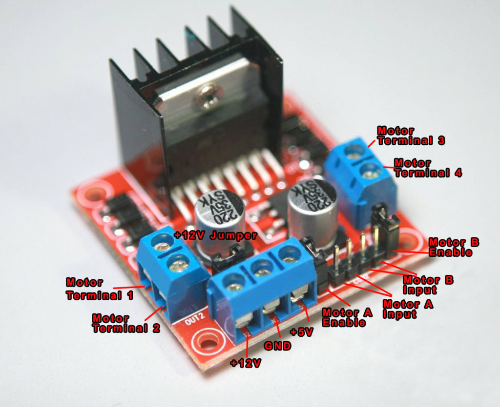

# L298N

 

## 接口

- OUT A，接马达 A
- OUT B ，接马达 B
- POWER，+5V、GND、+12V
    - 5V 电源，接 +5V + GND
    - 12V 电源，接 +12V + GND
- 控制端口，ENA、INA1、INA2、INB1、INB2、ENB
    - 接 GPIO 
    - ENA、INA1、INA2 控制马达 A
    - ENB、INB1、INB2 控制马达 B
