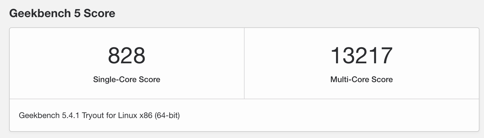

# 初衷

- 想组装一台可以随便折腾的主机
- 性价比要高，不要太贵
- 考虑到后面可能要部署大数据套件，性能不能太弱

# 硬件

| 硬件类型 | 参数             | 数量 | 价格 |
| -------- | ---------------- | ---- | ---- |
| 主板     | 华南金牌 x99 f8d | 1    | 894  |
| CPU      | E5 2683 v4       | 2    | 1940 |
| 内存     | 2133 ddr4 16g    | 4    | 1060 |
| 硬盘     | 4T hdd，500G ssd | 2    | 950  |
| 散热器   | 利民 as120       | 2    | 248  |
| 机箱     | -                | 1    | 429  |
| 电源     | 850w             | 1    | 889  |
| 显卡     | -                | -    | 60   |
| **合计** | -                | -    | 6470 |

**变更**

| 硬件类型 | 参数          | 数量 | 价格 |
| -------- | ------------- | ---- | ---- |
| 内存     | 2133 ddr4 32g | 2    | 960  |
| 硬盘     | 1T nvme       | 1    | 597  |
| 合计     | -             | -    | 1557 |

**合计**

6470 + 1557 

= 8027

# 注意事项

- 主板两个 cpu 供电口距离过大，电源需要两条独立 cpu 供电线，如果买一拖二的 cpu 供电线电源，提前买一根 cpu 供电线
- 注意散热器支持的接口，我这里用的是兼容 2011 接口的

# 配置

```shell
wii@srv:~$ free -h
              total        used        free      shared  buff/cache   available
Mem:          125Gi        13Gi       110Gi       2.0Mi       1.7Gi       110Gi
Swap:         8.0Gi          0B       8.0Gi
wii@srv:~$ lscpu
Architecture:                    x86_64
CPU op-mode(s):                  32-bit, 64-bit
Byte Order:                      Little Endian
Address sizes:                   46 bits physical, 48 bits virtual
CPU(s):                          64
On-line CPU(s) list:             0-63
Thread(s) per core:              2
Core(s) per socket:              16
Socket(s):                       2
NUMA node(s):                    2
Vendor ID:                       GenuineIntel
CPU family:                      6
Model:                           79
Model name:                      Intel(R) Xeon(R) CPU E5-2683 v4 @ 2.10GHz
Stepping:                        1
CPU MHz:                         1200.097
CPU max MHz:                     3000.0000
CPU min MHz:                     1200.0000
BogoMIPS:                        4199.82
Virtualization:                  VT-x
L1d cache:                       1 MiB
L1i cache:                       1 MiB
L2 cache:                        8 MiB
L3 cache:                        80 MiB
NUMA node0 CPU(s):               0-15,32-47
NUMA node1 CPU(s):               16-31,48-63
Vulnerability Itlb multihit:     KVM: Mitigation: Split huge pages
Vulnerability L1tf:              Mitigation; PTE Inversion; VMX conditional cache flushes, SMT vulnerable
Vulnerability Mds:               Mitigation; Clear CPU buffers; SMT vulnerable
Vulnerability Meltdown:          Mitigation; PTI
Vulnerability Spec store bypass: Mitigation; Speculative Store Bypass disabled via prctl and seccomp
Vulnerability Spectre v1:        Mitigation; usercopy/swapgs barriers and __user pointer sanitization
Vulnerability Spectre v2:        Mitigation; Full generic retpoline, IBPB conditional, IBRS_FW, STIBP conditional, RSB filling
Vulnerability Srbds:             Not affected
Vulnerability Tsx async abort:   Mitigation; Clear CPU buffers; SMT vulnerable
Flags:                           fpu vme de pse tsc msr pae mce cx8 apic sep mtrr pge mca cmov pat pse36 clflush dts acpi mmx fxsr sse sse2 ss ht tm pbe syscall nx pdpe1gb rdtscp lm constant_tsc arch_perfmon pebs
                                  bts rep_good nopl xtopology nonstop_tsc cpuid aperfmperf pni pclmulqdq dtes64 monitor ds_cpl vmx smx est tm2 ssse3 sdbg fma cx16 xtpr pdcm pcid dca sse4_1 sse4_2 x2apic movbe pop
                                 cnt tsc_deadline_timer aes xsave avx f16c rdrand lahf_lm abm 3dnowprefetch cpuid_fault epb cat_l3 cdp_l3 invpcid_single pti intel_ppin ssbd ibrs ibpb stibp tpr_shadow vnmi flexpri
                                 ority ept vpid ept_ad fsgsbase tsc_adjust bmi1 hle avx2 smep bmi2 erms invpcid rtm cqm rdt_a rdseed adx smap intel_pt xsaveopt cqm_llc cqm_occup_llc cqm_mbm_total cqm_mbm_local dt
                                 herm ida arat pln pts md_clear flush_l1d
```

# 跑分



详细参考[这里](https://browser.geekbench.com/v5/cpu/9471222)。