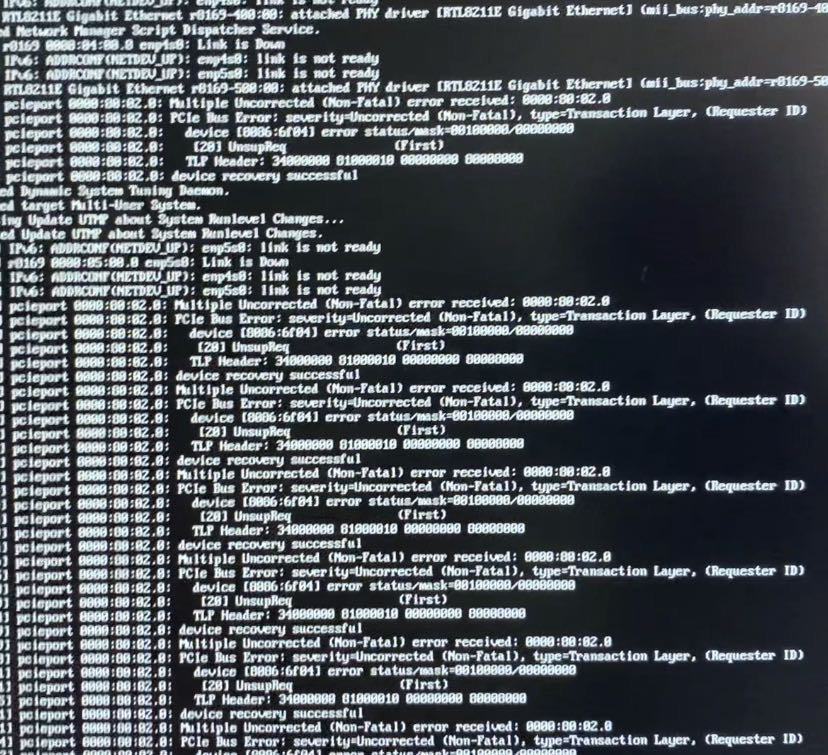
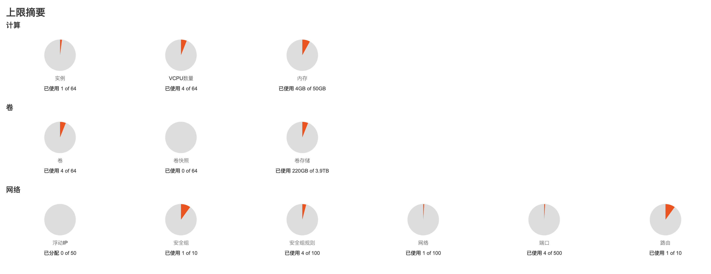

# BIOS 配置

## 断电恢复后自启动

- 开机长按 `Delete` 进入 BIOS
- `InelRCSetup -> PCH Configuration -> PCH Devices -> Restore AC after Power Loss`
- 设置为 `Power On`

设置断电恢复后启动，目的是设置远程启动。

# 系统

Centos 7。

# 配置

```shell
# 关闭 selinux
$ sudo vim /etc/selinux/config
SELINUX=enforcing -> SELINUX=disabled
$ sudo setenforce 0

# 关闭 swap
$ sudo vim /etc/fstab
注释掉行 /dev/mapper/centos-swap

# 关闭防火墙
$ systemctl stop firewalld
$ systemctl disable firewalld
```

# 程序

## 必备

```shell
sudo yum install git telnet -y
```

## zsh

```shell
$ sudo yum install zsh
# on my zsh
$ sh -c "$(curl -fsSL https://raw.github.com/ohmyzsh/ohmyzsh/master/tools/install.sh)"
```

## docker

```shell
# 一键安装脚本
$ curl -fsSL https://get.docker.com | bash -s docker --mirror Aliyun
```

## 参考

- [docker 安装](https://www.runoob.com/docker/ubuntu-docker-install.html)

## vnc

**服务端**

```shell
sudo apt install xfonts-base xfonts-75dpi xfonts-100dpi
sudo apt install tightvncserver

# centos
```

**配置**

```shell
# /etc/systemd/system/vncserver@:1.service
[Unit]
Description=Remote desktop service (VNC)
After=syslog.target network.target

[Service]
#User=wii
#Group=wii
#WorkingDirectory=/home/wii
Type=forking

# Clean any existing files in /tmp/.X11-unix environment
ExecStartPre=/bin/sh -c '/usr/bin/vncserver -kill %i > /dev/null 2>&1 || :'
# ExecStart=/sbin/runuser -l wii -c "/usr/bin/vncserver %i -geometry 1920x1080"
ExecStart=/bin/sh -c "/usr/bin/vncserver %i -geometry 1920x1080"
PIDFile=/home/wii/.vnc/%H%i.pid
ExecStop=/bin/sh -c '/usr/bin/vncserver -kill %i > /dev/null 2>&1 || :'

[Install]
WantedBy=multi-user.target
```

**客户端**

从[这里](https://www.tightvnc.com/download.php)下载。

**参考**

- https://www.tecmint.com/install-and-configure-vnc-server-in-centos-7/
- https://www.tecmint.com/install-tightvnc-remote-desktop/

## jdk

**手动下载**

```shell
# 从这里 https://www.oracle.com/java/technologies/javase/javase-jdk8-downloads.html 下载 jdk

# 安装
$ sudo yum install jdk-8u301-linux-x64.rpm
$ sudo alternatives --config java
```

**yum**

```shell
$ yum install -y java-1.8.0-openjdk-devel  # 安装 jdk
$ yum install -y java-1.8.0-openjdk        # 安装 jre
```

## mvn

从 [这里](https://maven.apache.org/) 下载。

```shell
# 修改 conf/settings.xml
# 注释掉如下内容
<mirror>
    <id>maven-default-http-blocker</id>
    <mirrorOf>external:http:*</mirrorOf>
    <name>Pseudo repository to mirror external repositories initially using HTTP.</name>
    <url>http://0.0.0.0/</url>
    <blocked>true</blocked>
</mirror>
```

## npm

```shell
$ curl -o- https://raw.githubusercontent.com/nvm-sh/nvm/v0.37.2/install.sh | bash
$ nvm install v12
# nrm
$ npm install nrm
$ nrm use taobao
```

## mysql / mariadb

```shell
$ yum install mariadb mariadb-server
$ systemctl start mariadb   #启动mariadb
$ systemctl enable mariadb  #设置开机自启动
$ mysql_secure_installation #设置root密码等相关
$ mysql -uroot -p           #测试登录
```

## ~~ambari~~ (using MapR)

**依赖**

- jdk

- mvn

- rpm-build（centos）

- npm

- python-devel

  - `sudo yum install -y python-devel`

- ant

  ```shell
  #!/bin/bash
  set -ex
  ANT_VERSION=1.10.11
  wget http://archive.apache.org/dist/ant/binaries/apache-ant-${ANT_VERSION}-bin.tar.gz
  sudo tar xvfvz apache-ant-${ANT_VERSION}-bin.tar.gz -C /opt
  sudo ln -sfn /opt/apache-ant-${ANT_VERSION} /opt/ant
  sudo sh -c 'echo ANT_HOME=/opt/ant >> /etc/environment'
  sudo ln -sfn /opt/ant/bin/ant /usr/bin/ant
  
  ant -version
  rm apache-ant-${ANT_VERSION}-bin.tar.gz
  ```

- gcc

**下载**

从 [这里](https://github.com/apache/ambari/tree/branch-2.7)下载，或使用 git 克隆，`git clone git@github.com:apache/ambari.git`，切换分支 `git checkout branch-2.7`。

**安装**

参考[这里](https://cwiki.apache.org/confluence/display/AMBARI/Installation+Guide+for+Ambari+2.7.5)。

```shell
# 添加 -Drat.skip=true
$ mvn -B clean install rpm:rpm -DnewVersion=2.7.5.0.0 -DbuildNumber=5895e4ed6b30a2da8a90fee2403b6cab91d19972 -DskipTests -Drat.skip=true -Dpython.ver="python >= 2.6"

# 需要修改所有 https://s3.amazonaws.com/dev.hortonworks.com/ 开头的连接
# 参照这个 mr 修改 https://github.com/apache/ambari/pull/3283/commits/3dca705f831383274a78a8c981ac2b12e2ecce85
```

**异常**

```shell
# 报错
[ERROR] Failed to execute goal com.github.eirslett:frontend-maven-plugin:1.3:npm (npm install) on project ambari-admin: Failed to run task: 'npm install --unsafe-perm' failed. (error code 1) -> [Help 1]
[ERROR]
[ERROR] To see the full stack trace of the errors, re-run Maven with the -e switch.
[ERROR] Re-run Maven using the -X switch to enable full debug logging.
[ERROR]
[ERROR] For more information about the errors and possible solutions, please read the following articles:
[ERROR] [Help 1] http://cwiki.apache.org/confluence/display/MAVEN/MojoFailureException
[ERROR]
[ERROR] After correcting the problems, you can resume the build with the command
[ERROR]   mvn <args> -rf :ambari-admin

# 处理
cd ambari-admin/src/main/resources/ui/admin-web
npm install --unsafe-perm

# 继续打包
mvn -B clean install rpm:rpm -DnewVersion=2.7.5.0.0 -DbuildNumber=5895e4ed6b30a2da8a90fee2403b6cab91d19972 -DskipTests -Drat.skip=true -Dpython.ver="python >= 2.6" -rf :ambari-admin
```

**问题集锦**

- https://www.cnblogs.com/barneywill/p/10264135.html

## 配置远程启动

整机无负载功率在 100w 左右，功率大且并不常用，工作的时候可能会用到。远程关闭、启动方案是通过设置 BIOS 的断电恢复后自动启动 + 小米智能插座实现。

# 使用

系统尝试了 centos 7、centos 8、ubuntu 20.04（desktop + server），尝试安装了 ambari、mapr、openstack、microstack。最终的使用方案是，ubuntu 20.04 + openstack Wallaby。

系统最开始打算用 centos 7，觉得可能会更稳定吧，公司服务器一般也是。

想搭一套大数据平台（zookeeper、hadoop、impala、yarn、spark、kudu 等），先是尝试了 ambari，但是现在 CDH 的时候遇到收费墙问题，放弃。后发现 MapR，惊喜，先是尝试在 centos 7 上装，后来发现最新版本不支持。然后尝试从 centos 7 直接升级到 centos 8，失败。重新安装 centos 8，再安装 MapR，配置后无法开机，又重新安装。

一出问题，买的那个亮机卡就不显示内容，需要搬机箱、拆换另外一台机器的显卡，崩溃。不想再在裸机上装太多东西，笨重的东西全部放虚拟机。考虑用 virtual box，但不太方便，最后选了 openstack。

先是尝试在 centos 7 装 openstack，每次创建卷时，cinder 都会报错，pip 锁死在 8.x.x。本打算用 centos 8 试下，最终放弃。

转战 Ubuntu 之后，开始倾向于 desktop 版本，有个界面也挺好，但是那个亮机卡装的时候好好的，一进系统就什么都不显示，随选择 server 版本。

Snap 有个 MicroStack，可以一键安装 openstack，试了下，可以。但是 snap 包内的文件只读，没办法改。最终，决定还是一步一步按官网教程来安装。

openstack 官方文档有一些细节没有覆盖到，总体还是很赞。

# 问题

## 硬件错误

### intel ssd 兼容性问题

但凡能看到内核日志的地方，都在疯狂刷下面的内容。后排查原因是 inter 一款 nvme 的 ssd 硬盘导致的，换了一块好了。

```shell
pcieport 0000:80:02.0: Multiple Uncorrected (Non-Fatal) error received: 0000:80:02.0
pcieport 0000:80:02.0: PCIe Bus Error: severity=Uncorrected (Non-Fatal), type=Transaction Layer, (Request ID)
pcieport 0000:80:02.0:   device [8086:bf] error status/mask=88100000/88000000
pcieport 0000:80:02.0:    [28] UnsupReq             (First)
pcieport 0000:80:02.0:   TLP Header: 34000000 01000010 00000000 00000000
pcieport 0000:80:02.0: device recovery successful
```



# 最终



