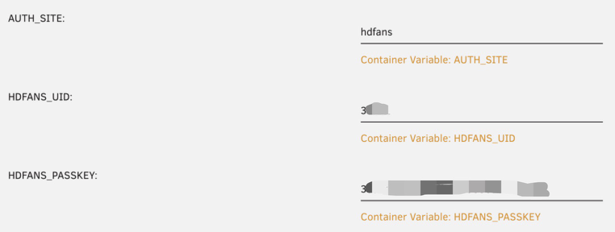
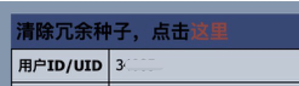
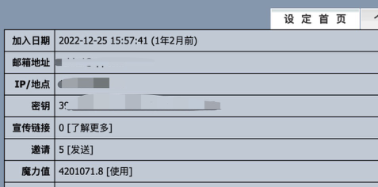
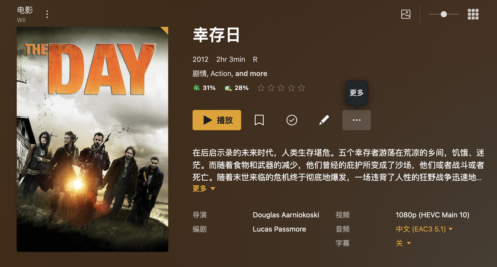
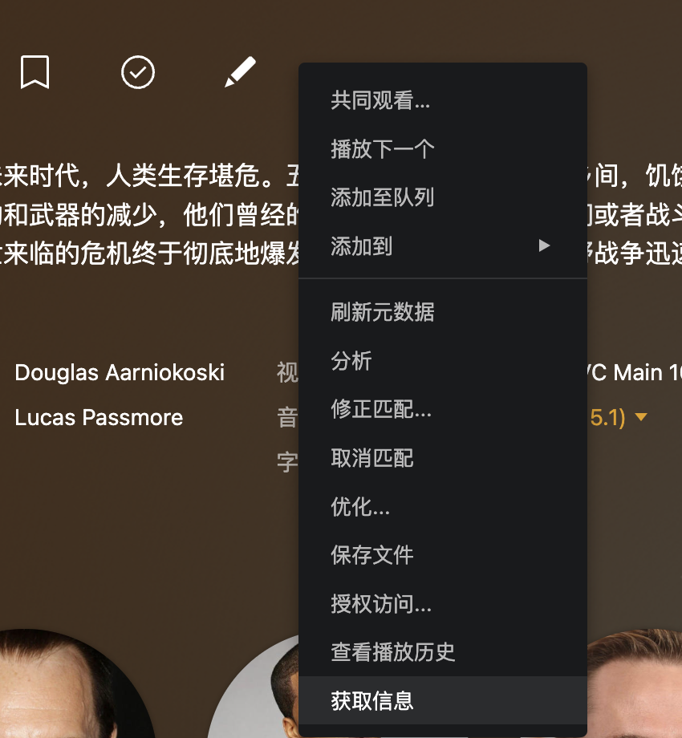
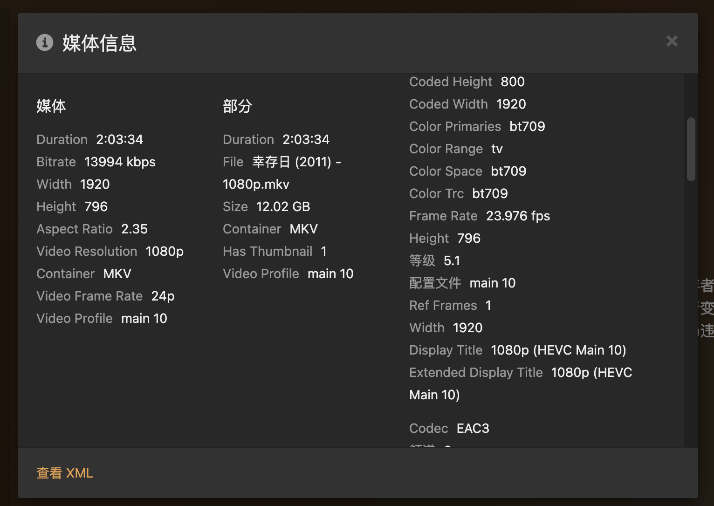
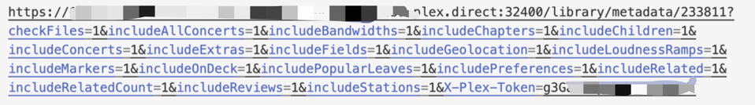
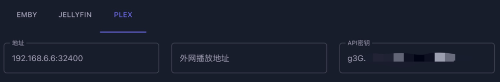

# 站点

- 必须配置一个认证站点

## 配置认证站点

以 HDFans 为例。



需要设置三个环境变量。

```shell
AUTH_SITE=hdfans
HDFANS_UID=...
HDFANS_PASSKEY=...
```

### 获取 UID

UID 是数字的用户 ID，点击用户名，跳转到用户信息页面，有 UID 一行。



### 获取 PASSKEY



一般在站点的设置页面的设置首页，这里的 **密钥** 就是 PASSKEY。

# 媒体服务

## 获取 Plex 的 API 密钥

找到一个媒体，点击这里的更多。



再点击获取信息。





再点击 查看 XML。



在最后有一个 X-Plex-Token，把等号后面的字符串填到 API 密钥那里。



# 注意

- MoviePilot 使用三方工具下载内容（比如 Transmission），并通过工具的 API 调用，需要注意的是，下载路径是 MoviePilot 制定的下载路径，如果 Transmission 在另外的容器里面，要确保下载路径在 MoviePilot 和 下载工具的映射**是一致的**。