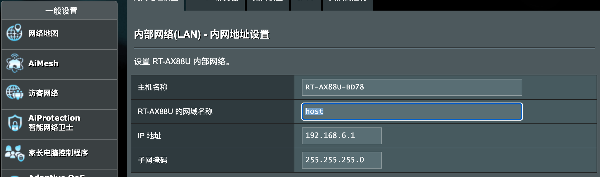
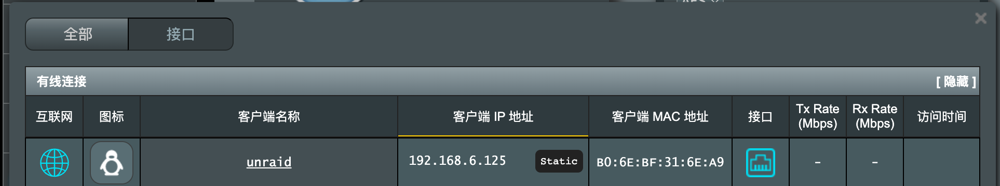
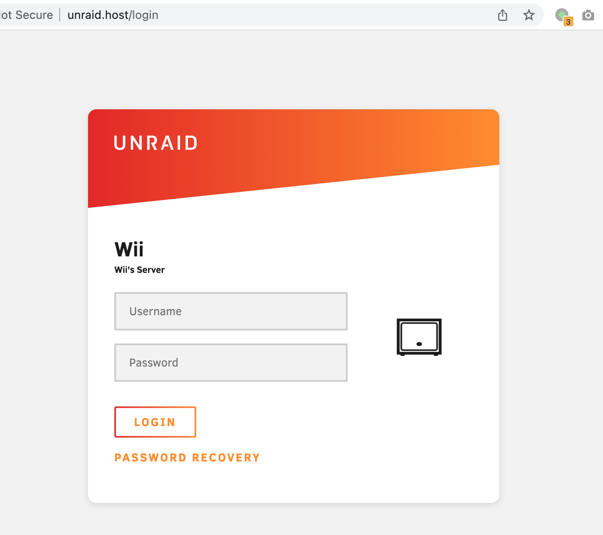

# 通过域名解析内网机器

打开 **高级设置 / 内部网络**，修改路由器网络名称为 `host`。

> 这里选 host 是应为 host 是合法的定级域名，浏览器输入不添加协议头 (`http://` 等) 时不会调用搜索。



**修改机器名称**

在 **一般设置 / 网络地图 / 阅览名单**，点击客户端名称列需要修改的机器名称。



**检查 Hosts**

```shell
$ ssh admin@192.168.6.1

$ cat /etc/hosts
127.0.0.1 localhost.localdomain localhost
192.168.6.1 RT-AX88U-BD78.host RT-AX88U-BD78
192.168.6.1 RT-AX88U-BD78.local
192.168.6.1 router.asus.com
192.168.6.1 www.asusnetwork.net
192.168.6.1 www.asusrouter.com
192.168.6.125 unraid.host
...
```

**浏览器访问**

