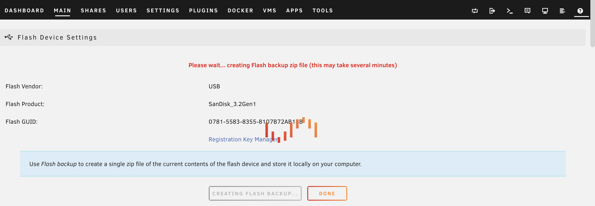

# 插件

```shell
$ vi /etc/hosts
199.232.68.133 raw.githubusercontent.com

# Plugin
https://github.com/dlandon/unassigned.devices/raw/master/unassigned.devices.plg
https://raw.githubusercontent.com/Squidly271/community.applications/master/plugins/community.applications.plg
```

# VFIO

```shell
vfio-pci.ids=054c:0899
```

# 备份 USB 内容

Main -> Flash -> Flash Backup



# Problems

## Requested operation is not valid: cannot undefine domain with nvram

```shell
$ virsh undefine --nvram "Macinabox BigSur"
```

# 设置 DNS

```shell
$ vim /boot/config/go
echo "nameserver 8.8.8.8" >> /etc/resolv.conf
echo "nameserver 4.4.4.4" >> /etc/resolv.conf
```

# 下载 App 网络错误

**查找 IP**

- [店长之家](https://ping.chinaz.com/raw.githubusercontent.com)

```shell
# vim /etc/hosts
# 添加如下内容
<ip>	raw.githubusercontent.com
```

# 保存数据

Unraid 系统中，`/boot`、`/mnt` 之外的路径均在内存中，在下次重启后，会丢失。可以用如下方式来保存数据。

- 第一步，数据保存在 `/boot` 路径下
- 第二步，在 Unraid 系统启动时把文件拷贝到目标位置，有两种方式
    - 其一，更改 `/boot/config/go` 文件（shell 脚本），在 Unraid 系统启动时把文件拷贝到目标位置
    - 其二，使用 User Scripts 插件，在 Apps 中搜索安装，在 Plugins 中使用
        - 可以选择脚本运行时间，如果只需运行一次，选 `At First Array Start Only` 即可
        - 脚本路径在界面有显示，比如 `/boot/config/plugins/user.scripts/scripts/dockerInit`，这是一个目录，下面有个 script 文件用于编写命令

# Docker

## 重启 Docker

```shell
$ /etc/rc.d/rc.docker restart
```

