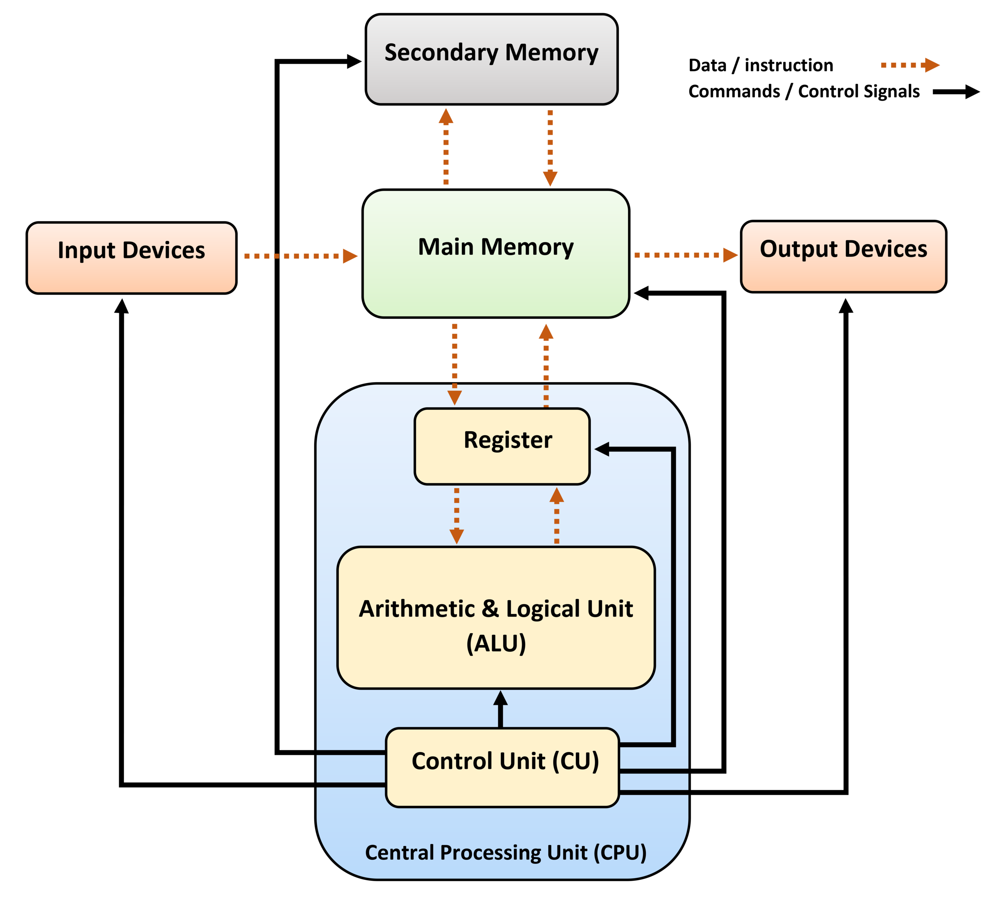

# CPU

- CPU	
    - ALU（算术逻辑单元，Arithmetic Logic Unit ），执行所有的计算任务
    - CU（控制单元，Control Unit），协助数据移动、解码执行
- 寄存器
    - PC（程序计数器，Program Counter），保存 RAM 中的下一条指令的地址
    - MAR（Memory Address Register），存储当前正在执行的指令的地址
    - MDR（Memory Data Register），保存将要写到内存或从内存读取的数据
    - CIR（Current Instruction Register），保存正在被解码和执行的实际指令
    - ACC（Accumulator），保存计算结果
- 总线（Buses）
    - Address Bus，传送指令或数据的地址
    - Data Bus，在处理器和内存间传送数据
    - Control Bus，传送控制信号（比如读内存、写内存）