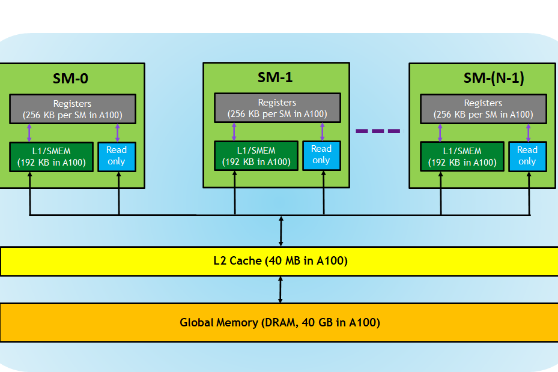

# 硬件

## CPU & GPU


## 内存

内存分级。



# 核函数

## 定义

```c++
__global__ void function_name(...) {
  ...
}
```

- `__global__` 限定词
- 返回值必须是 `void`

## 特性

- 核函数在 GPU 上并行执行
- 核函数只能访问 GPU 内存
- 核函数不能使用变长参数
- 核函数不能使用静态变量
- 核函数不能使用函数指针
- 核函数具有**异步性**
  - 使用 `cudaDeviceSynchronize()` 来做同步
- 核函数不支持 iostream，打印需要使用 printf

## 核函数和线程等级


核（Kernel）是执行在 GPU 上的函数。

## 调用

核函数调用需要指定线程模型。

```c++
kernel_function<<<grid, block>>>();
```

# 线程模型

## 重要概念

- grid，网格
- block，线程块

# 参考

- [CUDA Refresher: The CUDA Programming Model](https://developer.nvidia.com/blog/cuda-refresher-cuda-programming-model/)

- [CUDA Refresher: Reviewing the Origins of GPU Computing](https://developer.nvidia.com/blog/cuda-refresher-reviewing-the-origins-of-gpu-computing/)