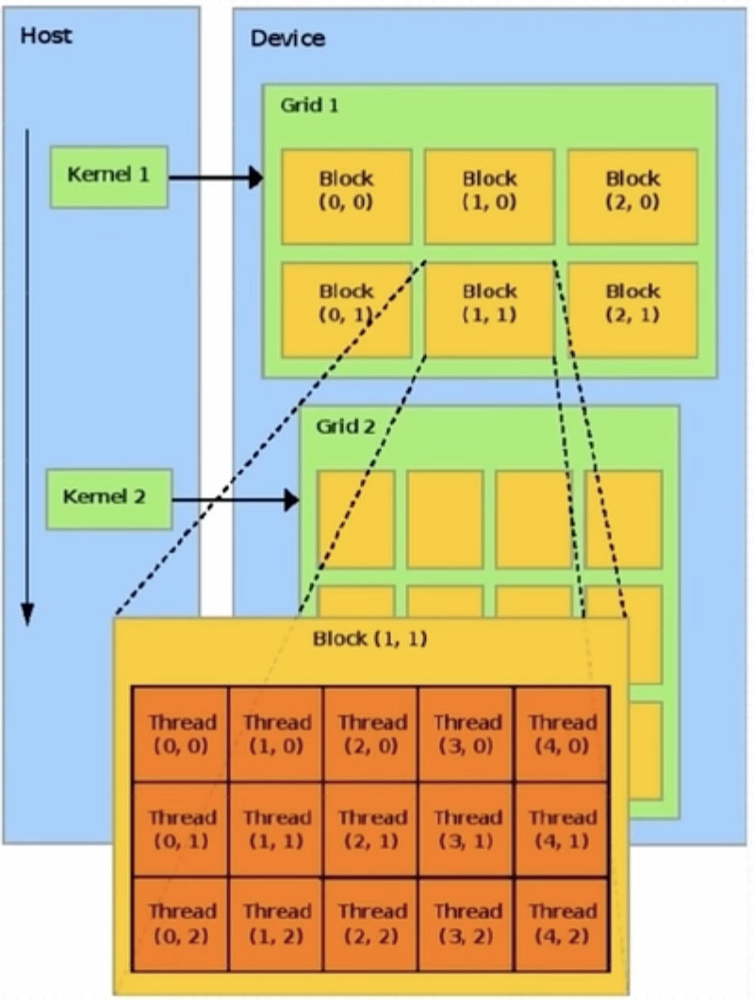

# TODO 

- 内存模型
    - 寄存器
    - 共享内存
    - 常量内存
    - 全局内存
- 缓存
- 同步（block 内线程同步等）
- 待整理
    - 内存占用（寄存器、共享内存）对并行性的影响
    - 设备信息（缓存、寄存器等信息）
    - SM 最大驻留线程束
    - SM 占有率

# 硬件

## CPU & GPU


## 内存

内存分级。


## Nvidia GPU 架构

## 层级


参考 [GPU Performance Background User's Guide](https://docs.nvidia.com/deeplearning/performance/dl-performance-gpu-background/index.html#)，[NVIDIA Hopper Architecture In-Depth](https://developer.nvidia.com/blog/nvidia-hopper-architecture-in-depth/)。 


### SM（Streaming Multiprocessor）


每个 SM 都有自己的指令调度器和各种指令执行管道。乘加是现代神经网络中最常见的运算，充当全连接层和卷积层的构建块，这两个层都可以被视为向量点积的集合。下表显示了 NVIDIA 最新 GPU 架构上各种数据类型的单个 SM 每个时钟的乘加运算。每个乘加都包含两个运算，因此可以将表中的吞吐量乘以 2，以获得每个时钟的 FLOP 计数。要获得 GPU 的 FLOPS 速率，需要将其乘以 SM 数量和 SM 时钟速率。例如，具有 108 个 SM 和 1.41 GHz 时钟频率的 A100 GPU 的峰值密集吞吐量为 156 TF32 TFLOPS 和 312 FP16 TFLOPS（应用程序实现的吞吐量取决于本文档中讨论的许多因素）。


# 核函数

## 定义

```c++
__global__ void function_name(...) {
  ...
}
```

- `__global__` 限定词
- 返回值必须是 `void`

## 特性

- 核函数在 GPU 上并行执行
- 核函数只能访问 GPU 内存
- 核函数不能使用变长参数
- 核函数不能使用静态变量
- 核函数不能使用函数指针
- 核函数具有**异步性**
  - 使用 `cudaDeviceSynchronize()` 来做同步
- 核函数不支持 iostream，打印需要使用 printf

## 核函数和线程等级


核（Kernel）是执行在 GPU 上的函数。应用程序的并行部分由K个不同的CUDA线程并行执行K次，而不是像常规的C/C++函数那样只执行一次。

每个CUDA内核都有一个`__global__`声明说明符。程序员通过使用内置变量为每个线程提供一个唯一的全局ID。


一组线程称为CUDA块（CUDA Block）。CUDA块被分组到一个网格（Grid）中。内核（Kernel）作为线程块网格（A Grid of Blocks of Threads）执行。

每个 CUDA 块被一个流式多处理器（Streaming Multiprocessor，SM）执行，不能被迁移到其他 SMs 处理（抢占、调试、CUDA动态并行期除外）。一个SM可以运行多个并发CUDA块，具体取决于CUDA块所需的资源。每个内核在一个设备上执行，CUDA支持一次在一个设备上运行多个内核。


上图展示了内核执行和GPU中可用硬件资源的映射。

**限制。**

- CUDA架构限制每个块的线程数（每个块限制1024个线程）
- 线程块的维度可以通过内置的block Dim变量在内核中访问
- 块中的所有线程都可以使用内部函数`__syncthreads` 进行同步。使用 `__syncthreads` 块中的所有线程都必须等待
- `<<<…>>>` 语法中指定的每个块的线程数和每个网格的块数可以是int或dim3类型。这些三尖括号标记从主机代码到设备代码的调用。它也称为 Kernel Launch

**示例。**

```c++
// Kernel - Adding two matrices MatA and MatB
__global__ void MatAdd(float MatA[N][N], float MatB[N][N], float MatC[N][N])
{
    int i = blockIdx.x * blockDim.x + threadIdx.x;
    int j = blockIdx.y * blockDim.y + threadIdx.y;
    if (i < N && j < N)
        MatC[i][j] = MatA[i][j] + MatB[i][j];
}
 
int main()
{
    ...
    // Matrix addition kernel launch from host code
    dim3 threadsPerBlock(16, 16);
    dim3 numBlocks((N + threadsPerBlock.x -1) / threadsPerBlock.x, (N+threadsPerBlock.y -1) / threadsPerBlock.y);
    MatAdd<<<numBlocks, threadsPerBlock>>>(MatA, MatB, MatC);
    ...
}
```

CUDA为线程和块定义了内置的3D变量。线程使用内置的3D变量threadIdx进行索引。三维索引提供了一种自然的方式来索引向量、矩阵和体积中的元素，并使CUDA编程更容易。类似地，块也使用称为block Idx的内置3D变量进行索引。示例的 CUDA 程序用于两个矩阵相加，显示了多维 blockIdx 和 threadIdx 以及其他变量（如 blockDim）。选择 2D 块是为了便于索引，每个块有 256 个线程，其中 x 和 y 方向各有 16 个线程。使用数据大小除以每个块的大小来计算块的总数。

## 调用

核函数调用需要指定线程模型。

```c++
kernel_function<<<grid, block>>>();
```

# 线程模型



- 重要概念

  - grid，网格

  - block，线程块

- 配置线程 `<<<grid_size, block_size>>>`

- 最大允许线程块大小 1024

- 最大允许网格大小  2^32 - 1

- 每个线程在核函数中都有一个唯一标识

- 内建变量（build-in variable）

  - 每个线程的唯一标识由 `<<<grid_size, block_size>>>` 确定，grid_size、block_size 保存在内建变量（build-in variable）
    - gridDim.x，该变量的值等于执行配置中变量 grid_size 的值
    - blockDim.x，该变量的值等于执行配置中变量 block_size 的值
  - 线程索引保存在内建变量
    - blockIdx.x，该变量保存一个线程块在一个网格中的索引，范围是 `[0, gridDim.x)`
    - threadIdx.x，该变量保存一个线程在线程块中的索引，范围是`[0, blockDim.x)`

- 多维线程

  - CUDA 可以组织三维的网格和线程块
  - blockIdx 和 threadIdx 是类型为 uint3 的变量，该类型是结构体，有 x、y、z 三个变量
  - gridDim 和 blockDim 是类型为 dim3 的变量，该类型是结构体，有 x、y、z 三个变量
  - 多维网格和多维线程块本质上是一维的，GPU 物理上不分块
  - 数量限制
    - 网格大小
      - gridDim.x，`[1, 2^31)`
      - gridDim.y，`[1, 2^16)`
      - gridDim.z，`[1, 2^16)`
    - 线程块
      - blockDim.x，1024
      - blockDim.y，1024
      - blockDim.z，64
  - 定义

```c++
dim3 grid_size(g_x, g_y, g_z);
dim3 block_size(g_x, g_y, g_z);
```


# nvcc 编译流程

- nvcc 分离源代码为
  - 主机（Host，`__host__`）代码
  - 设备（Device，`__global__`）代码
- 主机代码是 C/C++ 语法，设备代码是 C/C++ 扩展语言
- nvcc 先将设备代码编译为 PTX（Parallel Thread Execution）伪汇编语言，再将 PTX 代码编译为二进制的 cubin 目标代码
  - 编译 PTX 时，需要指定 `-arch=compute_XY` 选项，指定虚拟架构的计算能力，用于确定代码中能够使用的 CUDA 功能
  - 编译 cubin 时，需要指定 `-code=sm_ZW` 选项，指定一个真实架构的计算能力，用以确定可执行文件能够使用的 GPU


- PTX
  - PTX 是 CUDA 平台为基于 GPU 的通用计算而定义的虚拟机和指令集
  - nvcc 编译命令总是使用两个体系结构
    - 一个是虚拟的中间体系结构
    - 另一个是实际的 GPU 体系结构
  - 虚拟架构更像是对应用所需的 GPU 功能的声明
  - 兼容性
    - 虚拟架构应该尽可能选择低版本，适配更多实际 GPU
    - 实际架构应该尽可能选择高版本，充分发挥 GPU 性能

参考[文档](https://docs.nvidia.com/cuda/cuda-compiler-driver-nvcc/)。

# 运行

## 步骤

- 设置 GPU 设备
  - 使用 `cudaGetDeviceCount` 可以获取 GPU 设备数量
  - 使用 `cudaSetDevice` 来设置使用的设备
- 分配主机和设备内存
- 初始化主机中的数据
- 从主机复制数据到设备
- 调用核函数在设备中运行
- 将计算得到的数据从设备传给主机
- 释放主机与设备内存

# 内存

## 内存模型


基于 `<<<grid, block>>>` 的 cuda 程序内存模型。内存可见性及生命周期如下。


## 内存管理

- 内存分配，`cudaMalloc`，对应标准库 `malloc`
  - 运行环境：设备、主机
- 数据传递，`cudaMemcpy`，对应标准库 `memcpy`
  - 支持主机->主机、主机->设备、设备->设备、设备->主机 的内存拷贝，支持默认选项自动识别
  - 运行环境：主机
- 内存初始化，`memset`，对应标准库 `cudaMemset`
  - 运行环境：主机
- 内存释放，`cudaFree`，对应标准库 `free`
  - 运行环境：主机、设备

# 函数

- 设备函数（`__device__` 修饰）
  - 只能运行在 GPU 设备上
  - 设备函数只能被核函数和其他设备函数调用
- 核函数（`__global__` 修饰）
  - 一般由主机调用，在设备中执行
  - `__global__` 修饰符不能和 `__host__` 、`__device__` 同时用
- 主机函数（`__host__` 修饰或无修饰）
  - 主机端 C++ 函数

说明

- 可以使用 `__host__` 和 `__device__` 同时修饰一个函数来减少冗余，编译器会针对主机和设备分别编译

# 参考

- [CUDA Refresher: The CUDA Programming Model](https://developer.nvidia.com/blog/cuda-refresher-cuda-programming-model/)

- [CUDA Refresher: Reviewing the Origins of GPU Computing](https://developer.nvidia.com/blog/cuda-refresher-reviewing-the-origins-of-gpu-computing/)

- [CUDA编程基础入门系列](https://www.bilibili.com/video/BV1sM4y1x7of/?p=12&spm_id_from=pageDriver&vd_source=dde715d24e4fe38dc525c996ab020c1a)