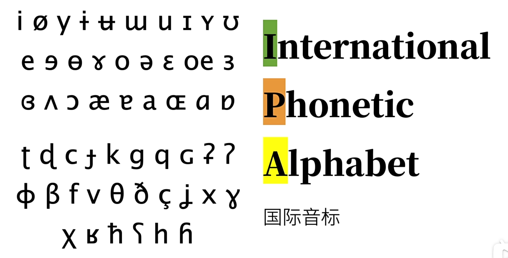
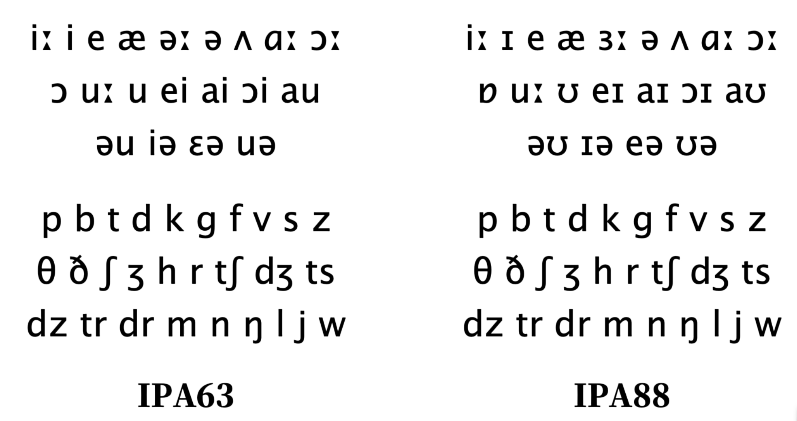
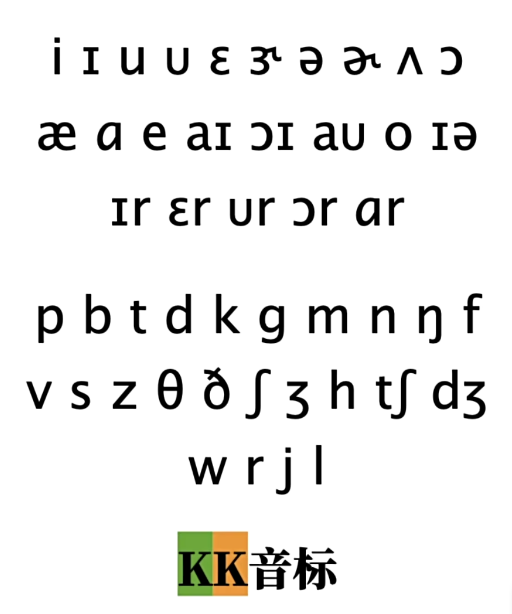
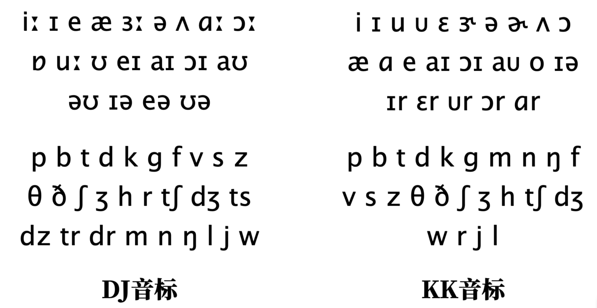
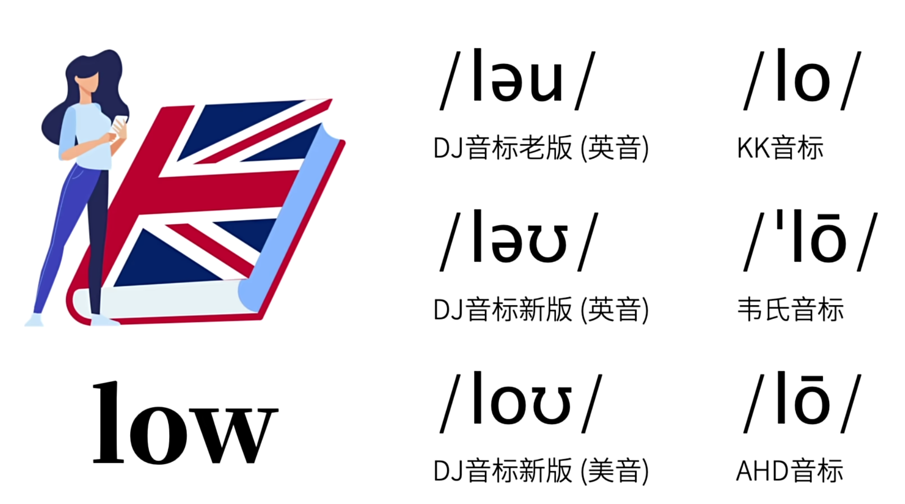
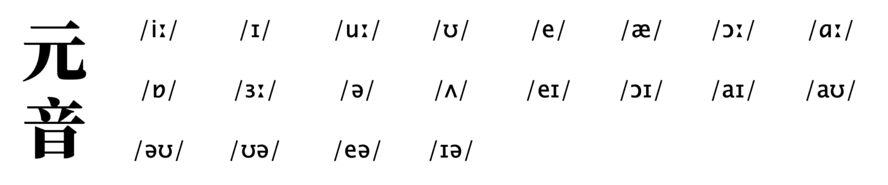
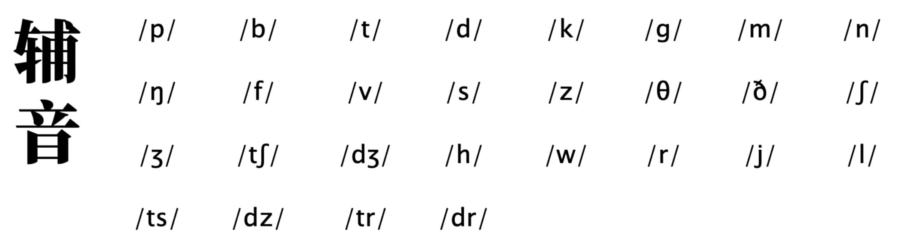

# 音标体系

## **国际音标**

## **DJ 音标**

## **KK 音标**

美式英语发音词典。

## 其他

- 韦氏音标
- AHD 音标

## 对比

**DJ音标 VS KK 音标**

**DJ 音标 VS KK 音标**

# 音标分类

## 元音

## 辅音

# 参考

- [B 站英语兔音标教程](https://www.bilibili.com/video/BV1iV411z7Nj?p=1&vd_source=dde715d24e4fe38dc525c996ab020c1a)
