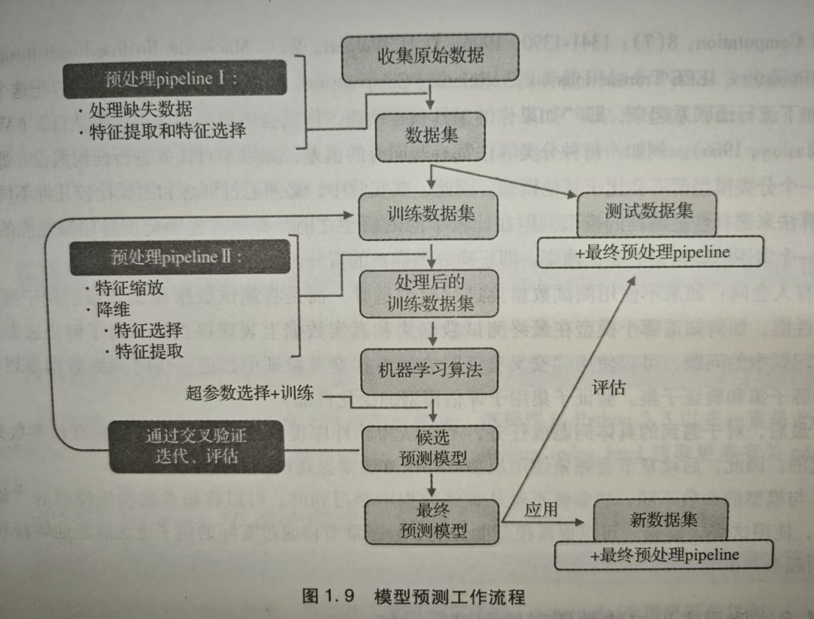

# 机器学习

机器学习，是人工智能的一个分支，赋予计算机从数据中学习的能力。机器学习算法从数据中获取知识来进行预测。

# 学习类型

常见的机器学习类型有三种。

- **监督学习**。从有标签的数据学习知识，并预测无标签的数据。
  - 分类任务，标签是离散值。
    - 二分类任务。
    - 多分类任务。
  - 回归任务，标签是连续值。
- **无监督学习**。无须知道结果变量或奖励函数便能探索数据的规律。
  - 聚类，挖掘数据结构性信息或数据间关系。
  - 降维。用于降噪、数据可视化。
- **强化学习**。学习一系列使总奖励最大化的动作，奖励可以在动作后立即获得，也可以延迟获得。

# 机器学习系统路线图

1. 数据预处理，让数据可用
2. 训练和选择预测模型
3. 使用未见过的数据对模型进行评估

