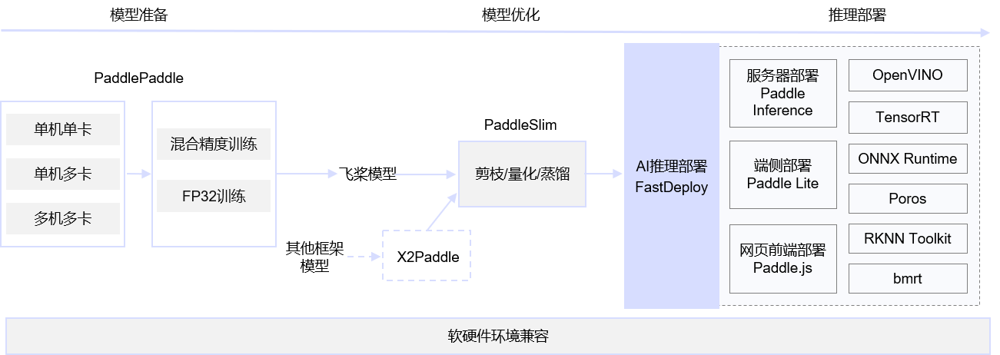

# 开源方案

- [Prophecis](https://github.com/WeBankFinTech/Prophecis)
- [MetaSpore](https://github.com/meta-soul/MetaSpore)
- [TensorNet](https://github.com/Qihoo360/tensornet)
  - [参考一](https://blog.csdn.net/ZVAyIVqt0UFji/article/details/108633132)
- [TFRA](https://github.com/tensorflow/recommenders-addons/tree/master)

# 训练框架

- [Tensorfow]()
- [PyTorch]()
- [PaddlePaddle]()
- [MegEngine](https://github.com/MegEngine/MegEngine)
- Keras
- MXNet
- CNTK

# Inference / Serving

- [triton](https://github.com/triton-inference-server/server)
- [TF Serving](https://github.com/tensorflow/serving/tree/master#)

# MLOps

- [cube-studio](https://github.com/tencentmusic/cube-studio)
- [ML-Model-CI](https://github.com/cap-ntu/ML-Model-CI/tree/master)

# 云商产品

- [TI-ONE](https://cloud.tencent.com/document/product/851/74170)

# 文章

- [美团 - 一站式机器学习平台建设实践](https://tech.meituan.com/2020/01/23/meituan-delivery-machine-learning.html)
- [TensorFlow在美团外卖推荐场景的GPU训练优化实践](https://tech.meituan.com/2022/03/24/tensorflow-gpu-training-optimization-practice-in-meituan-waimai-recommendation-scenarios.html)
- [Distributed hash](https://www.cnblogs.com/rossiXYZ/p/15928428.html#%E6%BA%90%E7%A0%81%E8%A7%A3%E6%9E%90-nvidia-hugectrgpu%E7%89%88%E6%9C%AC%E5%8F%82%E6%95%B0%E6%9C%8D%E5%8A%A1%E5%99%A8----6-----distributed-hash%E8%A1%A8)

# 训推一体方案

# 稀疏数据集

- https://www.paddlepaddle.org.cn/documentation/docs/zh/api_guides/low_level/layers/sparse_update.html

# 文章

- [MLOps（六）-回顾2023年开源的MLOps产品、框架、工具与格局变化](https://zhuanlan.zhihu.com/p/667299175)