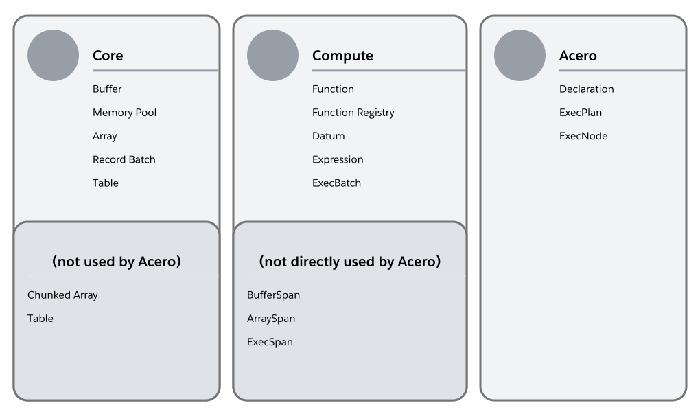

# Arrow

Arrow C++ 库由多个部分组成，每个部分完成不同的功能。

- 物理层
- 一维层
- 二维层
- 计算层
- IO 层
- IPC 层（Inter-Process Communication）
- 格式层
- 设备层
- 文件系统层

## 物理层（The physical layer）

- **Memory management** 抽象提供了统一的 API 来管理内存

- **Buffer** 抽象表示物理数据的连续区域。

## 一维层（The one-dimensional layer）

- **Data Types** 赋予物理数据逻辑含义
- **Arrays** 装了一个或多个有类型的缓冲区，允许将他们视为逻辑连续的值序列（可能是嵌套的）
- **Chunked arrays** （分块数组）是对数组的泛化，将多个相同类型的数组组合成一个更长的逻辑值序列

## 二维层（The two-dimensional layer）

- **Schemas** 描述了多个数据的逻辑集合，每个数据都有不同的名称和类型，以及可选的元数据
- **Tables** 是根据 Schemas 的分块数组的集合。它们是 Arrow 中最有能力提供数据集的抽象
- **Record batches** 是由 Schemas 描述的连续数组的集合，允许表的增量构造或序列化

## 计算层（The compute layer）

- **Datums** 是灵活的数据集一样，比如可以保存一个 Array 或 Table 引用
- **Kernels** 是在一组给定的 Datums 上循环运行的专用计算函数，这些数据表示函数的输入和输出参数
- **Acero** 是一个流执行引擎，允许将计算表示为可以转换数据流的运算符图

## IO 层（The IO layer）

- **Streams** 允许对各种外部数据（例如压缩或内存映射）进行无类型的顺序或可查找访问

## IPC 层（The Inter-Process Communication (IPC) layer）

- **Messaging Format** 允许 Arrow 数据在进程间交换，并尽可能少得拷贝

## 文件格式层（The file formats layer）

读写尽可能多的文件格式，比如 Parquet、CSV、Orc，以及 Arrow 专用的 Feather 格式。

## 设备层（The devices layer）

- **CUDA** 提供基础集成，允许描述由 GPU 分配的内存数据

## 文件系统层（The filesystem layer）

文件系统抽象允许从不同的存储后端读取和写入数据，例如本地文件系统或 S3 存储桶

# 计算

## 通用计算 API

### Functions 及其注册

- 函数表示对可能不同类型的输入的计算操作
- 在内部，一个函数由一个或多个“内核”（**Kernels**）实现
- 函数存储在全局函数注册表（[`FunctionRegistry`](https://arrow.apache.org/docs/cpp/api/compute.html#_CPPv4N5arrow7compute16FunctionRegistryE) ）中，可以在其中按名称查找它们

### Input Shapes

- 计算 API 的输入被标识为通用的 Datum 类，可以标识 Scalar、Array、ChunkedArray
- 很多函数支持 Array、Chunked Array和 Scalar 作为输入，但是有些需要特定的输入
  - array_sort_indices，仅接受一个 Array 作为输入
  - sort_indices，更通用，接受 Array、Chunked Array、BatchRecord、Table

### 调用函数

- 计算函数可以使用 `arrow::compute::CallFunctioni()` 来调用
- 也可以用具体的 API，比如 `arrow::compute::Add()`

```shell
arrow::compute::CallFunctioni("add", ...) 等价于 arrow::compute::Add(...)
```

需要注意的是，一些函数还需要特定类型的参数（Options）。

```c++
ScalarAggregateOptions scalar_aggregate_options;
arrow::compute::CallFunction("min_max", {...}, &scalar_aggregate_options)
```

## 隐式转换（Implicit casts）

functions 可能会对输入进行隐式转换。

## 可用的 Functions

### 类型分类

- Numeric，Integer、Floating、Decimal128/256
- Temporal，Date、Time、Timestamp、Duration、Interval
- Binary Like，Binary、LargeBinary、FixedSizeBinary
- String Like，String、LargeString
- List Like，List、LargeList、ListView、LargeListView、FixedSizeList
- Nested，List-likes、Struct、Union、related types like Map

**如果一个 Function 不支持一个输入类型，会返回 TypeError Status。**

### Aggregations（聚合）

标量聚合操作操作在 （Chunked）Array、Scalar，产生单个输出值。

具体的聚合方法看[这里](https://arrow.apache.org/docs/cpp/compute.html#aggregations)。

### Group Aggregations（组聚合）

组聚合方法通常无法直接调用，通常作为 SQL 类型 `group by` 操作，详见[这里](https://arrow.apache.org/docs/cpp/compute.html#grouped-aggregations-group-by)。

### Element-wise (“scalar”) functions

这类方法接受 Array 和 Scalar 作为输入。对于一元输入，输入是什么类型，输出就是什么类型。

两元输入时有如下的语义（在其他领域有时称为 `broadcasting` 比如 Numpy）。

- (Scalar, Scalar)，输出 Scalar
- (Array, Array)，输出 Array
- (Scalar, Array)、(Array, Scalar) 输出 Array。标量输入被处理为与另一个相同长度的数组，元素是重复的值。

[更多](https://arrow.apache.org/docs/cpp/compute.html#array-wise-vector-functions)。

# Acero

Acero 是一个流查询引擎，用来制定和执行计算。


Arrow 使用 ExecPlan 来表示计算，ExecPlan 以零个或多个 Stream 作为输入，但输出只有一个 Stream。Plan 描述了数据怎么被转换、传递。

Acero 处理流式数据，Compute 处理内存中的数据。



## 概念

### ExecNode

ExecNode 是 Acero 中最基础的概念，ExecNode 有零个或多个输入，零或一个输出。如果没有 Source，称其为源；如果没有输出，称其为 Sink。ExecNode 还有多种类型。

- Sources Nodes
- Compute Nodes
- Arrangement NOdes
- Sink Nodes

### ExecBatch

批量数据（Batches of Data）使用 ExecBatch 类来描述。ExecBatch 是一个二维结构，和 RecordBatch 很相似。可以有零个或多个列，每个列必须有相同的长度。

```shell
exec_batch.length :        数据行度 (row)
exec_batch.values.size() : 列数量 (column)
```


RecordBatch 和 ExecBatch 对 Arrays 和 Buffers 都有强所有权。把 RecordBatch 转换为 ExecBatch 总是零拷贝的。但是 ExecBatch 转换为 RecordBatch 时只有在无标量（Scalar） 时才是零拷贝。

 ### ExecPlan

ExecPlan 表示由 ExecNode 组成的图。一个合法的 ExecPlan 必须由一个 Source 节点，但技术上不需要有 Sink 节点。ExecPlan 包含所有节点共享的资源，以及工具方法来启动、停止节点的执行。ExecPlan 和 ExecNode 都与单个执行的生命周期相关联。它们有状态，预计不可重新启动。

### Declaration

Declaration 是 ExecNode 的蓝图。声明可以组合成一个图表，形成 ExecPlan 的蓝图。


## 使用

Acero 的基础工作流如下。

1. 首先，创建 Declaration 图，描述 Plan
2. 调用一个 DeclarationToXyz 方法来执行 Declaration
   1. 创建 ExecPlan。一个新的 ExecPlan 会从 Declaration Graph 中被创建。每个 Declaration 对应 Plan 中的一个 ExecNode。此外，会根据具体的 DeclarationToXyz 创建 Sink Node
   2. 执行 ExecPlan。通常，这是 DeclarationToXyz 调用的一部分，但在 DeclarationToReader 中，阅读器会在计划完成执行之前返回。
   3. 销毁。Plan 一但结束就会被销毁。

### 创建 Plan

#### 使用 Substrait

Substrait 是创建 Plan （Graph of Declaration）的推荐机制，原因如下。

- Substrait 耗费了大量时间和精力创建用户友好的 API，以简单的方式创建负责的 Execution Plans
- 更容易迁移到其他类似引擎
- 更多基于 Substrait 的工具

#### 程序化构建 Plan

以编程方式创建执行计划比从 Substra 创建计划更简单。[`Declaration::Sequence()`](https://arrow.apache.org/docs/cpp/api/acero.html#_CPPv4N5arrow5acero11Declaration8SequenceENSt6vectorI11DeclarationEE) 可以更方便地创建处理序列。

### 执行 plan

- DeclarationToTable，累计所有的结果到一个 `arrow::Table`
- DeclarationToReader，允许以迭代的方式使用所有结果，会创建一个 `arrow::RecordBatchReader`
- DeclarationToStatus，如果只想执行 Plan 而不消费结果时很有用
- 直接运行 Plan
  - 创建 ExecPlan 
  - 添加 Sink Node 到 Declaration Graph 中
  - 使用 Declaration::AddToPlan 添加 Declaration 到 Plan 中
  - 验证 Plan，`ExecPlan::Validate`
  - 开始 Plan，`EexcPlan::StartProducing`
  - 等待 Future，`ExecPlan::finished`

## 可用的 ExecNode

### Sources Node

用作数据源。

- source，SourceNodeOptions，通用源节点，包装异步流数据
- table_source，TableSourceNodeOptions
- record_batch_source，RecordBatchSourceNodeOptions
- record_batch_reader_source，RecordBatchReaderSourceNodeOptions
- exec_batch_source，ExecBatchSourceNodeOptions
- array_vector_source，ArrayVectorSourceNodeOptions
- scan，arrow::dataset::ScanNodeOptions

### Computer Nodes

对数据进行计算、转换、重塑。

- filter，FilterNodeOptions，移除不符合过滤表达式的行
- project，ProjectNodeOptions，通过执行计算表达式创建新的列，也可以移除、排序列
- aggregate，AggregateNodeOptions，计算整个输入流或数据组的汇总统计信息
- pivot_longer，PivotLongerNodeOptions，通过将某些列转换为附加行来重塑数据

### Arrangement Nodes

重新排序、组合或切片数据流。

- hash_john，HashJoinNodeOptions，基于相同的列合并两个输入
- asofjoin，AsofJoinNodeOptions，工具相同的有序列把多个输入合并到第一个输入
- union，合并两个具有相同 Schema 的输入
- order_by，OrderByNodeOptions，对流排序
- fetch，FetchNodeOptions，从流中切片出一系列行

### Sink Nodes

Sink 节点会结束一个 Plan。通常不需要创建 Sink Node，会基于 DeclarationToXyz 方法选择。

# Conceptions

- Core
  - Buffer
  - Memory Pool
  - Array 数组
  - **Scalar** 标量，表示有特定类型的单值
  - Record Batch
  - Table
  - Chunked Array
  - Table
- Compute
  - Function
  - Function Registry，注册自定义处理函数
  - Datum
  - Expression
  - ExecBatch
  - BufferSpan
  - ArraySpan
  - ExecSpan
- Acero
  - Declaration
  - ExecPlan
  - ExecNode
- Other

PushGenerator

JoinType

KernelState 

KernelContext 

KernelInitArgs 

ScalarKernel 

# 使用

## 自定义 Function

```c++
// Function 帮助类
struct FunctionDoc {
  std::string summary;
  std::string description;
  std::vector<std::string> arg_names;
  std::string options_class; // 参数类
  bool options_required;     // 是否需要参数（Options）
}

// 参数数量标记类
struct Arity {
	Arity Nullary(); // 无参数
  Arity Unary();   // 一个参数
  Arity Binary();  // 两个参数
  Arity Ternary(); // 三个参数
  Arity VarArgs(); // 动态参数
}

// 函数类型
enum Kind {
  SCALAR,
  VECTOR,
  SCALAR_AGGREGATE,
  HASH_AGGREGATE,
  META
}

// 函数基类
Function(std::string name, Function::Kind kind, const Arity& arity, FunctionDoc doc, 
         const FunctionOptions* default_options);
// ScalarFunction 实现了 FunctionImpl<ScalarKernel>
ScalarFunction(std::string name, const Arity& arity, FunctionDoc doc,
               const FunctionOptions* default_options = NULLPTR, bool is_pure = true);

// Kernel
using ArrayKernelExec = Status (*)(KernelContext*, const ExecSpan&, ExecResult*);
```

# TODO

- 需要对 Kernel 做详细了解

# 附录

- https://cloud.tencent.com/developer/article/2322102