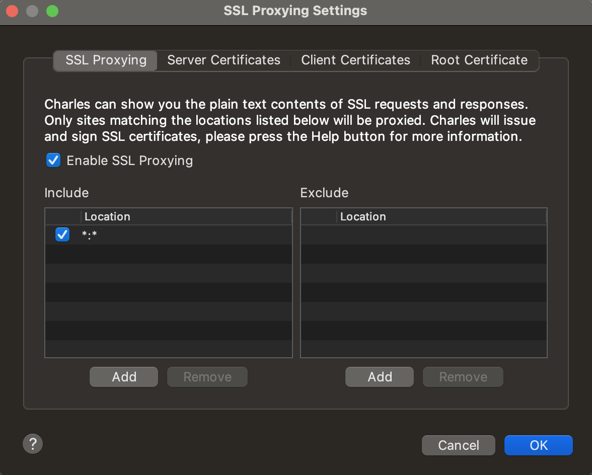
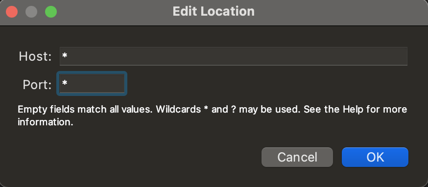
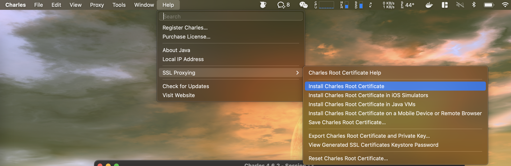
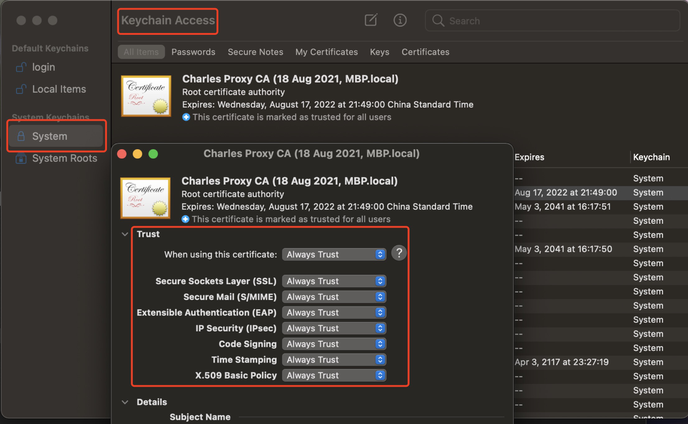
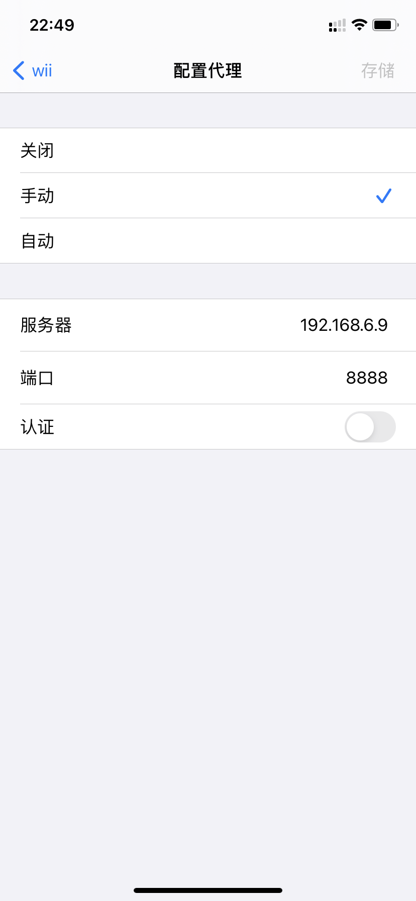
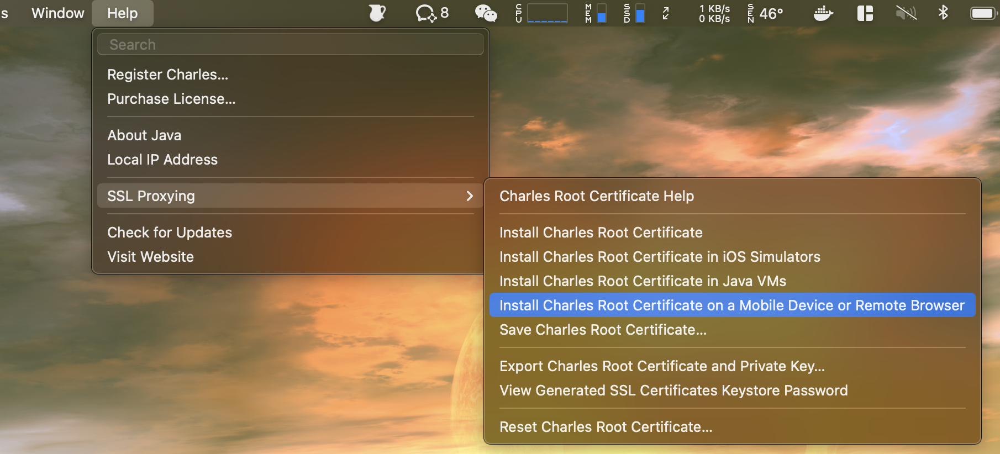
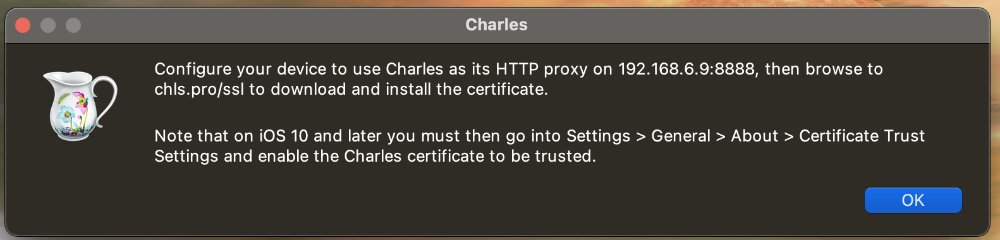
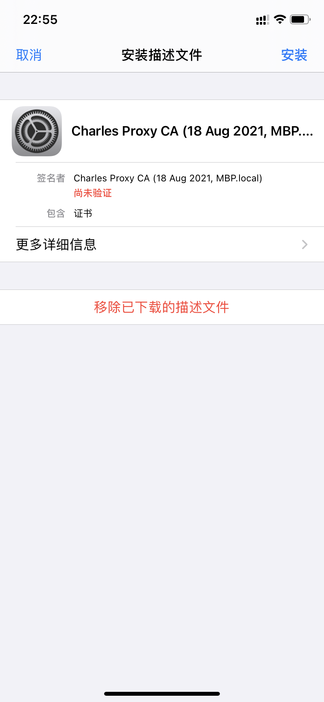
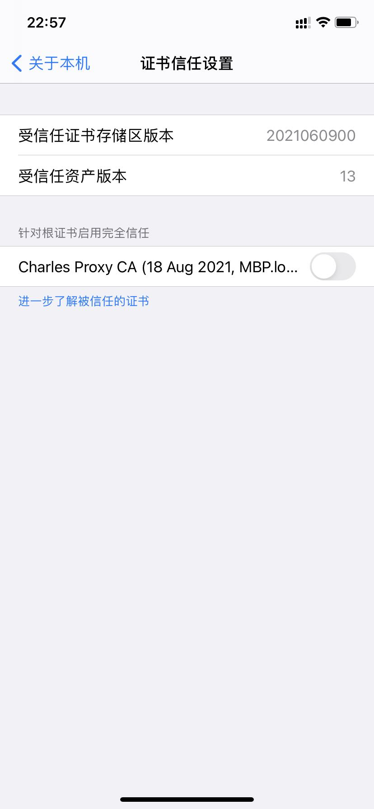

# 安装 & 配置

## 下载 & 安装 charles

[点击跳转](https://www.charlesproxy.com/download/)

## 配置

### chrome

下载插件 SwitchProxy，添加 charles 代理，并启用。

# 转发 localhost

## 添加 host

在 `/etc/hosts` 中添加 `127.0.0.1 charles.prx`。

## charles 中添加 `Map Remote`

## 效果

# 手机抓包

## Charles 设置

### Proxy 设置

- 打开「Proxy -> SSL Proxying Settings」

- 勾选「Enable SSL Proxying」
- 添加 Location
  - Host：*
  - Port：*

### 证书设置

- 点击 「Help -> Install Charles Root Certificate」
  - 安装证书，位置选择系统（不要选择 iCloud）
- 在密钥串访问（Keychain Access）程序中修改 Charles 证书的信任配置
  - 改为始终信任（Always Trust）

## iPhone

- 保证手机和电脑在统一局域网，或手机可通过 ip 访问电脑

### 设置代理

打开 iPhone 「设置 -> 无线局域网 -> 详情（已连接Wifi后的蓝色感叹号）-> 配置代理」，配置代理，ip 为开启 charles 的电脑 ip，port 为 charles 启动的代理端口，默认为 8888。

### 设置证书

打开「Charles -> Help 」

会有如下提示。

在 safari 中访问网址 `chls.pro/ssl` ，允许下载证书，成功后会提示去设置中安装描述符。

打开「设置 -> 通用 -> 描述文件 -> Charles Proxy CA」，安装证书。

最后一步，启用证书。打开「设置 -> 通用 -> 关于手机 -> 证书信任设置 -> Charles Proxy CA」，启用它。

