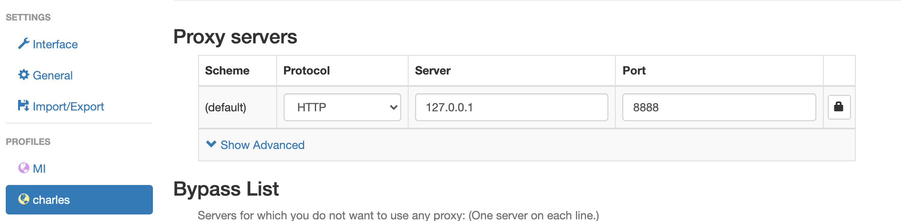
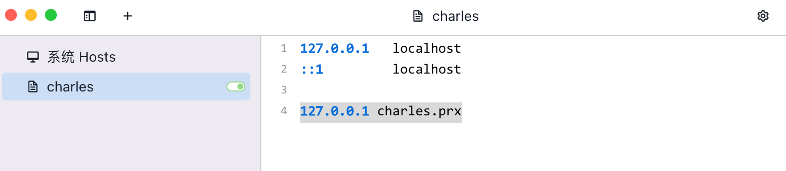
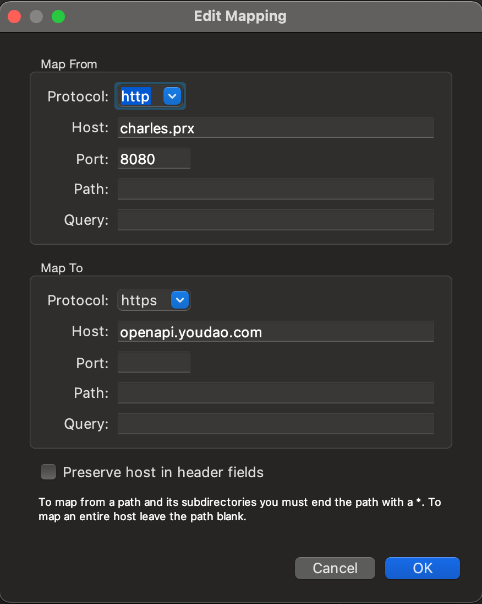
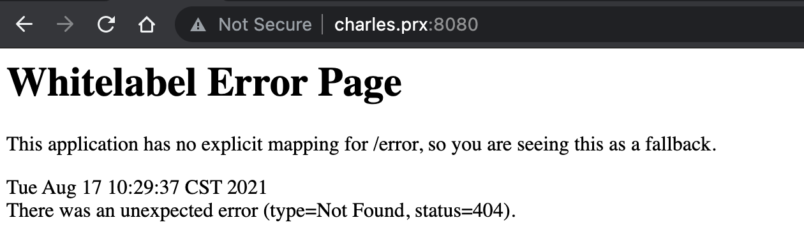

# 安装 & 配置

## 下载 & 安装 charles

[点击跳转](https://www.charlesproxy.com/download/)

## 配置

### chrome

下载插件 SwitchProxy，添加 charles 代理，并启用。

# 转发 localhost

## 添加 host

在 `/etc/hosts` 中添加 `127.0.0.1 charles.prx`。

## charles 中添加 `Map Remote`

## 效果

