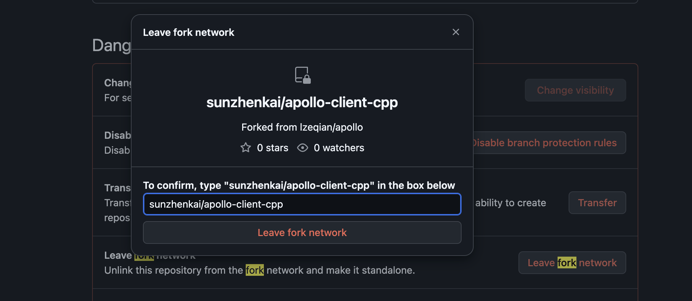

# 认证

在 Workflow 中可以使用 `secrets.GITHUB_TOKEN` 获取 Access Token，详见[文档](https://docs.github.com/en/actions/security-for-github-actions/security-guides/automatic-token-authentication)。注意，如果直接在文档中添加如下文本内容的话，在生成静态文件时，会报错。

# Fork 的一些问题

如果从一个仓库 fork 到自己账户下面，命令行创建 PR 的链接默认会创建在被 fork 的仓库下。如果想要关闭这种关联，可以在仓库的设置下 `Level fork network`。

