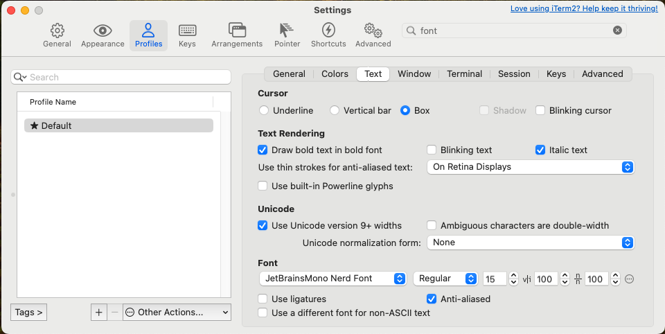
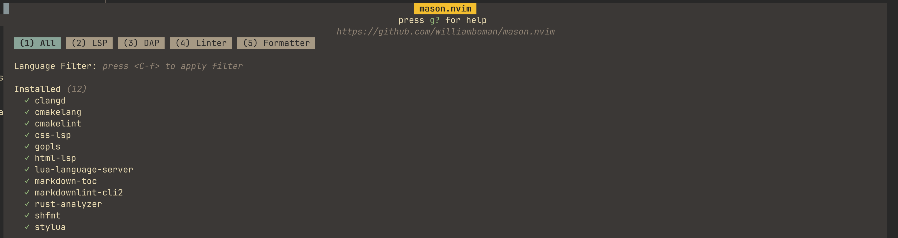

# 配置

使用 [LazyVim](https://github.com/LazyVim/LazyVim) 进行配置。

```shell
git clone https://github.com/LazyVim/starter ~/.config/nvim
```

## 安装字体（可选）

如果是通过 ssh 远程登录，需要在本地机器安装，并设置 terminal font。

```shell
wget https://github.com/ryanoasis/nerd-fonts/releases/download/v3.2.1/JetBrainsMono.zip
unzip JetBrainsMono.zip -d ~/.local/share/fonts
```

ubuntu

```shell
sudo apt install fontconfig
fc-cache -fv
```

# 概念

## Buffer

NeoVim 以 Buffer List 的方式管理打开的文件，每个打开的文件是一个 Buffer，并且有唯一的 id（`:ls` 可查看打开的文件列表及 id）。

# 编辑

## `.` 命令

重复上次的修改。

## 缩进

```shell
>    # 缩进当前行
>n   # 缩进接下来的 n+1 行
>G   # 缩进到文件末尾

< <n <G # 反向操作
```

## 跳转

```shell
gd    # 跳转到上一个编辑的位置，可跨文件
gr    # 跳转到使用位置
%     # 跳转到成对符号的另一侧, 比如 {}, [], ()
[{    # 跳转到代码块的开始位置
}]    # 跳转到代码块的结束位置
```

## 移动

```shell
Ctrl+[,j/k # Ctrl+[ 后快速按 j/k 键可以移动当前行上移/下移一行，注意必须要快；此外 Ctrl+[ 后会进入 command 模式
```

# Leader Key

默认是 `\` ，如果使用 LazyVim，会被替换为 `<Space>` 空格键。

# Vim

## 模式

- **Normal Mode**
  - `i`、`a`、`o` 进入 Insert Mode
    - `A` 在行尾插入
  - `:` 进入 Command Line Mode
  - `v`、`V` 进入 Visual Mode；`v` 按字符选择，`V` 按行选择
  - **Operator-Pending Mode**，操作符待决模式，改模式是指 Noraml 模式下输入了操作符但未完成整个操作时的状态
    - 可以按 `Esc` 中止该状态
-  **Insert Mode**
  - `Esc`、`C+[` 进入 Normal Mode
- **Command Line Mode**
- **Visual Mode**
  - `C+v` 进入按块选择

## 命令

操作 = 操作符 + 动作命令

`operation = {operator} + {motion}`

### 特殊命令

- `.` 重复上次操作
- `;` 重复上次 `f` 命令的查找
- `,` 上次 `f` 的反方向查找
- `*` 查找当前光标所在单词

### 复合命令

| 复合命令 | 等效命令 | 解释                                       |
| -------- | -------- | ------------------------------------------ |
| C        | c$       | 删除从当前位置到行尾的内容，并进入插入模式 |
| s        | cl       | 删除当前光标所在字符，并进入插入模式       |
| S        | ^c       | 删除当前行，并进入插入模式                 |
| I        | ^i       | 将光标移动到行首，并进入插入模式           |
| A        | $a       | 将光标移动到行尾，并进入插入模式           |
| o        | `A<CR>`  | 在下方新开一行，并进入插入模式             |
| O        | `ko`     | 在上方新开一行，并进入插入模式             |

## 操作符命令

| 命令 | 用途                                |
| ---- | ----------------------------------- |
| c    | 修改                                |
| d    | 删除                                |
| y    | 复制到寄存器                        |
| g~   | 反转大小写                          |
| gu   | 转换为小写                          |
| gU   | 转换为大写                          |
| >    | 增加缩进                            |
| <    | 减少缩进                            |
| =    | 自动缩进                            |
| !    | 使用外部程序过滤{motion} 所跨越的行 |


## 可重复的操作及回退方式

| 目的                 | 操作                    | 重复 | 回退 |
| -------------------- | ----------------------- | ---- | ---- |
| 修改                 | {edit}                  | .    | u    |
| 行内查找下一个字符   | `f{char}/t{char}`       | ;    | ,    |
| 行内查找上一个字符   | `F{char}/T{char}`       | ;    | ,    |
| 文档内查找下一处匹配 | `/pattern<CR>`          | n    | N    |
| 文档内查找上一处匹配 | `?pattern<CR>`          | n    | N    |
| 行内替换             | `:s/target/replacement` | &    | u    |
| 执行一系列修改       | `qx{changes}q`          | @x   | u    |

## 跳转

```shell
b   # 移动光标到单词开头，不包含标点符号
B   # 移动光标到单词开头，包含标点符号
e   # 移动光标到单词结尾，不包含标点符号
E   # 移动光标到单词结尾，包含标点符号
g{e/E}  # 移动光标到上一个单词的尾部
```

## Tips

- 当一个操作符命令被连续调用两次，会作用于当前行，比如 `>>`、`yy`

# 快捷键

## VIM

```shell
vib / biB # 选中当前/下一个 () {} 内的内容，b: (), B: {}
vic / viC # 移除当前/下一个 () {} 内的内容，b: (), B: {}

gf   # 打开文件
gx   # 打开链接

m{markname}  # 创建一个标签
'{markname}  # 跳转到标签
m+shift+{markname}  # 创建一个标签(跨文件)
'+shift+{markname}  # 跳转到标签(跨文件)

J   # 合并当前行和下一行，空格分割
gJ  # 合并当前行和下一行，无空格分割
```

## LazyVim

```shell
<space>-e      # 打开 NeoTree
<ctrl>-o       # 上一个编辑的位置
<ctrl>-i       # 下一个编辑的位置，<ctrl>-o 的逆操作
```

## Buffer

```shell
bd            # 删除当前 buffer
bn            # 下一个 buffer
bn{number}    # 下面的第 {number} 个
bp            # 前一个
bp{number}    # 前面的第 {number} 个
b#            # 切换到最近激活的 buffer
ls						# 列出所有 buffer
```

## NeoTree

```shell
?							# 打开帮助框
a							# 添加文件/文件夹，添加文件夹则以 '/' 结尾，否则添加文件
H							# 显式/折叠隐藏文件
.							# 设置选定的目录为 root dir
```

# 使用

## 多行编辑

```shell
# 行首添加
<ctrl>-v    # 开启矩阵选择
I     # 开始编辑
Esc         # 退出编辑，编辑对多行生效

# 行位添加
<ctrl>-v  
$     # shift + 4
A     # shift + a
Esc
```

## 代码折叠

```shell
z{?}
```

# 终端

## 滚动

**进入 Normal 模式**

在 Neovim 终端界面中，按 `Ctrl+\` + `Ctrl+N`（快速连续按键）切换到 Normal 模式，之后可使用以下操作：

- `j`/`k`：逐行上下滚动
- `Ctrl+u`/`Ctrl+d`：半屏滚动
- `gg`/`G`：跳转到顶部/底部

**退出 Normal 模式**

- `i` 

# 插件

# 常见问题

## 图标显示异常

修改 terminal font，以 iterm2 为例。字体可从 [nerd fonts](https://www.nerdfonts.com/font-downloads) 下载。



## 无法复制到系统粘贴板

场景是，登录到远程机器，并使用 nvim 编译，无法复制选中的文本，解决方案是使用快捷键，下面是 Max OS 下的快捷键操作，Windows/Linux 下可尝试探索。

```shell
<option + 拖动鼠标> : 选中连续文本，可跨行
<option + command + 拖动鼠标> : 选中矩形区域，可跨行
```

选中后，再按系统的复制快捷键即可（或右键弹出菜单、选择复制）。

## FZF 搜索窗口无法复制寄存器内容

核心思想是针对 fzf 窗口，自定义快捷键，调用 `getreg()` 来获取寄存器内容，搜索到使用 `getreg(nr2char(getchar()))` 命令，但是不行。在 `init.lua` 文件中添加任意一个方案的内容，在搜索时使用快捷键 `Ctrl + V` 即可粘贴寄存器内容。

方案一，使用 nvim 的 lua  api 命令创建。

```lua
local autogrp = vim.api.nvim_create_augroup("FZF", { clear = true })
vim.api.nvim_create_autocmd("FileType", {
	pattern = "fzf",
	group = autogrp,
	callback = function()
		vim.api.nvim_set_keymap("t", "<C-r>", "getreg()", { noremap = true, expr = true, silent = true })
	end,
})
```

方案二，使用 `vim.cmd`。

```lua
vim.cmd([[
  autocmd! FileType fzf tnoremap <expr> <C-r> getreg()
]])
```

# Lazy.nvim

## Mason

- mason 仅安装 LSP Server，最终还是要使用 lspconfig 插件来完成 LSP

### 唤出

```shell
:Mason
```




修改 Mason 配置后，可手动唤出 Mason 面板安装。

## 分屏

```shell
<space> -> <shift> + \ : 水平分屏
<space> -> - : 垂直分屏
```

切换分屏。

```shell
<ctrl> + H/左 : 左
<ctrl> + L/右 : 右
<ctrl> + J/下 : 下
<ctrl> + K/上 : 上
```

## 快捷键冲突检查

```shell
:checkhealth which-key
```

# 拷贝到系统剪贴板

```shell
:"+y
```

配置 V 模式下复制快捷键，修改 `lua/config/keymaps.lua`。

```lua
-- 可视模式下 <leader>y 复制到系统剪贴板
vim.keymap.set("v", "<leader>y", '"+y', {
	noremap = true, -- 非递归映射
	silent = true, -- 静默执行
	desc = "Copy to system clipboard", -- 可选的描述
})
```

**Iterm2 额外配置**


# 问题排查

```shell
:LspInfo               # 打印 Lsp 信息，用于排查
:setlocal indentexpr?  # 查看 indent 信息
```

## 日志

```shell
~/.local/state/nvim
```

## 初始化

```c++
#include "arrow/dataset/plan.h"

arrow::dataset::internal::Initialize();
```

