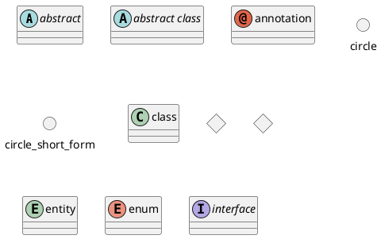
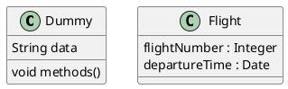

# 声明元素

```puml
@startuml
abstract        abstract
abstract class  "abstract class"
annotation      annotation
circle          circle
()              circle_short_form
class           class
diamond         diamond
<>              diamond_short_form
entity          entity
enum            enum
interface       interface
@enduml
```

 # 定义关系

| 关系                | 符号  |
| ------------------- | ----- |
| 扩展（Extension）   | <\|-- |
| 组合（Conposition） | *--   |
| 聚合（Aggregation） | o--   |

# 示例

```puml
@startuml
class Dummy {
  String data
  void methods()
}

class Flight {
   flightNumber : Integer
   departureTime : Date
}
@enduml
```

